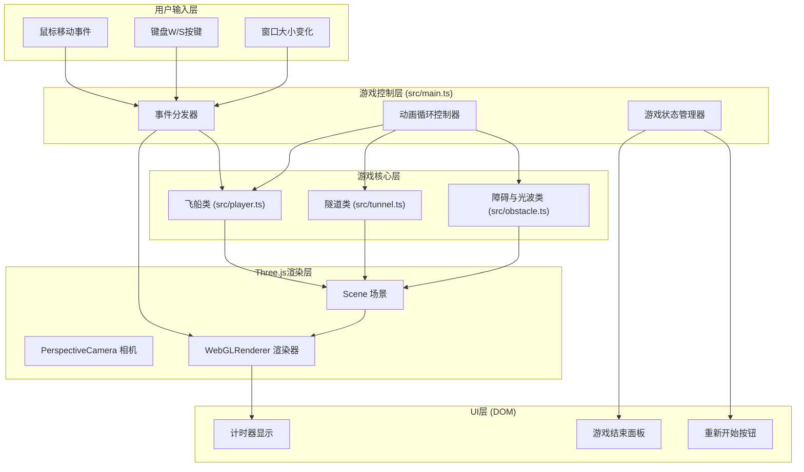

## 1. 架构设计



**数据流向说明**：
1. 鼠标/键盘事件 → main.ts事件分发器 → player.ts更新飞船位置
2. 动画循环 → tunnel.ts更新隧道旋转和移动 → obstacle.ts更新障碍和光波位置
3. 碰撞检测 → main.ts状态管理器 → 触发粒子特效/游戏结束逻辑
4. 游戏状态变化 → UI层更新显示

## 2. 技术栈说明

| 层级 | 技术选型 | 版本 | 用途 |
|------|----------|------|------|
| 前端框架 | TypeScript | ^5.0 | 类型安全的JavaScript |
| 3D引擎 | Three.js | ^0.160.0 | WebGL 3D渲染 |
| 构建工具 | Vite | ^5.0 | 快速开发构建 |
| 类型定义 | @types/three | ^0.160.0 | Three.js TypeScript类型 |

**项目初始化**：使用Vite vanilla-ts模板创建，不使用React/Vue等前端框架，保持轻量级。

## 3. 文件结构与调用关系

```
auto36/
├── package.json              # 项目依赖与脚本
├── vite.config.js            # Vite构建配置
├── tsconfig.json             # TypeScript配置
├── index.html                # 入口HTML
└── src/
    ├── main.ts               # 游戏入口：初始化场景、事件分发、动画循环
    ├── player.ts             # 飞船类：位置控制、粒子尾迹、碰撞特效
    ├── tunnel.ts             # 隧道类：动态生成、旋转移动、纹理贴图
    └── obstacle.ts           # 障碍/光波类：随机生成、碰撞检测、特效
```

### 模块调用关系

| 文件 | 依赖 | 被调用 | 职责 |
|------|------|--------|------|
| `main.ts` | `player.ts`, `tunnel.ts`, `obstacle.ts` | 无 | 游戏主控制器，协调各模块 |
| `player.ts` | 无 | `main.ts` | 管理飞船状态、移动、粒子系统 |
| `tunnel.ts` | 无 | `main.ts` | 隧道生成、旋转、速度控制 |
| `obstacle.ts` | 无 | `main.ts` | 障碍物/光波生成、移动、碰撞检测 |

### 数据流向

1. **输入 → 飞船**：鼠标X坐标 → `main.ts` → `Player.setTargetX()` → `Player.update()`平滑移动
2. **时间 → 隧道**：`requestAnimationFrame` → `main.ts` → `Tunnel.update(deltaTime)` → 旋转+移动
3. **定时器 → 障碍物**：2-3秒间隔 → `main.ts` → `ObstacleManager.spawn()` → 随机位置生成
4. **碰撞检测**：每帧 → `main.ts` → `Player.getBounds()` vs `ObstacleManager.checkCollision()` → 触发事件
5. **状态 → UI**：游戏状态变化 → `main.ts` → DOM更新计时器/结束面板

## 4. 核心数据结构

### 游戏状态

```typescript
interface GameState {
  isRunning: boolean;
  isPaused: boolean;
  isGameOver: boolean;
  elapsedTime: number;
  score: number;
  waveCollected: number;
  speedMultiplier: number;
}
```

### 飞船属性

```typescript
interface PlayerState {
  position: { x: number; y: number; z: number };
  targetPosition: { x: number; y: number };
  rotation: { x: number; y: number; z: number };
  bounds: { width: number; height: number; depth: number };
  trailParticles: Particle[];
  isShaking: boolean;
}
```

### 隧道段属性

```typescript
interface TunnelSegment {
  mesh: THREE.Mesh;
  startZ: number;
  length: number;
  radius: number;
}
```

### 障碍物/光波属性

```typescript
interface GameObject {
  id: string;
  type: 'obstacle' | 'wave';
  mesh: THREE.Mesh;
  position: THREE.Vector3;
  velocity: THREE.Vector3;
  size: number;
  rotationSpeed: number;
  spiralAngle?: number;
}
```

### 粒子属性

```typescript
interface Particle {
  mesh: THREE.Mesh | THREE.Sprite;
  position: THREE.Vector3;
  velocity: THREE.Vector3;
  life: number;
  maxLife: number;
  color: THREE.Color;
  size: number;
}
```

## 5. 性能优化策略

| 优化项 | 策略 | 目标 |
|--------|------|------|
| **隧道几何体** | TubeGeometry复用，每20单位添加新段，移除超出视野的旧段，最多保持3段 | 避免每帧重建几何体 |
| **粒子系统** | 对象池模式，粒子总数≤300，生命周期结束后复用 | 控制内存占用和Draw Call |
| **碰撞检测** | AABB包围盒检测，每帧检测当前视野内对象 | O(n)复杂度，n≤20 |
| **渲染优化** | 隧道使用CanvasTexture动态生成，避免加载外部图片资源 | 减少网络请求 |
| **帧率控制** | 使用deltaTime计算动画速度，确保不同设备速度一致 | 40+ FPS |

## 6. 性能预算

- **Draw Calls**：≤ 50（隧道3 + 飞船2 + 障碍/光波20 + 粒子15）
- **三角形数**：≤ 100k（隧道每段约30k，飞船约1k，粒子不计）
- **粒子数**：≤ 300（尾迹5/帧 + 爆炸50 + 光波特效）
- **JS执行时间**：≤ 10ms/帧
