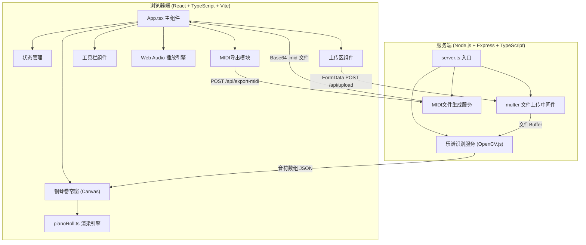
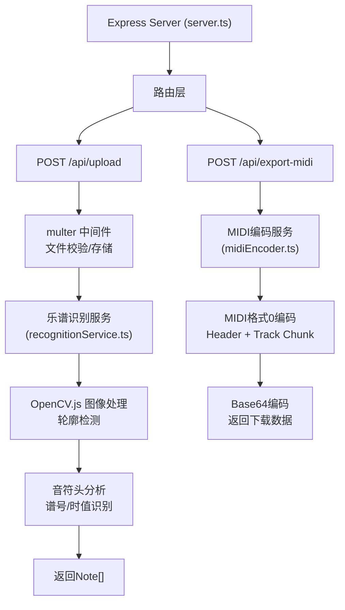

## 1. 架构设计



---

## 2. 技术选型说明

| 层级 | 技术栈 | 说明 |
|------|--------|------|
| 前端框架 | React 18 + TypeScript | 严格模式，target ES2020 |
| 构建工具 | Vite | 开发端口 5173，HMR热更新 |
| 样式方案 | 原生CSS + CSS变量 | 深色主题，CSS transition动画 |
| 渲染引擎 | Canvas 2D API | pianoRoll.ts 独立渲染引擎 |
| 音频播放 | Web Audio API | Sawtooth振荡器 + ADSR包络模拟钢琴音色 |
| 后端框架 | Express 4 + TypeScript | REST API服务 |
| 文件上传 | multer | 限制单文件5MB，支持PDF/PNG/JPG |
| 图像识别 | OpenCV.js (opencv-ts) | 轮廓检测 + 音符头位置分析算法 |
| MIDI导出 | 自定义MIDI编码器 | 标准MIDI格式0，单轨道，Base64编码 |
| 唯一标识 | uuid | 音符唯一ID生成 |

---

## 3. 路由与API定义

### 3.1 前端组件路由（单页应用，无路由跳转）

| 组件 | 职责 |
|------|------|
| `<App />` | 根组件，全局状态管理，布局编排 |
| `<Toolbar />` | 顶部工具栏：上传按钮、播放/暂停、BPM滑块、导出按钮 |
| `<UploadPanel />` | 左侧上传区：拖拽上传、文件列表、识别进度 |
| `<PianoRoll />` | 右侧钢琴卷帘窗Canvas容器 |

### 3.2 后端API接口

| 方法 | 路径 | 请求 | 响应 | 说明 |
|------|------|------|------|------|
| POST | `/api/upload` | `multipart/form-data: { file: File }` | `{ success: boolean, notes: Note[], progress: number }` | 上传乐谱文件并识别音符 |
| POST | `/api/export-midi` | `application/json: { notes: Note[], bpm: number }` | `{ success: boolean, data: string (Base64), filename: string }` | 导出MIDI文件Base64数据 |
| GET | `/api/health` | - | `{ status: 'ok' }` | 健康检查 |

---

## 4. 数据模型与类型定义

### 4.1 核心数据类型

```typescript
// 音符数据结构
interface Note {
  id: string;              // uuid
  pitch: number;           // MIDI音高编号 (C3=48, C4=60, C6=84)
  start: number;           // 起始时间（拍数，可小数）
  duration: number;        // 时值（拍数：0.5=八分音符, 1=四分音符）
  selected?: boolean;      // 是否被选中
  playing?: boolean;       // 是否正在播放
}

// 识别结果
interface RecognitionResult {
  success: boolean;
  notes: Note[];
  clef: 'treble' | 'bass';  // 谱号
  timeSignature: [number, number]; // 拍号
  confidence: number;       // 识别置信度 0-1
}

// 播放状态
interface PlaybackState {
  isPlaying: boolean;
  currentTime: number;      // 当前播放位置（拍数）
  bpm: number;              // 60-180
}

// 上传状态
interface UploadState {
  file: File | null;
  progress: number;         // 0-100
  isProcessing: boolean;
  error: string | null;
}
```

### 4.2 常量定义

```typescript
// 音高范围
const MIN_PITCH = 48;   // C3
const MAX_PITCH = 84;   // C6
const PITCH_RANGE = MAX_PITCH - MIN_PITCH + 1; // 37个半音（用户要求13个半音的话需要调整）

// 卷帘窗尺寸
const ROLL_WIDTH = 800;          // Canvas宽度px
const PX_PER_BEAT = 100;         // 每拍像素
const PX_PER_SEMITONE = 20;      // 每个半音高度px

// BPM范围
const MIN_BPM = 60;
const MAX_BPM = 180;
const DEFAULT_BPM = 120;

// 文件限制
const MAX_FILE_SIZE = 5 * 1024 * 1024; // 5MB
const ACCEPTED_TYPES = ['application/pdf', 'image/png', 'image/jpeg'];
```

---

## 5. 服务端架构



---

## 6. 项目文件结构

```
auto37/
├── package.json
├── index.html
├── vite.config.js
├── tsconfig.json
├── src/
│   ├── main.tsx                 # React入口
│   ├── App.tsx                  # 主组件，状态管理
│   ├── pianoRoll.ts             # 钢琴卷帘窗Canvas渲染引擎
│   ├── components/
│   │   ├── Toolbar.tsx          # 顶部工具栏
│   │   ├── UploadPanel.tsx      # 左侧上传面板
│   │   └── PianoRollView.tsx    # 卷帘窗Canvas容器
│   ├── audio/
│   │   └── audioEngine.ts       # Web Audio播放引擎
│   ├── midi/
│   │   └── midiEncoder.ts       # MIDI文件编码（前端备用）
│   ├── utils/
│   │   ├── noteUtils.ts         # 音高转换工具
│   │   └── animation.ts         # 动画工具（飘落粒子）
│   └── styles/
│       ├── global.css           # 全局样式（深色主题）
│       └── animations.css       # 动画定义
├── server/
│   ├── server.ts                # Express入口
│   ├── services/
│   │   ├── recognitionService.ts # OpenCV.js识别服务
│   │   └── midiService.ts       # MIDI文件生成
│   └── types/
│       └── index.ts             # 服务端类型定义
└── .trae/
    └── documents/
        ├── PRD.md
        └── ARCHITECTURE.md
```
