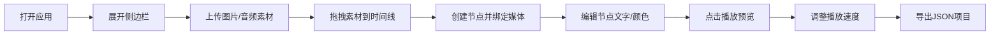
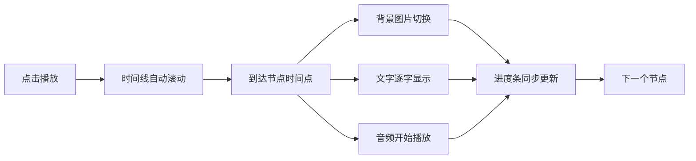

## 1. 产品概述
基于浏览器的时间线故事书创作工具，让用户通过拖拽多媒体元素到时间线上，自动生成可交互播放的叙事作品。
- 主要目的：提供简易的可视化叙事创作工具，适合教育、内容创作、个人纪念等场景
- 目标用户：内容创作者、教育工作者、个人用户
- 产品价值：降低交互式时间线叙事创作门槛，无需编程即可创建富有表现力的多媒体故事作品

## 2. 核心功能

### 2.1 功能模块
1. **时间线编辑器**：Canvas绘制横向滚动时间线，节点增删改，贝塞尔曲线连接
2. **节点管理**：圆形节点，支持文字/图片/音频绑定，拖拽交互
3. **播放控制**：自动滚动播放，打字机文字效果，音频同步，进度条
4. **素材管理**：侧边栏素材库，文件上传预览，缩略图/波形生成
5. **数据导入导出**：JSON格式项目数据导入导出

### 2.2 页面详情
| 页面名称 | 模块名称 | 功能描述 |
|---------|---------|----------|
| 主页面 | 时间线画布 | Canvas绘制时间线，支持横向滚动，星空粒子背景动画 |
| 主页面 | 节点组件 | 圆形节点渲染，预览浮窗，拖拽交互，属性编辑 |
| 主页面 | 播放控制区 | 播放/暂停按钮，速度调节，进度条 |
| 主页面 | 侧边栏 | 素材库面板，文件上传，素材列表展示 |
| 主页面 | 导入导出按钮 | JSON文件导入导出功能 |

## 3. 核心流程

### 3.1 创作流程
用户打开应用 → 展开侧边栏上传素材 → 拖拽素材到时间线创建节点 → 编辑节点属性（文字/颜色/时间）→ 点击播放预览 → 导出JSON项目文件

### 3.2 播放流程
点击播放 → 时间线自动滚动 → 节点依次激活 → 图片背景切换 → 文字打字机效果 → 音频同步播放 → 进度条同步高亮

## 4. 用户界面设计

### 4.1 设计风格
- **主色调**：#e94560（珊瑚红）
- **辅助色**：#0f3460（深海蓝）
- **背景色**：#1a1a2e（深空蓝）
- **文字色**：#eeeeee（浅灰白）
- **按钮风格**：圆角8px，悬停放大1.05倍，过渡0.2s
- **字体**：使用 'Segoe UI' 系统字体，标题加粗，正文常规
- **布局风格**：沉浸式全屏画布，左侧可折叠侧边栏，底部播放控制条
- **图标风格**：简洁线性图标，使用SVG内联

### 4.2 页面设计概述
| 页面名称 | 模块名称 | UI元素 |
|---------|---------|--------|
| 主页面 | 时间线画布 | Canvas 400px高度，横向滚动，贝塞尔曲线连接节点，星空粒子背景 |
| 主页面 | 节点组件 | 圆形直径40px，悬停scale 1.15，选中发光动画，预览浮窗带阴影圆角 |
| 主页面 | 播放控制区 | 播放/暂停按钮，速度选择（1x/1.5x/2x），全屏进度条 |
| 主页面 | 侧边栏 | 毛玻璃半透明效果，宽300px，平滑展开收起动画 |
| 主页面 | 导入导出 | 右上角按钮，hover高亮 |

### 4.3 响应式
- 桌面端优先，支持最小宽度1200px以上
- 时间线区域自适应宽度，最小高度400px
- 侧边栏在小屏幕可完全收起
- 触摸设备支持手势滑动时间线滚动

### 4.4 动画与交互
- 节点悬停：scale 1.15，过渡0.2s ease-out
- 节点选中：外圈发光动画，2s循环
- 侧边栏展开收起：0.3s cubic-bezier 平滑过渡
- 星空粒子：2-4px随机大小，缓慢漂移
- 文字显示：打字机逐字显示，光标闪烁
- 播放进度：底部进度条同步高亮
