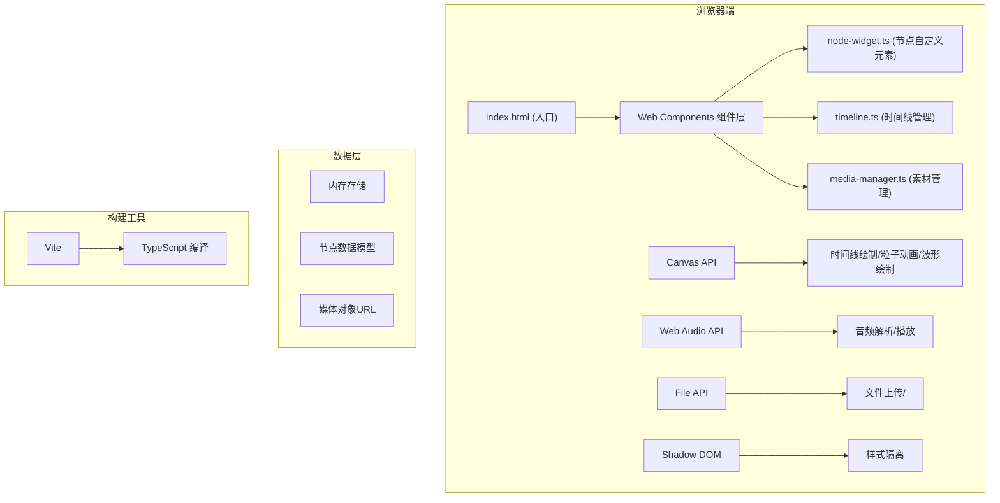
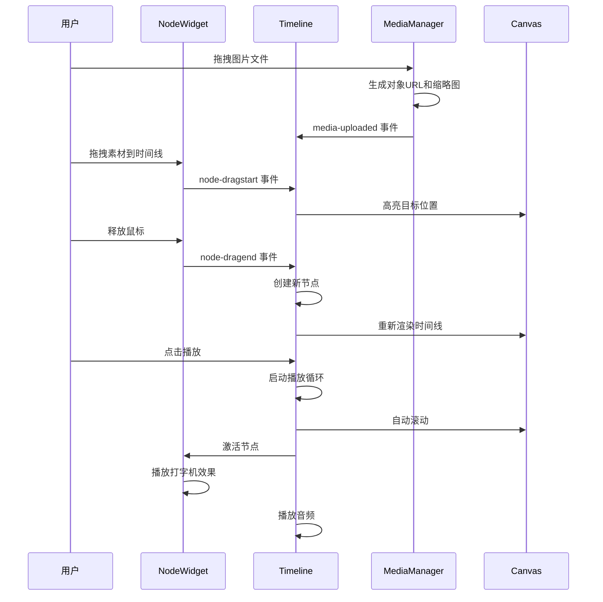

## 1. 架构设计



## 2. 技术描述

- **前端技术栈**：TypeScript + 原生 Web Components + Vite
- **核心API**：Canvas API、Web Audio API、File API、Shadow DOM
- **构建工具**：Vite 5.x
- **语言**：TypeScript 5.x（严格模式，target ES2020）
- **样式方案**：CSS 变量 + Shadow DOM 隔离样式
- **无框架依赖**：使用原生 Web Components (Custom Elements + Shadow DOM)

## 3. 文件结构

| 文件路径 | 职责 |
|---------|------|
| package.json | 项目依赖配置，启动脚本 |
| index.html | 应用入口，全屏布局 |
| vite.config.js | Vite 构建配置，端口 3005 |
| tsconfig.json | TypeScript 配置，严格模式 |
| src/timeline.ts | 时间线核心逻辑，状态管理，播放控制 |
| src/node-widget.ts | Web Component 节点组件 |
| src/media-manager.ts | 素材管理，文件上传，波形提取 |
| src/style.css | 全局样式，主题变量 |

## 4. 数据模型

### 4.1 节点数据模型 (TimelineNode)

```typescript
interface TimelineNode {
  id: string;
  timestamp: number;
  color: string;
  text: string;
  imageUrl?: string;
  audioUrl?: string;
  audioWaveform?: number[];
  duration?: number;
}
```

### 4.2 项目数据模型 (ProjectData)

```typescript
interface ProjectData {
  version: string;
  nodes: TimelineNode[];
  totalDuration: number;
  createdAt: string;
  updatedAt: string;
}
```

### 4.3 媒体素材模型 (MediaItem)

```typescript
interface MediaItem {
  id: string;
  type: 'image' | 'audio';
  name: string;
  url: string;
  thumbnail?: string;
  waveform?: number[];
  duration?: number;
}
```

## 5. 核心模块设计

### 5.1 Timeline 类 (src/timeline.ts)

- **状态管理**：节点数组、播放状态、当前时间、播放速度
- **核心方法**：
  - `addNode(node: TimelineNode): void`
  - `removeNode(id: string): void`
  - `updateNode(id: string, data: Partial<TimelineNode>): void`
  - `render(): void` - Canvas 渲染时间线、贝塞尔曲线、粒子背景
  - `play(): void` - 开始播放
  - `pause(): void` - 暂停播放
  - `seek(time: number): void` - 跳转到指定时间
  - `exportJSON(): string` - 导出 JSON
  - `importJSON(data: string): void` - 导入 JSON
- **事件回调**：onNodeClick、onPlay、onPause、onTimeUpdate

### 5.2 NodeWidget Web Component (src/node-widget.ts)

- **自定义元素**：`<node-widget>`
- **Shadow DOM**：样式隔离
- **属性**：node-id, timestamp, color, text, image-url, audio-url
- **事件**：node-dragstart、node-dragend、node-click、node-edit
- **内部渲染**：圆形节点、预览浮窗、拖拽交互、发光动画

### 5.3 MediaManager 类 (src/media-manager.ts)

- **文件上传**：处理图片/音频文件上传
- **缩略图生成**：图片自动生成缩略图
- **音频波形**：使用 Web Audio API 解析音频生成波形数据
- **素材列表**：维护已上传素材
- **事件**：media-uploaded、media-selected

## 6. 性能优化策略

### 6.1 Canvas 渲染优化
- 使用 `requestAnimationFrame` 进行 60FPS 渲染
- 离屏 Canvas 预渲染静态元素（时间线刻度、贝塞尔曲线）
- 脏矩形渲染，只重绘变化区域
- 粒子对象池复用，避免频繁 GC

### 6.2 节点交互优化
- 事件委托，统一处理节点事件
- 拖拽时使用 CSS transform 而非 DOM 重绘
- 节流/防抖处理高频事件（mousemove、scroll）

### 6.3 音频播放优化
- 预加载音频文件
- 使用 Web Audio API 进行音频解码和播放
- 音频波形数据缓存

### 6.4 性能指标
- 50 个节点时拖拽响应 < 100ms
- 播放帧率稳定 60FPS
- 内存占用 < 200MB

## 7. 交互事件流


