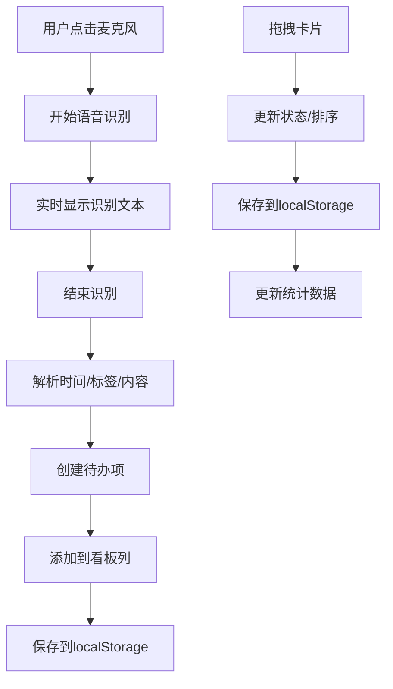

## 1. 产品概述
智能待办看板是一款基于AI语音助手的任务管理应用，用户通过语音指令快速创建、分类和追踪待办事项，同时提供可视化的进度追踪和统计分析。

- 主要用途：帮助用户通过语音快速管理日常任务，提供直观的看板视图和数据统计
- 解决的问题：传统待办应用操作繁琐，语音输入可大幅提升效率
- 目标用户：需要高效管理日常事务的职场人士、学生等
- 产品价值：语音交互+可视化看板+数据分析，打造高效、愉悦的任务管理体验

## 2. 核心功能

### 2.1 用户角色
| 角色 | 注册方式 | 核心权限 |
|------|----------|----------|
| 普通用户 | 无需注册，本地存储 | 创建、编辑、删除任务，查看统计，语音输入 |

### 2.2 功能模块
1. **语音输入模块**：麦克风按钮、语音识别、指令解析
2. **看板视图模块**：三列看板、任务卡片、拖拽排序、状态切换
3. **统计分析模块**：完成趋势图、分类饼图、标签筛选
4. **数据持久化模块**：localStorage存储、数据初始化

### 2.3 页面详情
| 页面名称 | 模块名称 | 功能描述 |
|----------|----------|----------|
| 主页面 | 左侧导航栏 | 看板/统计视图切换，毛玻璃效果，滚动固定 |
| 主页面 | 看板区域 | 三列布局（待处理/进行中/已完成），卡片渲染，拖拽交互 |
| 主页面 | 语音输入 | 浮动麦克风按钮，实时识别，指令解析反馈 |
| 统计页面 | 趋势图表 | 每日完成数量曲线图，ECharts渲染 |
| 统计页面 | 分类图表 | 任务标签分类饼图，支持交互筛选 |
| 统计页面 | 标签筛选 | 点选标签筛选看板卡片，实时过滤 |

## 3. 核心流程

### 3.1 语音创建任务流程
用户点击麦克风按钮 → 开始语音识别 → 实时显示识别文本 → 结束识别 → 系统解析时间/标签/内容 → 创建待办项 → 自动添加到对应看板列 → 显示创建成功提示

### 3.2 任务管理流程
用户查看看板 → 拖拽卡片改变状态/排序 → 数据自动保存 → 点击标签筛选 → 看板实时过滤 → 切换到统计视图 → 查看趋势和分类数据

## 4. 用户界面设计

### 4.1 设计风格
- **设计基调**：低饱和度日系清新风格，柔和、舒适、简约
- **主色调**：#D4E9E2（浅绿色），用于导航栏、按钮、重要交互元素
- **背景色**：#F7E8D0（米色），营造温暖舒适的氛围
- **字体颜色**：#333333（深灰色），保证可读性
- **卡片样式**：白色圆角卡片，柔和阴影，边框极细
- **按钮样式**：圆角矩形，hover时轻微上浮，点击有涟漪效果
- **字体**：系统无衬线字体，标题16-20px，正文14px，辅助文字12px
- **动效**：卡片拖拽弹性缩放（transform 0.2s），状态切换涟漪效果，页面元素渐入动画

### 4.2 页面设计概述
| 页面名称 | 模块名称 | UI元素 |
|----------|----------|----------|
| 主页面 | 左侧导航栏 | 半透明毛玻璃效果，240px宽，图标+文字，选中项高亮，滚动时固定 |
| 主页面 | 看板区域 | 三列等宽布局，每列有标题和计数，卡片间距16px，纵向滚动 |
| 主页面 | 任务卡片 | 标题、截止时间、标签（彩色圆角）、优先级标识，hover轻微上浮 |
| 主页面 | 语音按钮 | 右下角浮动圆形按钮，麦克风图标，录音时脉冲动画 |
| 统计页面 | 趋势图表 | 曲线图，浅绿色渐变填充，数据点高亮，X轴日期，Y轴数量 |
| 统计页面 | 分类饼图 | 环形饼图，不同颜色代表不同标签，hover显示详情 |
| 统计页面 | 标签筛选区 | 横向排列标签，选中状态有边框和背景色变化 |

### 4.3 响应式设计
- **宽屏（≥1200px）**：导航栏240px，看板三列并排，统计图表横向排列（左曲线右饼图）
- **中屏（768px-1199px）**：导航栏折叠为图标，看板三列并排，统计图表横向排列
- **窄屏（<768px）**：导航栏变为顶部标签栏，看板可横向滑动，统计图表纵向堆叠
- **触控优化**：拖拽区域扩大，按钮最小尺寸44px，滑动手势支持

### 4.4 动画与交互
- **卡片拖拽**：开始拖拽时卡片缩放1.05，阴影加深，释放时弹性回弹
- **状态切换**：卡片落入新列时显示涟漪扩散效果（从中心向外渐变透明）
- **语音输入**：麦克风按钮录音时显示呼吸灯效果，识别文字逐字显示
- **页面切换**：左侧导航切换时内容区淡入淡出（opacity 0.3s）
- **数据加载**：初次加载时骨架屏动画，数据加载后平滑过渡
