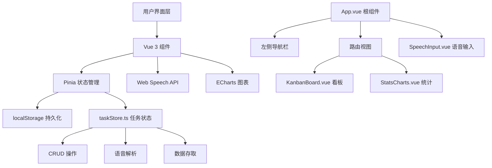

## 1. 架构设计



## 2. 技术描述

### 2.1 技术栈
- **前端框架**：Vue 3 + TypeScript
- **构建工具**：Vite 5.x
- **状态管理**：Pinia 2.x
- **路由**：Vue Router 4.x
- **图表库**：ECharts 5.x
- **ID生成**：uuid 9.x
- **语音识别**：Web Speech API（浏览器原生）

### 2.2 初始化方式
使用 Vite 的 vue-ts 模板初始化项目，然后安装所需依赖。

### 2.3 数据存储
- 所有任务数据存储在浏览器 localStorage 中
- 存储键名：`voice-todo-tasks`
- 数据格式：JSON 数组

## 3. 目录结构

```
auto4/
├── index.html
├── package.json
├── vite.config.js
├── tsconfig.json
└── src/
    ├── main.ts
    ├── App.vue
    ├── types.ts
    ├── components/
    │   ├── KanbanBoard.vue
    │   ├── SpeechInput.vue
    │   └── StatsCharts.vue
    ├── stores/
    │   └── taskStore.ts
    └── router/
        └── index.ts
```

## 4. 路由定义

| 路由 | 用途 | 组件 |
|------|------|------|
| / | 看板视图（默认） | KanbanBoard.vue |
| /stats | 统计视图 | StatsCharts.vue |

## 5. 数据模型

### 5.1 Task 接口定义

```typescript
interface Task {
  id: string;
  title: string;
  deadline: string | null;
  tags: string[];
  priority: 'low' | 'medium' | 'high';
  status: 'todo' | 'in-progress' | 'done';
  createdAt: string;
  completedAt?: string;
}
```

### 5.2 数据初始化
- 应用启动时从 localStorage 读取数据
- 若无数据，生成 5-8 条示例任务
- 每次数据变更自动同步到 localStorage

## 6. 核心模块说明

### 6.1 语音解析模块
- 调用浏览器 `webkitSpeechRecognition` API
- 解析规则：
  - 时间关键词：明天、后天、下周、X点、上午/下午/晚上
  - 标签关键词：工作、生活、购物、学习、会议等
  - 优先级关键词：重要、紧急、优先（高优先级）
- 解析失败时提示用户手动输入

### 6.2 拖拽模块
- 使用 HTML5 原生 Drag and Drop API
- 拖拽时记录源位置和目标位置
- 支持同列内排序和跨列状态切换
- 拖拽结束自动更新数据并保存

### 6.3 图表模块
- ECharts 按需引入（LineChart、PieChart）
- 趋势图：最近7天每日完成数量
- 饼图：按标签分类统计任务数量
- 图表响应式，窗口 resize 自动重绘

## 7. 性能优化

### 7.1 加载性能
- 路由懒加载
- ECharts 按需引入
- 组件级代码分割
- 目标：首屏加载 < 2秒

### 7.2 运行时性能
- 使用 Vue 3 Composition API 和响应式优化
- 虚拟滚动（长列表时）
- 拖拽操作使用 transform 而非 top/left
- 目标：滚动和拖拽保持 60fps

### 7.3 语音识别性能
- 即时识别模式（continuous: false, interimResults: true）
- 识别超时控制（最长5秒）
- 目标：响应时间 < 1.5秒

## 8. 类型安全

- TypeScript 严格模式（strict: true）
- 所有组件 props 和 emits 显式类型定义
- Store state 和 actions 完整类型注解
- target: ES2022，module: ESNext
