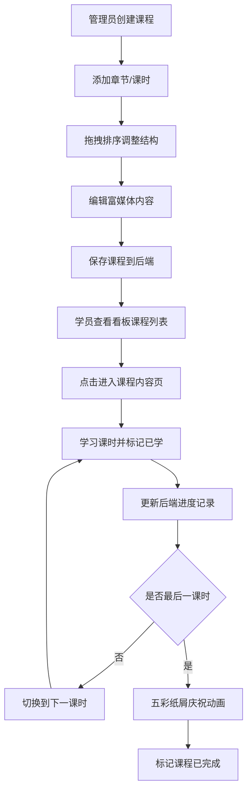

## 1. 产品概述
在线课程编辑器与学习看板应用，为企业内部培训部门提供轻量级课程创建与学习进度追踪解决方案。
- 主要目的：解决培训部门缺乏支持拖拽排序、富媒体内容编辑和学习记录输出的课程管理工具问题
- 目标用户：企业内部培训部门管理员和员工学员
- 市场价值：降低企业培训课程制作成本，提升学员学习体验与数据追踪能力

## 2. 核心功能

### 2.1 用户角色
| 角色 | 注册方式 | 核心权限 |
|------|----------|----------|
| 培训管理员 | 系统内置 | 创建/编辑/删除课程、管理章节与课时、查看学习进度 |
| 学员 | 系统内置 | 浏览课程列表、学习课时、查看个人学习进度 |

### 2.2 功能模块
1. **课程编辑器**：课程管理、章节拖拽排序、课时拖拽排序、富媒体内容编辑（文字/图片/视频）
2. **学习看板**：课程列表展示、进度条显示、最后学习时间、按时间排序
3. **课程内容页**：课时内容展示、上下课时导航、学习记录标记、完成庆祝动画
4. **响应式布局**：双栏桌面布局、上下平板布局、单栏手机布局、汉堡菜单

### 2.3 页面详情
| 页面名称 | 模块名称 | 功能描述 |
|----------|----------|----------|
| 课程编辑器 | 章节管理 | 添加/删除/展开/折叠章节（最多8个）、拖拽排序 |
| 课程编辑器 | 课时管理 | 添加/删除课时（每章最多15个）、拖拽排序 |
| 课程编辑器 | 内容编辑 | 富文本（加粗/列表）、图片URL预览（180x180缩略图、点击放大）、YouTube/Vimeo视频嵌入 |
| 学习看板 | 课程卡片 | 显示课程名称、进度条（渐变橙-绿）、课时数（如3/8）、最后学习时间戳 |
| 学习看板 | 排序功能 | 默认按最后学习时间降序排列 |
| 课程内容页 | 内容展示 | 展示当前课时的富媒体内容 |
| 课程内容页 | 导航按钮 | 上一课时/下一课时固定底部居中、淡入淡出动画 |
| 课程内容页 | 学习记录 | 点击课时标记已学、记录时间戳 |
| 课程内容页 | 完成庆祝 | 最后一课时学完后五彩纸屑动画、自动标记完成 |

## 3. 核心流程
管理员创建课程结构（章节+课时），通过拖拽调整顺序，编辑富媒体内容并保存。学员登录后在看板查看课程列表和进度，点击课程进入学习页面，依次学习各课时，系统记录学习进度和时间戳，完成全部课时后触发庆祝动画并标记课程完成。

## 4. 用户界面设计
### 4.1 设计风格
- 主色调：深色背景 #1a1a2e，强调色 #00d2ff
- 面板样式：毛玻璃效果 rgba(255,255,255,0.1)，模糊12px，边框 1px solid rgba(255,255,255,0.2)
- 文字主色：浅灰 #e0e0e0
- 按钮：悬停放大1.05倍+加亮阴影，0.2s ease-out过渡
- 进度条渐变：<40%橙色，40%-80%黄绿色，>80%绿色

### 4.2 页面设计概述
| 页面名称 | 模块名称 | UI元素 |
|----------|----------|----------|
| 课程编辑器 | 章节列表 | 16px加粗标题、拖拽手柄（左侧竖线）、展开/折叠箭头、半透明拖拽+旋转阴影 |
| 课程编辑器 | 课时列表 | 14px正常标题、拖拽手柄、内容类型图标（文字/图/视频） |
| 课程编辑器 | 内容编辑区 | 富文本工具栏、图片URL输入+180x180缩略图预览、视频嵌入区域 |
| 学习看板 | 课程卡片网格 | 卡片毛玻璃、课程名、进度条、课时数统计、时间戳标签 |
| 课程内容页 | 内容区 | 富媒体内容渲染、已学标记按钮、底部导航栏（居中） |
| 全局 | 导航栏 | 56px高度、移动端汉堡菜单折叠 |

### 4.3 响应式
- 桌面端（>=1024px）：双栏布局（左侧编辑器/看板，右侧预览/详情，可拖拽调整分栏）
- 平板端（768-1023px）：上下布局，上栏导航+列表，下栏内容区
- 手机端（<768px）：单栏全屏，汉堡菜单导航

### 4.4 性能约束
- 课程列表数据请求：<500ms
- 拖拽排序UI更新延迟：<50ms
- 富文本输入按键响应：<100ms
