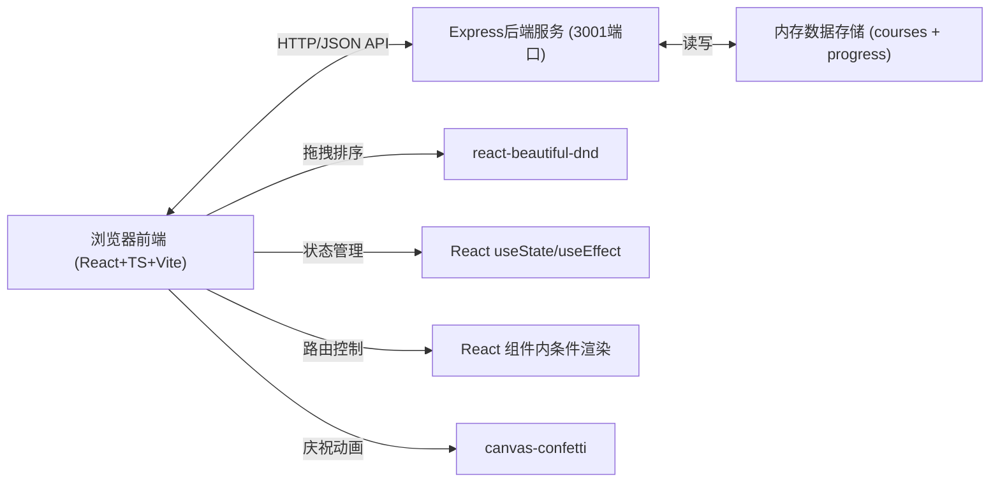
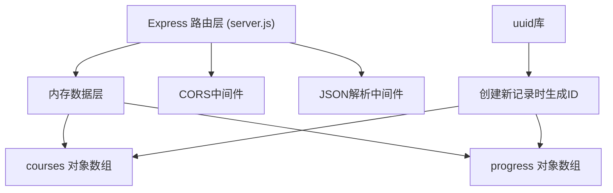
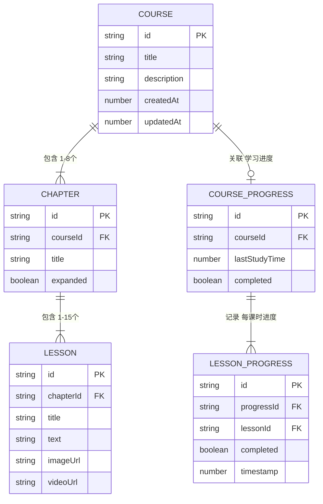

## 1. 架构设计



## 2. 技术描述
- 前端：React@18 + TypeScript@5 + Vite@5
- 初始化工具：vite-init（react-express-ts模板）
- 后端：Express@4.18，运行于3001端口
- 数据存储：内存存储（使用JS对象+uuid生成ID）
- 核心依赖：
  - react-beautiful-dnd：拖拽排序库
  - cors：跨域支持
  - uuid：ID生成
  - canvas-confetti：完成庆祝动效
  - lucide-react：图标库

## 3. 页面路由（组件内切换实现）
| 视图 | 渲染触发条件 | 组件 |
|------|--------------|------|
| 课程编辑器 | 默认视图 | CourseEditor |
| 学习看板 | 顶部导航切换 | LearningDashboard |
| 课程内容学习页 | 看板点击课程卡片 | CourseContent + LearningSession |

## 4. API 定义

### 4.1 类型定义

```typescript
interface LessonContent {
  text?: string;
  imageUrl?: string;
  videoUrl?: string;
}

interface Lesson {
  id: string;
  title: string;
  content: LessonContent;
}

interface Chapter {
  id: string;
  title: string;
  expanded: boolean;
  lessons: Lesson[];
}

interface Course {
  id: string;
  title: string;
  description: string;
  chapters: Chapter[];
  createdAt: number;
  updatedAt: number;
}

interface LessonProgress {
  lessonId: string;
  completed: boolean;
  timestamp: number;
}

interface CourseProgress {
  courseId: string;
  lessons: LessonProgress[];
  lastStudyTime: number;
  completed: boolean;
}
```

### 4.2 接口列表

| Method | Path | Purpose | Request | Response |
|--------|------|---------|---------|----------|
| GET | /api/courses | 获取所有课程列表 | - | Course[] |
| GET | /api/courses/:id | 获取单个课程详情 | - | Course |
| POST | /api/courses | 创建新课程 | {title, description, chapters} | Course |
| PUT | /api/courses/:id | 更新课程（含重排后章节/课时顺序） | Course（完整对象） | Course |
| DELETE | /api/courses/:id | 删除课程 | - | {success: true} |
| GET | /api/progress | 获取所有学习进度 | - | CourseProgress[] |
| GET | /api/progress/:courseId | 获取某课程学习进度 | - | CourseProgress |
| POST | /api/progress/:courseId/lesson/:lessonId | 标记课时已学 | - | CourseProgress |
| POST | /api/progress/:courseId/complete | 标记课程已完成 | - | CourseProgress |

## 5. 服务端架构



服务端采用单层架构（路由+内存存储），server.js集中处理所有逻辑，简单高效。

## 6. 数据模型

### 6.1 实体关系图



### 6.2 初始化数据

内存存储初始化时，预置1-2门示例课程（包含完整章节+课时结构）和对应的初始学习进度，便于立即预览功能。
