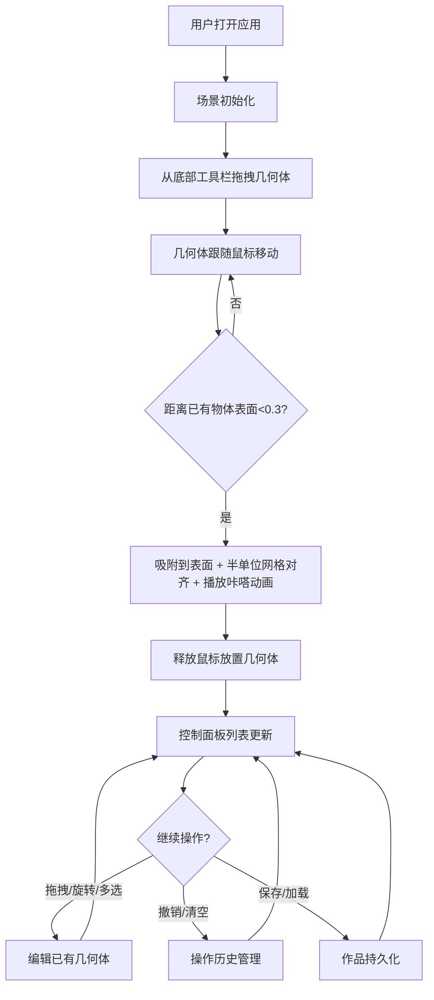

## 1. 产品概述
一款基于3D几何体的交互式乐高搭建Web应用，用户可在3D空间中通过拖拽、旋转和组合基础几何体来搭建乐高风格的模型，支持吸附对齐、撤销/重做、保存加载等功能。
- 目标用户：创意爱好者、教育场景师生、乐高/积木爱好者
- 产品价值：提供零门槛的3D创意搭建体验，无需专业建模知识即可快速构建3D作品

## 2. 核心特性

### 2.1 用户角色
无需用户注册登录，即开即用的单用户Web应用。

### 2.2 功能模块
1. **3D场景渲染**：Three.js渲染引擎，60FPS流畅运行，最多支持200个几何体
2. **几何体工具栏**：6种基础几何体（1x1立方体、2x1扁立方体、圆柱体、半圆拱、球体、楔形体），6种颜色区分
3. **交互系统**：拖拽放置、表面吸附、半单位网格对齐、几何体旋转、多选框选、删除、场景视角控制
4. **控制面板**：几何体列表管理、一键清空、撤销操作（最多30步）、高亮选中
5. **持久化**：作品保存与加载（本地存储）

### 2.3 页面详情
| 页面名称 | 模块名称 | 功能描述 |
|-----------|-------------|---------------------|
| 主页面 | 3D场景区域 | Three.js渲染画布，展示搭建场景，支持视角旋转、几何体拖拽交互 |
| 主页面 | 底部几何体工具栏 | 6种几何体拖拽源，显示类型图标和颜色标识 |
| 主页面 | 左侧控制面板 | 几何体列表、操作按钮（清空/撤销）、作品保存/加载 |
| 主页面 | 吸附反馈系统 | 吸附时"咔嗒"缩放动画、高亮提示、网格对齐线 |

## 3. 核心流程

### 3.1 主要用户流程
用户打开应用 → 从底部工具栏拖拽几何体 → 几何体在场景中跟随鼠标 → 靠近已有物体时自动吸附（距离<0.3单位）→ 吸附时播放缩放动画并对齐半单位网格 → 释放鼠标完成放置 → 可左键拖拽调整位置/右键旋转/Shift多选 → 左侧控制面板实时更新几何体列表 → 可随时撤销、清空或保存作品

## 4. 用户界面设计

### 4.1 设计风格
- **主色调**：深色科幻风，背景 `#1a1a2e`
- **强调色**：发光蓝色 `#00d4ff`（操作按钮、交互高亮）
- **几何体颜色**：红、蓝、绿、黄、紫、橙（饱和度适中）
- **控制面板**：半透明毛玻璃效果（backdrop-filter: blur）
- **布局**：左右布局（左侧控制面板 + 右侧3D场景 + 底部工具栏）
- **字体**：现代无衬线字体（如JetBrains Mono或Orbitron科幻风格）

### 4.2 页面设计概览
| 页面名称 | 模块名称 | UI元素 |
|-----------|-------------|-------------|
| 主页面 | 3D场景 | 全屏深色背景、网格辅助线、柔和环境光 + 方向光、选中几何体白色加粗描边 |
| 主页面 | 底部工具栏 | 6个几何体卡片（图标+名称+颜色）、拖拽提示、hover发光效果 |
| 主页面 | 左侧控制面板 | 毛玻璃半透明面板、几何体列表（按时间排序，类型图标+颜色圆点）、操作按钮组（撤销/清空）、保存加载按钮 |
| 主页面 | 动画效果 | 吸附时几何体缩放弹回（ease-out 0.2s）、拖拽弹性缓动、按钮hover发光、列表项高亮联动 |

### 4.3 响应式设计
- **桌面端（≥768px）**：左侧控制面板固定宽度（280px），右侧场景自适应，底部工具栏水平排列
- **移动端（<768px）**：控制面板折叠为底部抽屉，点击展开，底部工具栏改为可横向滚动
- **触摸优化**：支持触摸拖拽放置、双指旋转视角、长按选中

### 4.4 3D场景设计指引
- **环境**：纯深色背景 `#1a1a2e`，无HDRI，配半透明网格地面
- **灯光**：AmbientLight（强度0.5）+ DirectionalLight（强度0.8，带柔和阴影）+ HemisphereLight补光
- **相机**：PerspectiveCamera，fov 50，初始位置(8, 8, 8)，看向原点
- **交互**：OrbitControls控制视角（禁用平移，仅旋转缩放），拖拽几何体时暂停视角控制
- **后处理**：轻微Bloom效果让选中描边发光，几何体材质带适度金属感和粗糙度
- **性能**：几何体共享Geometry实例，使用InstancedMesh优化相同类型几何体渲染
