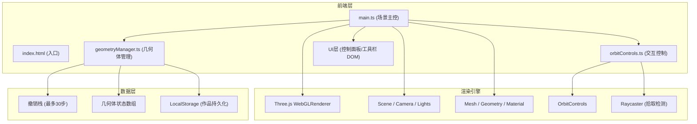

## 1. 架构设计



## 2. 技术栈说明
- **前端框架**：原生 TypeScript（无React/Vue，用户明确要求）
- **3D引擎**：Three.js ^0.160.0
- **构建工具**：Vite ^5.0.0
- **类型系统**：TypeScript ^5.3.0（strict模式，target ES2020，moduleResolution bundler）
- **类型定义**：@types/three ^0.160.0
- **样式方案**：原生CSS（CSS变量 + backdrop-filter毛玻璃）

## 3. 文件结构
```
auto42/
├── index.html              # 入口HTML，含Canvas容器、控制面板、底部工具栏占位
├── package.json            # 依赖和脚本配置
├── vite.config.js          # Vite构建配置
├── tsconfig.json           # TypeScript严格模式配置
└── src/
    ├── main.ts             # 场景初始化、渲染循环、事件协调、UI加载
    ├── geometryManager.ts  # 几何体工厂、吸附算法、状态管理、撤销栈、持久化
    └── orbitControls.ts    # OrbitControls封装、拖拽旋转、Shift框选、事件导出
```

## 4. 核心数据结构

### 4.1 几何体类型定义
```typescript
enum GeometryType {
  CUBE_1x1 = 'cube_1x1',       // 1x1立方体
  CUBE_2x1 = 'cube_2x1',       // 2x1扁立方体
  CYLINDER = 'cylinder',       // 圆柱体
  HALF_ARCH = 'half_arch',     // 半圆拱
  SPHERE = 'sphere',           // 球体
  WEDGE = 'wedge',             // 楔形体
}

enum GeometryColor {
  RED = '#e74c3c',
  BLUE = '#3498db',
  GREEN = '#2ecc71',
  YELLOW = '#f1c40f',
  PURPLE = '#9b59b6',
  ORANGE = '#e67e22',
}

interface LegoGeometry {
  id: string;
  type: GeometryType;
  color: GeometryColor;
  position: { x: number; y: number; z: number };
  rotation: { x: number; y: number; z: number }; // 弧度
  mesh: THREE.Mesh;              // Three.js网格实例
  edges: THREE.LineSegments;     // 边线（用于选中高亮）
}

interface Snapshot {
  geometries: Array<Omit<LegoGeometry, 'mesh' | 'edges'>>;
}
```

### 4.2 吸附算法
- **射线检测**：Raycaster从鼠标位置向场景发射，获取最近交点
- **距离阈值**：交点距离 < 0.3 单位时触发吸附
- **半单位对齐**：`Math.round(value * 2) / 2` 将坐标吸附到0.5单位网格
- **法线偏移**：沿交点法线方向偏移半个几何体尺寸，避免穿透

## 5. 事件流设计

| 事件 | 触发源 | 处理模块 | 行为 |
|------|--------|----------|------|
| mousedown (工具栏) | DOM | main.ts | 创建拖拽ghost几何体，开始拖拽流程 |
| mousemove | DOM | orbitControls.ts → main.ts | 更新ghost位置，检测吸附，播放动画 |
| mouseup | DOM | main.ts | 确认放置，推入撤销栈，更新UI列表 |
| mousedown (几何体) | Raycaster | geometryManager.ts | 选中高亮，开始拖拽移动 |
| contextmenu | DOM | geometryManager.ts | 选中几何体Y轴旋转90° |
| wheel | DOM | orbitControls.ts | 缩放场景视角 |
| Shift + mousedown | DOM | orbitControls.ts | 开始框选，绘制选择框 |
| Shift + mouseup | DOM | geometryManager.ts | 批量选中框内几何体 |
| Delete/Backspace | DOM | geometryManager.ts | 删除选中几何体，推入撤销栈 |
| click (列表项) | DOM | main.ts | 高亮对应场景几何体 |
| click (撤销) | DOM | geometryManager.ts | 弹出撤销栈快照，恢复场景 |
| click (清空) | DOM | geometryManager.ts | 清空所有几何体，推入撤销栈 |

## 6. 性能优化策略
1. **Geometry复用**：同类型几何体共享同一个BufferGeometry实例
2. **材质池**：预创建6种颜色×6种类型的MeshStandardMaterial池，避免重复创建
3. **渲染优化**：OrbitControls改变时才标记needsUpdate，静态帧减少重绘
4. **Raycaster优化**：仅在mousedown/mousemove时执行拾取，闲置时暂停
5. **边线优化**：仅选中几何体显示LineSegments，未选中隐藏，减少Draw Call
6. **上限控制**：硬限制200个几何体，超出时拒绝放置并提示
