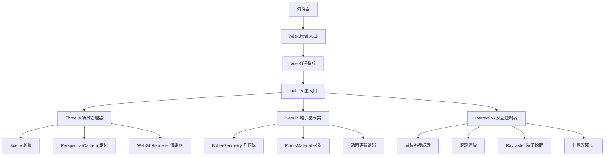

## 1. 架构设计



## 2. 技术描述
- **前端框架**：纯 TypeScript (无框架) + Three.js
- **构建工具**：Vite 5.x
- **开发语言**：TypeScript 5.x (strict模式, target ES2020)
- **3D引擎**：Three.js (原生Three.js而非React封装)
- **UI方案**：原生 DOM + CSS (毛玻璃效果使用 backdrop-filter)

## 3. 文件结构
| 路径 | 用途 |
|-------|---------|
| `package.json` | 项目依赖与脚本 (three, typescript, vite, @types/three) |
| `vite.config.js` | Vite 构建配置 (端口3000, index.html入口) |
| `tsconfig.json` | TypeScript 配置 (strict, ES2020, bundler) |
| `index.html` | 入口页面 (全屏Canvas, 加载动画, 样式) |
| `src/main.ts` | 主入口 (初始化场景/相机/渲染器, 动画循环, UI管理) |
| `src/nebula.ts` | Nebula 粒子星云类 (粒子生成/位置/颜色/动画/销毁) |
| `src/interaction.ts` | Interaction 交互控制模块 (拖拽/缩放/悬停/点击/Raycaster) |

## 4. 核心类与接口定义

```typescript
// src/nebula.ts 核心接口
interface ParticleData {
  index: number;
  position: { x: number; y: number; z: number };
  baseColor: { r: number; g: number; b: number };
  nextColor: { r: number; g: number; b: number };
  size: number;
  waveAmplitude: number;
  wavePeriod: number;
  waveOffset: number;
  colorPeriod: number;
  colorOffset: number;
  alphaPeriod: number;
  alphaOffset: number;
}

class Nebula {
  particleCount: number;
  points: THREE.Points;
  geometry: THREE.BufferGeometry;
  material: THREE.PointsMaterial;
  
  constructor(count: number);
  generatePoissonDisc(minRadius: number, maxRadius: number): Float32Array;
  update(deltaTime: number, elapsedTime: number, rotationSpeed: number, sizeScale: number): void;
  getParticleInfo(index: number): ParticleData | null;
  getNeighborhoodStats(index: number, radius: number): { avgColor: string; density: number };
  dispose(): void;
}

// src/interaction.ts 核心接口
interface HoveredParticle {
  index: number;
  data: ParticleData;
}

class Interaction {
  scene: THREE.Scene;
  camera: THREE.PerspectiveCamera;
  renderer: THREE.WebGLRenderer;
  nebula: Nebula;
  raycaster: THREE.Raycaster;
  
  rotationSpeed: number;
  sizeScale: number;
  
  onRotationChange?: (speed: number) => void;
  onSizeChange?: (scale: number) => void;
  onReset?: () => void;
  
  constructor(scene, camera, renderer, nebula);
  updateCameraTarget(theta: number, phi: number, distance: number): void;
  handleMouseMove(event: MouseEvent): void;
  handleMouseDown(event: MouseEvent): void;
  handleMouseUp(event: MouseEvent): void;
  handleWheel(event: WheelEvent): void;
  handleClick(event: MouseEvent): void;
  pickParticle(event: MouseEvent): number | null;
  showTooltip(x: number, y: number, content: string): void;
  hideTooltip(): void;
  bindPanelDrag(panel: HTMLElement, titleBar: HTMLElement): void;
}
```

## 5. 性能优化策略
- **批量数据生成**：使用 Float32Array 存储位置、颜色、大小等顶点属性
- **BufferAttribute**：使用 BufferGeometry + BufferAttribute，避免每帧重建几何体
- **增量更新**：每帧仅更新 attribute.array 内容，标记 needsUpdate = true
- **PointsMaterial**：使用透明 + AdditiveBlending 混合模式减少绘制调用
- **Raycaster 优化**：仅在需要时执行拾取，限制拾取频率
- **泊松盘采样**：预生成分布位置，避免运行时计算

## 6. 颜色预设
```typescript
const COLOR_PALETTE = [
  { r: 0.388, g: 0.400, b: 0.945 }, // 蓝紫 #6366f1
  { r: 0.925, g: 0.282, b: 0.600 }, // 粉红 #ec4899
  { r: 0.078, g: 0.722, b: 0.651 }, // 青绿 #14b8a6
  { r: 0.961, g: 0.620, b: 0.043 }, // 橙黄 #f59e0b
  { r: 0.886, g: 0.910, b: 0.941 }, // 银白 #e2e8f0
];
```
