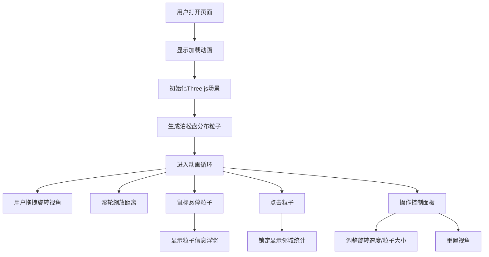

## 1. 产品概述
3D粒子星云画廊展示应用，让用户通过交互方式沉浸式漫游动态彩色粒子构成的梦幻宇宙场景。
- 主要目的：提供一个视觉震撼的3D粒子星云交互展示，支持用户自由探索和查看粒子信息
- 目标用户：对视觉艺术、3D交互、宇宙主题感兴趣的普通用户
- 产品价值：提供沉浸式的3D视觉体验，展示高性能WebGL粒子渲染技术

## 2. 核心特性

### 2.1 功能模块
1. **3D粒子星云渲染**：高性能粒子系统，支持20000+动态彩色粒子
2. **视角交互控制**：鼠标拖拽旋转、滚轮缩放、悬停信息显示
3. **粒子详情查询**：悬停显示单个粒子信息，点击锁定查看邻域统计
4. **控制面板**：可拖拽、可折叠的参数调节面板
5. **性能监控**：实时FPS计数器

### 2.2 页面详情
| 页面名称 | 模块名称 | 功能描述 |
|-----------|-------------|---------------------|
| 主页面 | 3D星云场景 | 全屏渲染动态粒子星云，包含雾效增强深度感 |
| 主页面 | FPS计数器 | 左下角固定显示，实时更新帧率 |
| 主页面 | 控制面板 | 右下角可拖拽折叠，调节旋转速度、粒子大小、重置视角 |
| 主页面 | 粒子信息浮窗 | 悬停粒子显示详情，点击锁定显示邻域信息 |
| 主页面 | 加载动画 | 初始化时显示加载状态 |

## 3. 核心流程
用户打开页面后看到加载动画，粒子星云初始化完成后自动开始动画。用户可通过鼠标拖拽旋转视角、滚轮缩放距离、悬停查看单个粒子信息、点击粒子锁定查看邻域统计数据、通过控制面板调整参数。

## 4. 用户界面设计

### 4.1 设计风格
- **主色调**：深空黑 (#000011) 作为背景，营造宇宙氛围
- **粒子色谱**：蓝紫 (#6366f1)、粉红 (#ec4899)、青绿 (#14b8a6)、橙黄 (#f59e0b)、银白 (#e2e8f0)
- **UI风格**：半透明毛玻璃效果 (backdrop-filter: blur(10px)、rgba(255,255,255,0.1))
- **圆角**：控制面板/浮窗 12px、FPS计数器 8px
- **字体**：系统无衬线字体、浅灰色文字
- **视觉效果**：场景雾效 (近端50、远端200)、粒子呼吸闪烁、颜色渐变

### 4.2 页面设计概述
| 页面名称 | 模块名称 | UI元素 |
|-----------|-------------|-------------|
| 主页面 | 3D星云场景 | 全屏Canvas、黑色背景、动态彩色粒子、缓慢自转、正弦波动、雾效 |
| 主页面 | FPS计数器 | 左下角固定、白色半透明背景、圆角8px、14px字体、实时更新 |
| 主页面 | 控制面板 | 右下角定位、可拖拽标题栏(32px)、可折叠内容、毛玻璃效果、包含粒子数量显示、速度滑块、大小滑块、重置按钮 |
| 主页面 | 粒子信息浮窗 | 跟随鼠标、半透明毛玻璃、圆角12px、白色12px字体、显示坐标/颜色/序号/邻域统计 |
| 主页面 | 加载动画 | 居中显示、旋转动画、提示文字 |

### 4.3 响应式
- 桌面端优先、全屏自适应窗口大小
- Canvas自动适配视口尺寸变化
- 控制面板最小尺寸保证可用性

### 4.4 3D场景指导
- **环境**：纯黑背景 (#000011) + 雾效 (FogExp2 或 Fog)
- **光照**：粒子使用自发光材质、无需额外光源
- **相机**：PerspectiveCamera、初始距离80、视角范围 20-200
- **组合**：以场景中心为旋转中心、粒子分布在球壳区域 (半径50-100)
- **交互**：OrbitControls风格自定义交互、Raycaster粒子拾取
- **后处理**：通过粒子透明度和混合模式营造发光效果
- **性能**：BufferAttribute批量更新、PointsMaterial、避免每帧重建几何体
