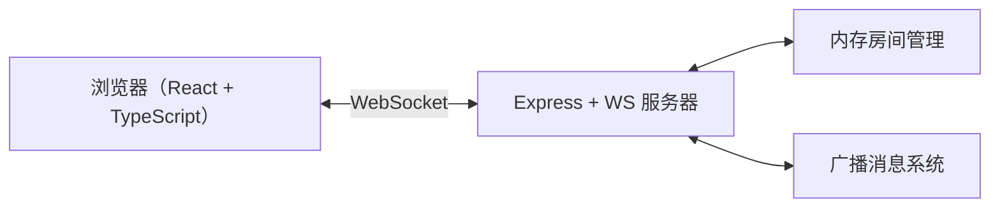
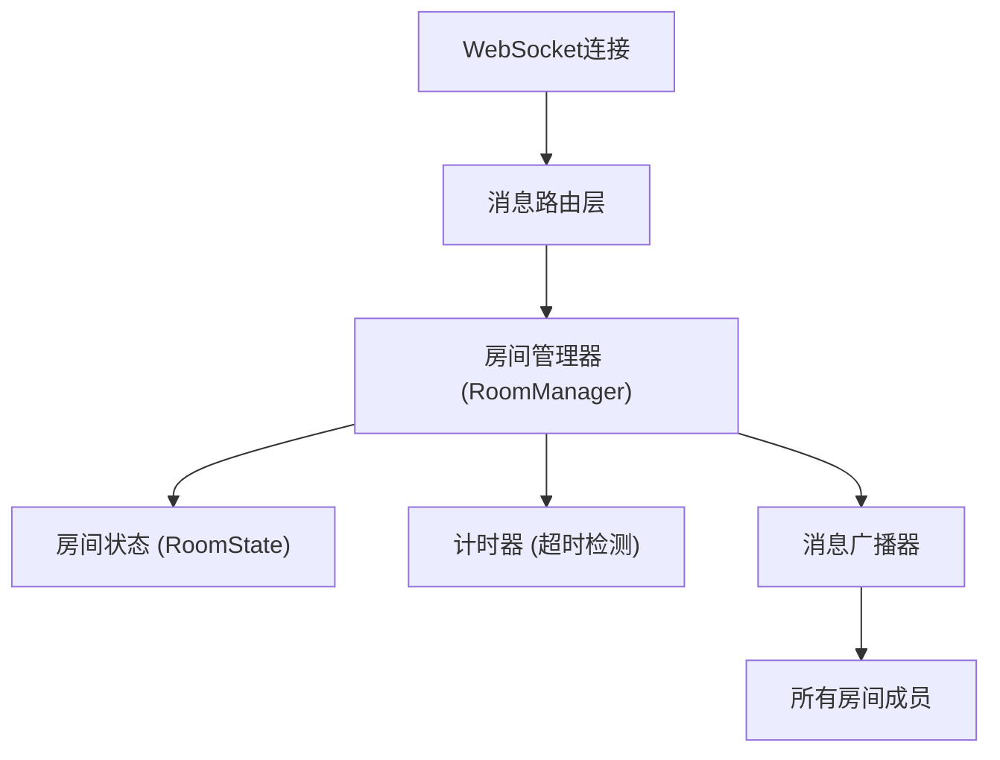
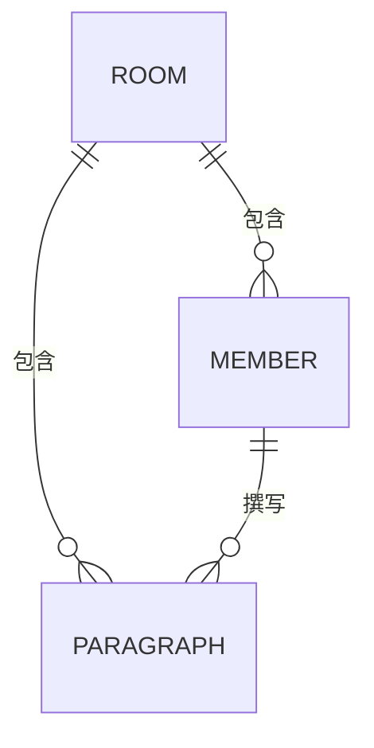

## 1. 架构设计



## 2. 技术说明

- **前端**：React@18 + TypeScript + Vite
- **后端**：Express@4 + ws（WebSocket库）+ cors + uuid
- **初始化工具**：Vite（react-ts模板）
- **数据存储**：内存存储（房间状态、成员信息、段落数据）

## 3. 路由定义

| 路由 | 用途 |
|-----|-----|
| / | 首页（房间列表+创建/加入房间表单） |
| /room/:id | 写作房间页 |
| /story/:id | 完整故事展示页 |

## 4. API / WebSocket 消息定义

### 4.1 REST API

| 方法 | 路径 | 描述 |
|-----|------|-----|
| GET | /api/rooms | 获取所有房间列表 |
| POST | /api/rooms | 创建新房间 |
| GET | /api/rooms/:id | 获取房间详情 |

### 4.2 WebSocket 消息

```typescript
// 客户端发送
type ClientMessage =
  | { type: 'join'; roomId: string; nickname: string }
  | { type: 'submit'; roomId: string; content: string }
  | { type: 'ping' }

// 服务器发送
type ServerMessage =
  | { type: 'roomState'; state: RoomState }
  | { type: 'memberJoined'; member: Member }
  | { type: 'memberLeft'; memberId: string }
  | { type: 'turnChanged'; currentWriterId: string; deadline: number }
  | { type: 'paragraphSubmitted'; paragraph: Paragraph }
  | { type: 'storyComplete'; story: Story }
  | { type: 'memberSkipped'; memberId: string; reason: string }
  | { type: 'error'; message: string }
```

## 5. 服务器架构



## 6. 数据模型

### 6.1 数据模型定义



```typescript
interface Member {
  id: string
  nickname: string
  color: string
  avatar?: string
  joinedAt: number
}

interface Paragraph {
  id: string
  memberId: string
  content: string
  round: number
  submittedAt: number
}

interface RoomState {
  id: string
  name: string
  members: Member[]
  paragraphs: Paragraph[]
  currentWriterIndex: number
  currentRound: number
  totalRounds: number
  maxMembers: number
  status: 'waiting' | 'writing' | 'completed'
  turnDeadline?: number
  createdAt: number
}
```

### 6.2 核心常量

- 最大成员数：6
- 总轮次数：3
- 每段最少字数：100
- 每段最多字数：500
- 每轮超时时间：5分钟（300000ms）
- 颜色调色板：`['#FFD6E0', '#D4E6F1', '#D5F5E3', '#E8DAEF', '#FADBD8', '#FEF9E7']`

## 7. 项目文件结构

```
auto45/
├── package.json
├── index.html
├── vite.config.js
├── tsconfig.json
├── server/
│   └── server.ts          (Express + WebSocket 服务器)
└── src/
    ├── App.tsx            (主组件，路由+WebSocket管理)
    ├── main.tsx           (入口)
    └── components/
        ├── Editor.tsx     (写作区组件)
        └── StoryView.tsx  (故事展示组件)
```
