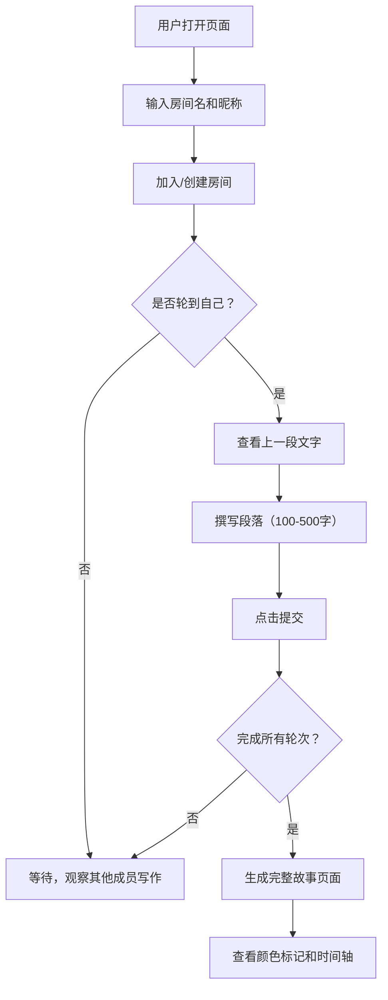

## 1. 产品概述

团队故事接龙创作应用，让多名团队成员轮流在同一故事上添加段落，每次仅能看到上一人的文字（盲写模式），最终生成完整协作故事并展示颜色标记和时间轴。

- **主要用途**：团队创意协作、破冰游戏、集体创作
- **目标用户**：创意团队、教育工作者、朋友聚会
- **市场价值**：提供趣味性强的远程协作创作体验

## 2. 核心特性

### 2.1 用户角色

| 角色 | 注册方式 | 核心权限 |
|------|---------|---------|
| 普通用户 | 输入昵称加入房间 | 创建/加入房间、撰写段落、查看故事 |

### 2.2 功能模块

1. **首页/房间列表页**：房间创建、房间列表、实时状态展示
2. **写作房间页**：写作区域、上一段展示、字数统计、轮次显示、当前写作者提示
3. **故事展示页**：完整故事、颜色高亮、时间轴交互、贡献者信息

### 2.3 页面详情

| 页面名称 | 模块名称 | 功能描述 |
|---------|---------|---------|
| 首页 | 房间创建表单 | 输入房间名和昵称，点击创建或加入 |
| 首页 | 房间列表卡片 | 展示房间名、人数、状态，悬停上浮效果 |
| 写作房间 | 顶部状态栏 | 显示当前轮到谁（头像+昵称）、当前轮次、房间成员 |
| 写作房间 | 上一段展示区 | 展示上一位成员写的文字（最多500字），纸张纹理背景 |
| 写作房间 | 写作输入区 | 文本框（100-500字），实时字数统计，提交按钮 |
| 写作房间 | 倒计时提示 | 5分钟超时提醒，超时自动跳过 |
| 故事展示页 | 故事正文区 | 完整故事，不同成员文字用不同颜色高亮 |
| 故事展示页 | 时间轴 | 纵向排列各段落，悬停高亮对应正文段落并放大 |

## 3. 核心流程

用户打开页面 → 输入房间名和昵称 → 加入房间 → 等待轮到自己 → 看到上一段文字 → 撰写段落（100-500字）→ 提交 → 等待其他成员 → 完成所有轮次 → 查看完整故事（颜色标记+时间轴）

## 4. 用户界面设计

### 4.1 设计风格

- **主色调**：浅米色背景 #F5F0E8，深灰文字 #2C2C2C
- **颜色调色板**：6种柔和色用于成员文字高亮（浅粉、浅蓝、浅绿、浅紫、浅橙、浅黄）
- **按钮风格**：圆角小标签样式，点击有纸页翻转动画（0.4秒卡片翻转效果）
- **字体**：手写风格字体，正文区域模拟纸张纹理（CSS渐变）
- **布局风格**：卡片式布局，房间卡片带轻微投影和悬停上浮
- **图标**：简洁线条图标，搭配手写风格

### 4.2 页面设计概览

| 页面名称 | 模块名称 | UI元素 |
|---------|---------|---------|
| 首页 | Hero区域 | 手写风格大标题、简短介绍 |
| 首页 | 创建表单 | 两个输入框（房间名、昵称）、圆角提交按钮 |
| 首页 | 房间列表 | 卡片网格，每张卡片带投影、悬停上浮3px |
| 写作房间 | 顶部状态栏 | 成员头像横排、当前写作者高亮、轮次显示 |
| 写作房间 | 上一段展示 | 纸张背景卡片、柔和边框、上一位作者信息 |
| 写作房间 | 输入区 | 白色文本框、底部字数统计、提交按钮 |
| 故事展示页 | 正文区 | 两栏布局，左侧故事正文，右侧时间轴 |
| 故事展示页 | 时间轴 | 纵向线条、圆点标记、悬停放大效果 |

### 4.3 响应式

桌面优先设计，移动端自适应布局。写作区和故事展示页在小屏幕上单栏排列。

### 4.4 交互动效

- 提交按钮：点击后纸页翻转效果（CSS 3D transform，0.4秒）
- 房间卡片：hover时上浮3px，阴影加深
- 时间轴：hover对应段落时，正文高亮+轻微放大
- 成员加入/提交：实时更新，淡入动画
