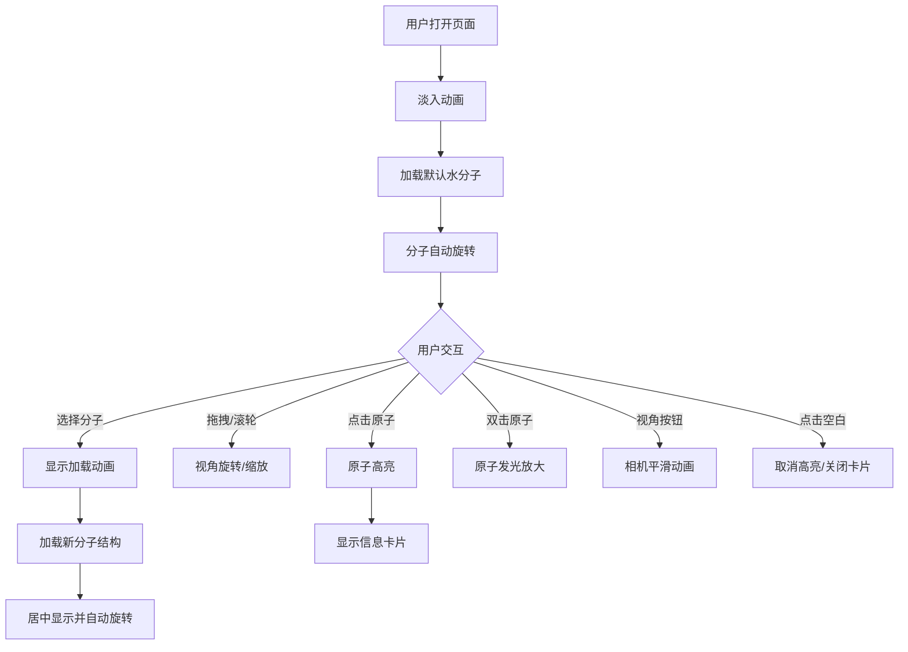

## 1. 产品概述

基于Web的3D分子结构可视化与交互编辑器，让用户直观地从预设分子库中选择并探索分子的三维空间结构。面向化学学习者、研究人员和教育工作者，提供沉浸式的分子结构交互体验。

- 核心价值：将抽象的分子结构转化为可交互的3D可视化内容，提升化学学习与研究的效率
- 目标用户：化学学生、教师、科研人员、科普爱好者

## 2. 核心特性

### 2.1 功能模块

1. **分子选择模块**：下拉菜单选择预设分子（水H₂O、甲烷CH₄、苯C₆H₆）
2. **3D分子渲染模块**：原子球体+化学键圆柱体的高质量3D渲染
3. **视角交互模块**：拖拽旋转、滚轮缩放、双击高亮、视角快捷按钮
4. **原子信息卡片模块**：点击原子显示元素信息和化学键属性
5. **状态显示模块**：底部化学式和统计信息栏

### 2.2 页面详情

| 页面名称 | 模块名称 | 功能描述 |
|-----------|-------------|---------------------|
| 主页面 | 分子选择下拉菜单 | 顶部左侧，选择预设分子，切换时显示加载动画 |
| 主页面 | 视角快捷按钮 | 顶部右侧三个按钮：俯视、正视、侧视，平滑过渡动画 |
| 主页面 | 3D场景区域 | 全屏Three.js场景，支持拖拽旋转、滚轮缩放、自动旋转 |
| 主页面 | 原子信息卡片 | 右下角悬浮卡片，显示元素名、原子序数、半径、配位数 |
| 主页面 | 底部信息栏 | 显示化学式、总原子数、总键数 |

## 3. 核心流程

```
用户打开页面
    → 显示淡入加载动画
    → 默认加载水分子3D结构
    → 分子自动缓慢旋转
用户操作流程：
    选择分子 → 显示旋转加载动画 → 加载完成居中显示新分子
    拖拽场景 → 视角自由旋转（带阻尼效果）
    滚轮滚动 → 缩放场景（0.5-10单位范围）
    单击原子 → 高亮原子 + 显示信息卡片
    双击原子 → 原子发光放大 + 信息卡片更新
    点击视角按钮 → 相机动画平滑切换到对应视角
    点击空白处 → 取消高亮 + 关闭信息卡片
```



## 4. 用户界面设计

### 4.1 设计风格

- **主色调**：深蓝背景 `#0B1020`，营造科技感深空氛围
- **高亮色**：翠绿 `#00FF88`，用于原子高亮和交互反馈
- **原子色（CPK标准）**：碳灰 `#909090`、氢白 `#FFFFFF`、氧红 `#FF0000`
- **化学键色**：灰色半透明（单键）、蓝色（苯双键）、绿色（苯单键）
- **UI元素**：深灰半透明 `rgba(30, 35, 50, 0.85)`，毛玻璃效果
- **圆角**：所有UI元素8px圆角
- **阴影**：微妙的阴影增强层次感
- **字体**：UI使用现代无衬线，统计信息使用等宽字体monospace

### 4.2 页面设计概览

| 页面名称 | 模块名称 | UI元素 |
|-----------|-------------|-------------|
| 主页面 | 分子选择下拉 | 深灰渐变背景、8px圆角、悬停高亮、展开淡入0.3s |
| 主页面 | 视角快捷按钮 | 深灰渐变、图标+文字、点击反馈、过渡1s平滑动画 |
| 主页面 | 3D场景 | 全屏覆盖、深蓝渐变背景、环境光+方向光+软阴影 |
| 主页面 | 信息卡片 | 毛玻璃0.85透明、圆角、阴影、标题翠绿渐变 |
| 主页面 | 底部信息栏 | 半透明深色条、等宽字体、浅灰16px、淡入淡出 |
| 主页面 | 加载动画 | 小分子球体环绕旋转环、居中显示、旋转循环 |

### 4.3 响应式设计

- Desktop-first设计，全屏3D场景
- 下拉菜单和按钮在小屏幕上自适应堆叠
- 信息卡片在移动端调整位置避免遮挡

### 4.4 3D场景指导

- **环境/氛围**：深蓝色渐变背景，轻微星空粒子效果增强深空感
- **光照设置**：环境光（0.4强度）+ 方向光（0.8强度，软阴影）+ 半球光（天空/地面色）
- **相机设置**：PerspectiveCamera，fov 60，初始距离5单位，OrbitControls带阻尼0.1
- **构图与焦点**：分子始终居中，自动旋转展示多角度
- **交互与动画**：自动旋转0.5°/s，视角切换缓动，原子高亮缩放动画0.5s ease-in-out
- **后处理**：原子发光效果（OutlinePass或自定义边缘发光），轻微Bloom
- **性能预算**：原子数≤20，几何体总数≤200，使用InstancedMesh优化，帧率稳定60FPS
