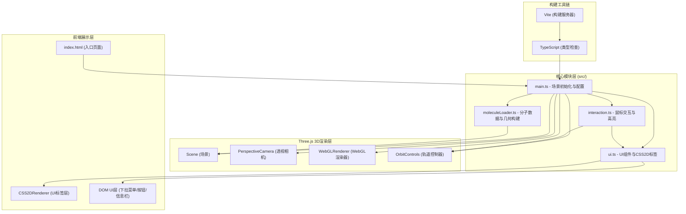

## 1. 架构设计



## 2. 技术选型

- **前端框架**：原生 TypeScript（用户明确指定，不使用React/Vue）
- **3D引擎**：Three.js ^0.160.0
- **类型定义**：@types/three ^0.160.0
- **构建工具**：Vite ^5.0.0
- **开发语言**：TypeScript ^5.3.0（严格模式，target ES2020）
- **UI渲染**：原生DOM + Three.js CSS2DRenderer

## 3. 项目文件结构

```
auto46/
├── .trae/documents/
│   ├── PRD.md
│   └── tech-architecture.md
├── package.json           # 依赖配置: three, typescript, vite, @types/three
├── index.html             # 入口页面, 全屏深蓝背景, 淡入加载动画
├── vite.config.js         # Vite配置, 端口3000, index.html入口
├── tsconfig.json          # TS配置, strict: true, target: ES2020
└── src/
    ├── main.ts            # 场景/相机/渲染器/控制器初始化与导出
    ├── moleculeLoader.ts  # 分子数据接口, 预设分子, 原子/键几何构建
    ├── interaction.ts     # 射线拾取, 原子高亮, 点击交互
    └── ui.ts              # 下拉菜单, 视角按钮, 信息卡片, 底部栏
```

## 4. 核心数据结构定义

### 4.1 分子数据接口

```typescript
// 元素类型
export type ElementType = 'C' | 'H' | 'O' | 'N' | 'S';

// 元素信息
export interface ElementInfo {
  name: string;           // 中文名称
  atomicNumber: number;   // 原子序数
  atomicRadius: number;   // 原子半径 (pm)
  cpkColor: number;       // CPK颜色
  displayRadius: number;  // 显示半径 (3D单位)
}

// 原子数据
export interface AtomData {
  id: string;
  element: ElementType;
  position: [number, number, number];  // [x, y, z]
}

// 化学键类型
export type BondType = 'single' | 'double' | 'triple' | 'aromatic';

// 化学键数据
export interface BondData {
  atom1Id: string;
  atom2Id: string;
  type: BondType;
}

// 分子定义
export interface MoleculeData {
  id: string;
  name: string;           // 中文名称
  formula: string;        // 化学式
  atoms: AtomData[];
  bonds: BondData[];
}

// 构建结果
export interface MoleculeGroup {
  atomGroup: THREE.Group;      // 包含所有原子球体
  bondGroup: THREE.Group;      // 包含所有化学键圆柱体
  atomMap: Map<string, THREE.Mesh>;  // id -> 原子Mesh映射
  bondCount: number;
  atomCount: number;
}
```

### 4.2 元素CPK标准颜色映射

| 元素 | 颜色(十六进制) | 显示半径 |
|------|--------------|---------|
| 碳(C) | 0x909090 (灰) | 0.4 |
| 氢(H) | 0xFFFFFF (白) | 0.2 |
| 氧(O) | 0xFF4444 (红) | 0.35 |
| 氮(N) | 0x3050F8 (蓝) | 0.35 |

## 5. 预设分子三维坐标数据

### 5.1 水分子 (H₂O) - 键角104.5°
- O: [0, 0, 0]
- H1: [0.757, 0.586, 0]
- H2: [-0.757, 0.586, 0]
- 键: O-H1 (单键), O-H2 (单键)

### 5.2 甲烷 (CH₄) - 正四面体结构
- C: [0, 0, 0]
- H1: [0.629, 0.629, 0.629]
- H2: [-0.629, -0.629, 0.629]
- H3: [-0.629, 0.629, -0.629]
- H4: [0.629, -0.629, -0.629]
- 键: C-H×4 (单键)

### 5.3 苯 (C₆H₆) - 平面六边形
- 碳原子环: 半径1.39Å的六边形, z=0平面
- 氢原子: 向外延伸1.09Å, 共平面
- 键: C-C 交替单/双键 (芳香环), C-H 单键×6

## 6. 关键模块职责

| 模块文件 | 职责 | 导出内容 |
|---------|------|---------|
| main.ts | Three.js环境搭建: Scene, Camera, WebGLRenderer, OrbitControls, 光照, 动画循环, 窗口resize处理 | scene, camera, renderer, controls, labelRenderer (CSS2DRenderer) |
| moleculeLoader.ts | 分子数据库, 元素信息, 原子Mesh构建(SphereGeometry+StandardMaterial), 键Cylinder构建, 苯环特殊颜色处理, InstancedMesh优化 | ELEMENT_INFO, MOLECULE_DATABASE, buildMolecule(), getCoordinationNumber() |
| interaction.ts | Raycaster射线拾取, 鼠标事件监听, 原子高亮(发光边缘/缩放), 双击特效, 高亮状态管理, 坐标计算 | setupInteraction(), 高亮事件回调机制 |
| ui.ts | 下拉菜单DOM构建, 视角按钮组, 信息卡片(CSS2DRenderer或DOM), 底部统计栏, 加载动画, 视角切换动画函数 | setupUI(), createMoleculeSelector(), createViewButtons(), createInfoCard(), createBottomBar(), showLoading() |

## 7. 性能优化策略

1. **InstancedMesh**: 相同元素的原子使用InstancedMesh共享几何体
2. **几何体复用**: 预创建SphereGeometry和CylinderGeometry实例并复用
3. **材质复用**: 同种元素共享同一份MeshStandardMaterial
4. **射线拾取优化**: 仅对原子组进行Raycaster检测
5. **动画节流**: resize事件使用requestAnimationFrame节流
6. **资源清理**: 切换分子时正确dispose旧的几何体和材质
