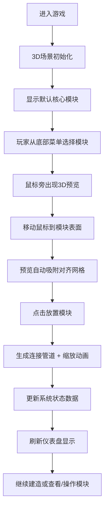

## 1. 产品概述
这是一个基于Three.js的3D空间站模块化建造Web游戏，玩家通过拖拽和拼接不同功能模块来建造自己的空间站。
- 面向对太空探索、建造类游戏感兴趣的玩家，提供沉浸式的模块化建造体验
- 核心价值在于直观的3D交互、实时系统状态反馈和富有科幻感的视觉体验

## 2. 核心功能

### 2.1 功能模块
1. **3D建造场景**：Three.js渲染的太空场景，支持视角旋转、平移、缩放
2. **模块系统**：6种不同功能模块（太阳能板、居住舱、实验室、对接舱、推进器、种植舱），支持吸附放置、动画效果
3. **连接管道系统**：模块间自动生成半透明连接管道
4. **状态仪表盘**：实时显示电力、氧气、结构完整性三项核心指标
5. **模块交互**：点击高亮显示信息浮窗，右键菜单支持移除和旋转模块
6. **菜单栏**：底部模块选择栏，点击后出现3D预览跟随鼠标

### 2.2 页面详情
| 页面名称 | 模块名称 | 功能描述 |
|---------|---------|---------|
| 主游戏界面 | 3D渲染画布 | 全屏Canvas，展示太空场景和空间站，支持所有3D交互 |
| 主游戏界面 | 顶部状态仪表盘 | 三个圆形Canvas仪表盘显示电力、氧气、结构完整性，数值和单位展示 |
| 主游戏界面 | 模块信息浮窗 | 点击模块后显示的浮动信息卡片，包含名称、大小、功能、连接数 |
| 主游戏界面 | 底部模块菜单栏 | 6种模块选择按钮，半透明科幻风格面板 |
| 主游戏界面 | 右键菜单 | 模块上右键弹出的操作菜单（移除、旋转） |
| 主游戏界面 | 低氧警告提示 | 氧气低于30%时显示的浮动警告文字 |

## 3. 核心流程
玩家打开游戏后进入3D太空场景，从底部菜单栏选择想要建造的模块，鼠标旁出现半透明3D预览，移动鼠标到已有模块表面时预览自动吸附对齐，点击放置新模块并生成连接管道。玩家可通过鼠标拖拽旋转查看空间站、滚轮缩放、右键平移。点击任意模块查看详细信息，右键可移除或旋转模块。左上角仪表盘实时显示空间站系统状态，当指标异常时触发警告效果。

## 4. 用户界面设计

### 4.1 设计风格
- **主色调**：深空蓝紫渐变背景（#0a0a2e → #1a1a4e）
- **文字颜色**：亮白色 #e0e0ff，带细发光描边效果
- **面板样式**：半透明深蓝 #1a1a3e（透明度0.8），圆角12px，边框 #3a3a6e
- **交互高亮**：悬停/选中时边框变为青色 #00ccff，微微放大1.05倍
- **整体风格**：科幻太空站主题，带发光效果和微妙动画

### 4.2 模块设计
| 模块类型 | 形状 | 颜色 | 大小 |
|---------|-----|-----|-----|
| 太阳能板 | 扁平长方体 | 金色 | 1单位 |
| 居住舱 | 圆柱体 | 白色 | 1单位 |
| 实验室 | 球体 | 蓝色 | 1单位 |
| 对接舱 | 环形 | 灰色 | 1单位 |
| 推进器 | 圆锥体 | 红色 | 1单位 |
| 种植舱 | 半透明立方体 | 绿色 | 1单位 |

### 4.3 页面设计概述
| 页面名称 | 模块名称 | UI元素 |
|---------|---------|-------|
| 主游戏界面 | 3D场景 | 深空背景、星空粒子、模块发光边框、吸附动画、管道连接 |
| 主游戏界面 | 仪表盘 | Canvas绘制圆形仪表盘、发光指针动画、数值文字、低电量红色闪烁 |
| 主游戏界面 | 菜单栏 | 底部水平排列、模块图标+名称、悬停放大高亮 |
| 主游戏界面 | 信息浮窗 | 圆角卡片、模块名称加粗、功能描述、连接数统计、自动偏移定位 |
| 主游戏界面 | 警告提示 | 半透明文字、上下浮动动画、红色低电量闪烁 |

### 4.4 3D场景指导
- **环境**：纯深空背景，带稀疏星空粒子效果，无HDRI
- **光照**：环境光（强度0.4）+ 方向光模拟太阳光（强度0.8，从斜上方照射），模块自发光材质补充
- **相机**：PerspectiveCamera，初始距离10单位，目标为场景中心
- **相机控制**：左键旋转（OrbitControls，360度无限制）、右键平移、滚轮缩放（2-20单位范围）
- **交互**：Raycaster进行鼠标拾取，模块表面法线计算吸附位置
- **动画**：吸附缩放闪烁动画（0.2秒）、旋转过渡动画（0.3秒）、仪表盘指针平滑过渡、警告浮动动画
- **性能**：50个模块保持30FPS以上，仪表盘每秒更新一次，材质复用减少Draw Call

### 4.5 响应式
桌面端优先设计，全屏Canvas自适应窗口大小，UI元素使用固定像素定位，不考虑移动端适配。
