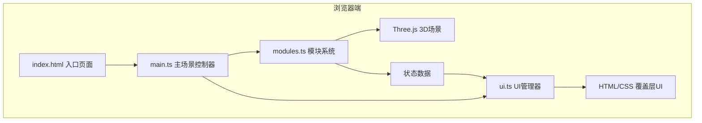

## 1. 架构设计



## 2. 技术描述
- **前端框架**：纯TypeScript，无UI框架
- **3D引擎**：Three.js最新版，使用原生API（非React Three Fiber）
- **构建工具**：Vite
- **开发语言**：TypeScript（严格模式）
- **无后端**：纯前端运行，所有状态在内存中管理

## 3. 项目文件结构
| 文件路径 | 作用 |
|---------|-----|
| `package.json` | 项目依赖配置（three, typescript, vite, @types/three） |
| `index.html` | 入口HTML，全屏Canvas容器，深空渐变背景 |
| `vite.config.js` | Vite构建配置，端口3000，index.html为入口 |
| `tsconfig.json` | TypeScript配置，target ES2020，严格模式 |
| `src/main.ts` | Three.js场景初始化、相机控制、渲染循环主逻辑 |
| `src/modules.ts` | Module类定义、模块创建、吸附逻辑、连接管道、交互事件处理 |
| `src/ui.ts` | HTML覆盖层管理：仪表盘Canvas绘制、菜单栏、信息浮窗、右键菜单、警告提示 |

## 4. 核心数据模型

### 4.1 模块类型枚举
```typescript
enum ModuleType {
  SOLAR_PANEL = 'solar_panel',    // 太阳能板 - 金色扁平长方体
  HABITAT = 'habitat',            // 居住舱 - 白色圆柱体
  LABORATORY = 'laboratory',      // 实验室 - 蓝色球体
  DOCKING = 'docking',            // 对接舱 - 灰色环形
  THRUSTER = 'thruster',          // 推进器 - 红色圆锥
  GREENHOUSE = 'greenhouse'       // 种植舱 - 绿色半透明立方体
}
```

### 4.2 模块配置
```typescript
interface ModuleConfig {
  type: ModuleType;
  name: string;
  color: number;
  description: string;
  shape: 'box' | 'cylinder' | 'sphere' | 'torus' | 'cone';
  size: number;          // 基础尺寸1单位
  powerContribution: number;    // 电力贡献
  oxygenContribution: number;   // 氧气贡献
}
```

### 4.3 模块实例
```typescript
class SpaceModule {
  id: string;
  type: ModuleType;
  mesh: THREE.Mesh;
  position: THREE.Vector3;
  rotation: number;        // 0/90/180/270度
  connections: string[];   // 连接的模块ID列表
  bounds: THREE.Box3;
}
```

### 4.4 空间站状态
```typescript
interface StationStats {
  power: number;           // 0-100
  oxygen: number;          // 0-100
  integrity: number;       // 0-100
  moduleCount: number;
  connectionCount: number;
}
```

## 5. 核心算法与逻辑

### 5.1 模块吸附逻辑
1. 使用Raycaster从鼠标位置发射射线
2. 检测与现有模块表面的交点
3. 获取交点处的表面法线
4. 计算吸附位置：交点位置 + 法线方向 × 0.5单位（模块半宽）
5. 将位置对齐到0.5单位网格

### 5.2 连接管道生成
1. 放置新模块时，遍历所有相邻网格位置
2. 检查0.5网格相邻位置是否存在其他模块
3. 存在则在两模块中心点之间创建圆柱体管道
4. 管道半径0.1单位，半透明材质，自动朝向

### 5.3 状态计算
- **电力** = min(100, 太阳能板数量 × 15)
- **氧气** = min(100, 种植舱数量 × 20 + 实验室数量 × 10)
- **结构完整性** = min(100, (连接数 / 模块数) × 50 + 模块数 × 2)

### 5.4 性能优化
- 材质对象复用，同类型模块共享Material
- 几何体缓存，避免重复创建
- 仪表盘每秒更新一次，而非每帧
- 使用Box3进行快速碰撞/邻接检测
