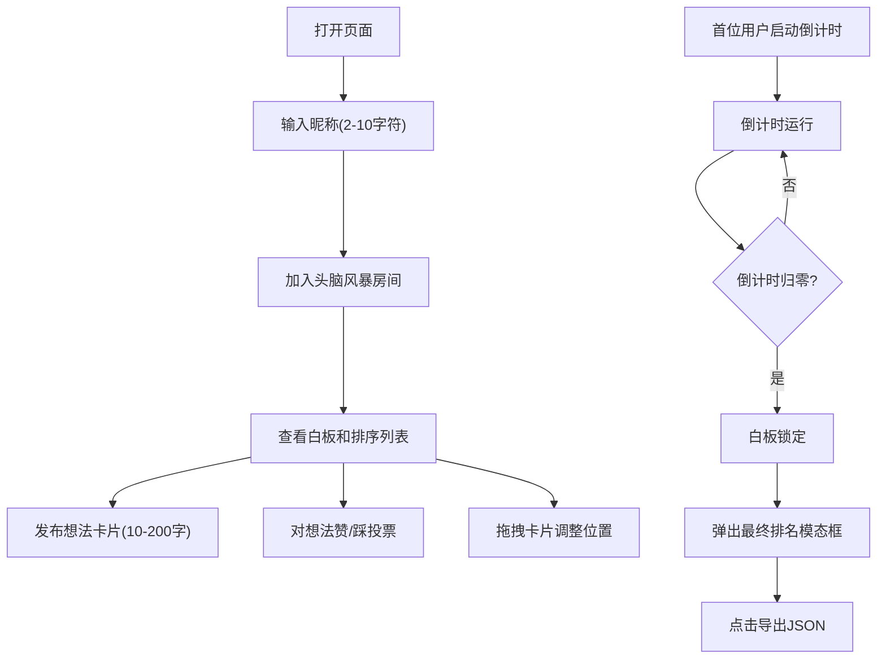

## 1. 产品概述

在线团队头脑风暴与想法投票排序Web应用，帮助团队成员在虚拟白板上协作发布创意、进行民主投票，并自动生成优先级排序，快速聚焦最有价值的想法。

- 核心价值：解决团队头脑风暴中想法散乱、难以聚焦的痛点，通过实时协作+投票排序机制提升决策效率
- 目标用户：产品团队、设计团队、研发团队及所有需要进行创意讨论和决策的协作团队

## 2. 核心功能

### 2.1 用户角色

| 角色 | 加入方式 | 核心权限 |
|------|----------|----------|
| 普通用户 | 输入昵称（2-10字符）加入房间 | 发布想法、投票、拖拽卡片、导出结果 |
| 首位用户 | 第一个加入房间的用户 | 额外拥有设置和启动倒计时的权限 |

### 2.2 功能模块

1. **主应用页面**：昵称输入入口、顶部导航栏（房间名、在线人数）、白板区（70%）、投票排序列表（30%）、倒计时控件、结果导出模态框
2. **白板组件**：可拖拽想法卡片、新建想法、删除想法、投票交互、实时同步
3. **投票排序组件**：按得票数降序排列、高亮前三名、自动刷新

### 2.3 页面详情

| 页面名称 | 模块名称 | 功能描述 |
|----------|----------|----------|
| 主应用 | 昵称输入模态框 | 用户首次进入时输入2-10字符昵称加入房间 |
| 主应用 | 顶部导航栏 | 显示房间名称、当前在线人数（Socket.IO实时更新） |
| 主应用 | 白板区域（左侧70%） | 展示可拖拽想法卡片，支持新建卡片 |
| 主应用 | 投票排序列表（右侧30%） | 按得票数降序显示所有想法，高亮前三名 |
| 主应用 | 倒计时控件（右下角） | 首位用户可设置时长（默认30分钟）并启动，归零后锁定白板 |
| 主应用 | 结果模态框 | 倒计时结束后弹出最终排名，支持导出JSON |
| 想法卡片 | 内容展示 | 显示想法文字（10-200字）、发布者昵称、发布时间（HH:mm） |
| 想法卡片 | 投票按钮 | 赞（绿色拇指向上）/踩（红色拇指向下），可切换投票，实时更新数字 |
| 想法卡片 | 拖拽功能 | 鼠标拖拽移动位置，碰撞检测避免重叠，实时同步 |
| 想法卡片 | 删除功能 | 发布者可删除自己的卡片 |

## 3. 核心流程

用户打开页面 → 输入昵称加入房间 → 在白板上发布想法卡片 → 对他人想法进行赞/踩投票 → 拖拽卡片调整位置 → 倒计时归零 → 白板锁定 → 查看最终排名 → 导出JSON结果

## 4. 用户界面设计

### 4.1 设计风格

- **主题色彩**：浅色主题，背景色#f5f7fa，卡片白色#ffffff，边框#e0e4ea
- **主色调**：绿色（赞 #22c55e）、红色（踩 #ef4444）、金色/银色/铜色（前三名高亮）
- **按钮风格**：圆角设计，赞/踩按钮带缩放动画（scale 1.15回弹，0.2s）
- **字体**：使用现代无衬线字体，卡片标题醒目，正文清晰易读
- **布局风格**：卡片式布局，左侧白板70% + 右侧列表30%，移动端上下排列
- **阴影效果**：卡片柔和阴影 box-shadow: 0 4px 12px rgba(0,0,0,0.08)，悬停时加深并轻微上移（transition 0.3s）
- **圆角**：统一使用12px圆角

### 4.2 页面设计概述

| 页面名称 | 模块名称 | UI元素 |
|----------|----------|--------|
| 主应用 | 昵称输入模态框 | 居中卡片、输入框、加入按钮、字符计数提示 |
| 主应用 | 顶部导航栏 | 房间名称标题、在线人数徽章（带用户头像点） |
| 主应用 | 白板区域 | 自由拖拽区域、+新建卡片浮动按钮、想法卡片网格 |
| 主应用 | 投票排序列表 | 固定侧边栏、排名序号、想法摘要、得票数、前三名发光边框动画 |
| 主应用 | 倒计时控件 | 右下角浮动卡片、时间显示、设置/启动按钮（仅首位用户） |
| 主应用 | 结果模态框 | 全屏遮罩、排名列表、导出按钮、关闭按钮 |
| 想法卡片 | 卡片主体 | 280px宽、自适应高度、圆角12px、白色背景、柔和阴影 |
| 想法卡片 | 卡片头部 | 发布者昵称、发布时间（HH:mm）、删除按钮（仅本人可见） |
| 想法卡片 | 卡片内容 | 想法文字内容、自适应换行 |
| 想法卡片 | 卡片底部 | 赞按钮（绿色拇指图标）、踩按钮（红色拇指图标）、实时数字 |

### 4.3 响应性

- **桌面端（≥768px）**：白板区域占左侧70%，投票排序列表占右侧30%，并排显示
- **移动端（<768px）**：白板和列表上下排列，白板在上，列表在下，全宽显示
- **触摸优化**：拖拽支持触摸事件，按钮尺寸适合手指点击（最小44x44px）

### 4.4 动效设计

- 卡片悬停：阴影加深 + 轻微上移（translateY -2px），transition 0.3s
- 投票按钮：点击时 scale(1.15) 再回弹，持续0.2s
- 前三名卡片：金色/银色/铜色 box-shadow 呼吸动画
- 新建卡片：渐入 + 缩放动画
- 倒计时结束：模态框淡入动画
