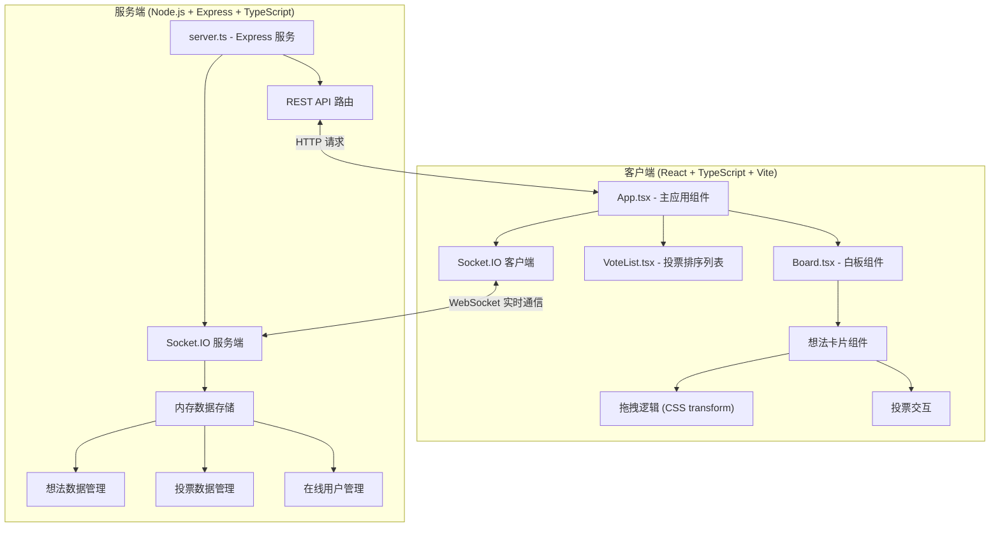
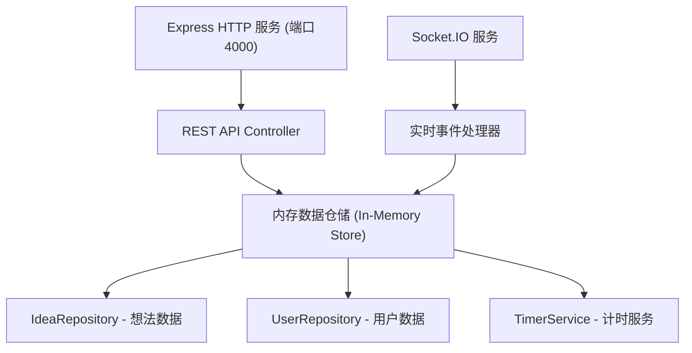
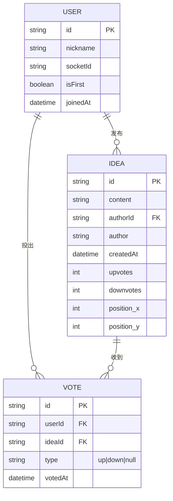

## 1. 架构设计



## 2. 技术描述

- **前端框架**: React 18 + TypeScript 5
- **构建工具**: Vite 5（代理后端API端口4000）
- **实时通信**: Socket.IO 客户端
- **唯一ID**: uuid
- **样式方案**: 原生CSS（CSS变量 + 模块化）
- **后端框架**: Express 4 + TypeScript
- **实时通信**: Socket.IO 服务端
- **跨域处理**: cors
- **数据存储**: 内存存储（生产环境可替换为Redis/数据库）
- **初始化工具**: vite-init（react-express-ts模板）

## 3. 路由定义

| 路由 | 用途 |
|------|------|
| / | 主应用页面（白板+排序列表） |

## 4. API 定义

### 4.1 REST API 接口

```typescript
// 想法数据类型
interface Idea {
  id: string;
  content: string;
  author: string;
  authorId: string;
  createdAt: string;
  upvotes: number;
  downvotes: number;
  votes: Record<string, 'up' | 'down' | null>;
  position: { x: number; y: number };
}

// 用户类型
interface User {
  id: string;
  nickname: string;
  socketId: string;
  isFirst: boolean;
}

// 房间状态
interface RoomState {
  ideas: Idea[];
  users: User[];
  timer: {
    duration: number;
    remaining: number;
    isRunning: boolean;
    isLocked: boolean;
    startedBy: string | null;
  };
}

// GET /api/ideas - 获取所有想法
// Response: { ideas: Idea[] }

// POST /api/ideas - 创建新想法
// Request: { content: string; author: string; authorId: string }
// Response: Idea

// DELETE /api/ideas/:id - 删除想法
// Response: { success: boolean }

// GET /api/state - 获取完整房间状态
// Response: RoomState
```

### 4.2 Socket.IO 事件

```typescript
// 客户端 → 服务端
'join-room': { nickname: string }
'create-idea': { content: string; position: { x: number; y: number } }
'delete-idea': { ideaId: string }
'vote': { ideaId: string; voteType: 'up' | 'down' | null }
'drag-idea': { ideaId: string; position: { x: number; y: number } }
'start-timer': { duration: number }
'stop-timer': void
'reset-timer': void

// 服务端 → 客户端
'user-joined': { user: User; users: User[] }
'user-left': { userId: string; users: User[] }
'idea-created': Idea
'idea-deleted': { ideaId: string }
'vote-updated': { ideaId: string; upvotes: number; downvotes: number; votes: Record<string, 'up' | 'down' | null> }
'idea-dragged': { ideaId: string; position: { x: number; y: number } }
'timer-updated': { duration: number; remaining: number; isRunning: boolean; isLocked: boolean }
'room-locked': void
'state-sync': RoomState
```

## 5. 服务端架构



## 6. 数据模型

### 6.1 数据模型定义



### 6.2 数据结构（内存存储）

```typescript
// 想法存储
const ideas: Map<string, Idea> = new Map();

// 用户存储
const users: Map<string, User> = new Map();

// 房间计时器状态
const timerState = {
  duration: 30 * 60,        // 默认30分钟（秒）
  remaining: 30 * 60,       // 剩余时间（秒）
  isRunning: false,
  isLocked: false,
  startedBy: null as string | null,
  intervalId: null as NodeJS.Timeout | null,
};
```

## 7. 性能优化策略

1. **拖拽60fps优化**：
   - 使用CSS transform而非top/left定位
   - 使用requestAnimationFrame节流拖拽事件
   - 拖拽时应用will-change: transform提升GPU合成层
   - 碰撞检测采用空间网格优化（50张卡片时O(n)复杂度）

2. **实时通信延迟优化（<200ms）**：
   - Socket.IO使用WebSocket传输（降级HTTP长轮询）
   - 投票操作即时乐观更新UI，服务端确认后同步
   - 拖拽事件节流（throttle 16ms ~ 60fps）后广播

3. **渲染性能**：
   - React.memo包装想法卡片避免不必要重渲染
   - 排序列表每5秒刷新，非实时渲染
   - 使用useMemo/useCallback优化计算和回调

4. **碰撞检测算法**：
   - 卡片尺寸固定280px宽，使用AABB（轴对齐包围盒）检测
   - 碰撞时沿拖拽法线方向弹开，避免重叠
