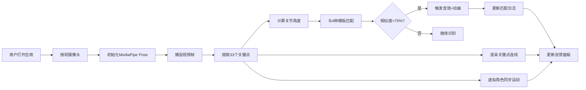

## 1. 产品概述
基于摄像头实时人体姿态识别的体感交互应用，将人体动作映射为虚拟角色动画，解决传统键鼠操作在体感游戏中不够直观的问题。
- 主要用途：体感游戏控制、动作捕捉演示、健身动作识别
- 目标用户：游戏玩家、健身爱好者、教育演示者
- 产品价值：零硬件门槛的体感交互体验，低成本实现VR级沉浸感

## 2. 核心功能

### 2.1 用户角色
| 角色 | 注册方式 | 核心权限 |
|------|---------|---------|
| 普通用户 | 无需注册，直接使用 | 开启摄像头、查看姿态识别、体验动作匹配 |

### 2.2 功能模块
1. **主画布区**：关键点连线渲染、虚拟角色动画、匹配度动画
2. **姿态追踪模块**：MediaPipe Pose 33点关键点提取、实时数据流输出
3. **动作匹配模块**：4种预设模板（挥手/跳跃/蹲下/侧身）、关节角度相似度计算、音效触发
4. **虚拟角色模块**：简笔画角色同步运动、关节角度映射、平滑插值动画
5. **反馈面板模块**：FPS监测、关键点坐标JSON展示、匹配日志滚动列表

### 2.3 页面详情
| 页面名称 | 模块名称 | 功能描述 |
|---------|---------|----------|
| 主页 | 主画布区 | 全屏Canvas渲染关键点+虚拟角色，深色主题背景 |
| 主页 | 摄像头小窗 | 左下角镜像显示320x240摄像头画面，圆角+阴影 |
| 主页 | 反馈面板 | 右上角半透明悬浮面板：FPS警告、JSON坐标、匹配日志 |
| 主页 | 侧边提示区 | 左右留白区放置操作提示和设置按钮 |

## 3. 核心流程
用户打开应用→授权摄像头权限→MediaPipe Pose初始化→实时捕捉视频帧→提取33个人体关键点→计算关节角度→与模板匹配计算相似度→超过75%触发音效+动画→渲染关键点连线+虚拟角色同步运动→更新反馈面板数据

## 4. 用户界面设计
### 4.1 设计风格
- 主色：#1a1a2e（深蓝背景）
- 强调色：#e94560（品红主色）、#0f3460（深蓝辅助色）
- 按钮风格：圆角8px，悬浮放大1.05倍，0.3s过渡
- 字体：系统默认无衬线字体（sans-serif）
- 布局：居中主画布（占80%+），左右对称留白
- 图标风格：简洁线性SVG图标

### 4.2 页面设计概述
| 页面名称 | 模块名称 | UI元素 |
|---------|---------|--------|
| 主页 | 主画布 | 渐变背景、彩色关节点、角度颜色映射、简笔画角色 |
| 主页 | 匹配动画 | 圆形进度条向外扩散、红→绿渐变、动作名称文字 |
| 主页 | 反馈面板 | 毛玻璃效果、半透明背景、FPS红色警告样式、JSON代码块、滚动列表 |
| 主页 | 摄像头小窗 | 圆角12px、阴影、镜像翻转、边框2px强调色 |
| 主页 | 侧边栏 | 操作说明、动作图例、设置按钮、过渡动画 |

### 4.3 响应式设计
- 桌面端：主画布占80%，左右留白各10%，摄像头小窗左下320x240
- 手机竖屏：主画布全屏、摄像头小窗移至顶部（宽度自适应）、文字缩小至70%、面板紧凑排布
- 触控优化：按钮最小触控区48x48px、手势缩放支持
- 性能适配：摄像头>720p自动降采样，目标帧率40FPS+

### 4.4 动画设计
- 进入/退出过渡：0.3s ease-out 透明度+位移
- 匹配度动画：圆形进度条从中心向外扩散，脉冲效果
- 角色运动：requestAnimationFrame 线性插值，延迟<100ms
- FPS警告：红色闪烁+抖动效果
