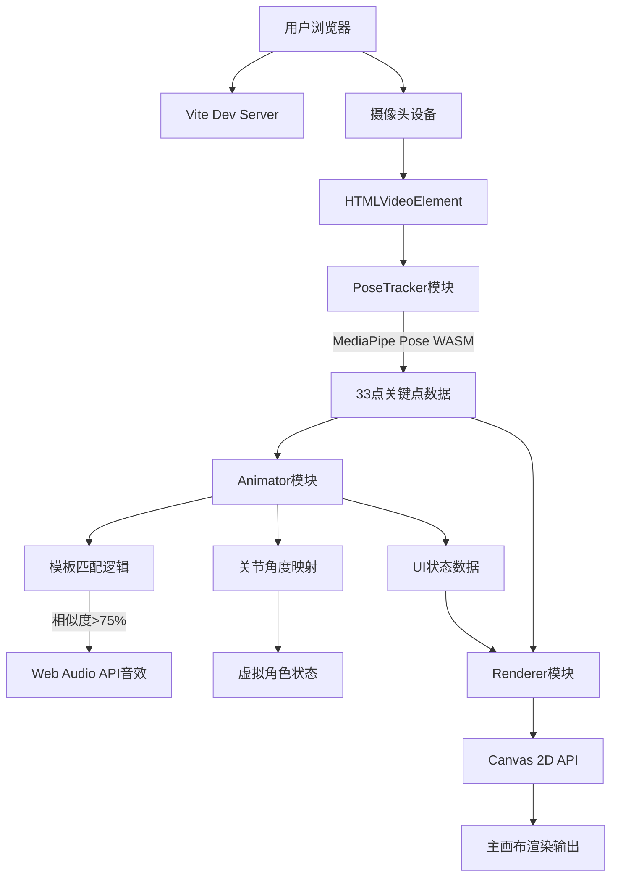

## 1. 架构设计



## 2. 技术描述
- 前端框架：无框架（Vanilla TypeScript），纯原生Canvas 2D渲染
- 构建工具：Vite 5.x（处理WASM文件、TypeScript编译、热更新）
- 姿态识别：@mediapipe/pose + @mediapipe/camera_utils（33关键点BlazePose模型）
- 音效系统：Web Audio API（OscillatorNode合成音效，无需音频文件）
- 语言：TypeScript 5.x（严格模式 strict: true，target ES2020）
- 动画系统：requestAnimationFrame + 线性插值实现低延迟平滑过渡

## 3. 文件结构
```
auto5/
├── package.json            # 依赖配置（@mediapipe/pose, typescript, vite等）
├── index.html              # 入口HTML：video元素、Canvas容器、布局结构
├── vite.config.js          # Vite配置：WASM文件处理、开发服务器
├── tsconfig.json           # TypeScript配置：严格模式、ES2020
└── src/
    ├── main.ts             # 入口文件：初始化协调、主循环、事件绑定
    ├── poseTracker.ts      # PoseTracker类：封装MediaPipe调用
    ├── animator.ts         # Animator类：模板匹配、角度计算、音效、角色状态
    └── renderer.ts         # Renderer类：Canvas绘制、UI面板、FPS统计
```

## 4. 模块职责定义

### 4.1 PoseTracker (src/poseTracker.ts)
**职责单一原则**：仅负责从视频流提取关键点
- 输入：HTMLVideoElement（摄像头视频帧）
- 处理：调用MediaPipe Pose. send({image: frame})
- 输出：通过回调/事件发射器输出 NormalizedLandmark[]（33点，x/y/z归一化坐标）
- 内部状态：Pose实例、模型加载状态、上一帧时间戳

### 4.2 Animator (src/animator.ts)
**职责单一原则**：仅负责姿态数据→动作语义的转换
- 输入：关键点数据流
- 核心计算：
  - 12组关键关节角度计算（肩/肘/腕/髋/膝/踝，左右对称）
  - 余弦相似度算法，对比4种预设模板角度向量
  - 平滑滤波：EMA指数移动平均，防抖延迟<50ms
- 输出：
  - 角色状态对象（12个关节角度+位置）
  - 匹配事件：{动作名, 相似度, 时间戳}
  - 触发Web Audio API合成音效

### 4.3 Renderer (src/renderer.ts)
**职责单一原则**：仅负责视觉渲染，不包含业务逻辑
- 输入：角色状态、关键点数据、匹配事件、UI状态
- 绘制内容：
  - 33关节点+连线（颜色随关节角度HSL映射）
  - 简笔画虚拟角色（头部圆+躯干线+四肢线段，几何风格）
  - 匹配度动画（圆形扩散进度条）
  - 右上角反馈面板（FPS/JSON/日志）
  - 左下角摄像头小窗（镜像绘制）
- FPS统计：帧间时间差计算，EMA平滑

### 4.4 Main (src/main.ts)
**协调器角色**：不包含业务逻辑，仅负责模块装配
- DOM就绪→创建视频元素、Canvas元素
- 实例化PoseTracker→实例化Animator→实例化Renderer
- 建立数据管道：PoseTracker→Animator→Renderer
- 启动主循环：requestAnimationFrame递归调用
- 事件绑定：窗口resize、按钮点击、摄像头授权

## 5. 核心数据结构

```typescript
// 33个关键点（MediaPipe标准）
interface Landmark {
  x: number;    // 0~1归一化X
  y: number;    // 0~1归一化Y
  z: number;    // 相对深度
  visibility: number;  // 可见度0~1
}

// 关节角度集合
interface JointAngles {
  leftShoulder: number;   // 左肩角度
  rightShoulder: number;  // 右肩角度
  leftElbow: number;      // 左肘角度
  rightElbow: number;     // 右肘角度
  leftHip: number;        // 左髋角度
  rightHip: number;       // 右髋角度
  leftKnee: number;       // 左膝角度
  rightKnee: number;      // 右膝角度
  torsoLean: number;      // 躯干倾斜
  armSpan: number;        // 手臂展开度
}

// 动作模板
interface ActionTemplate {
  name: string;           // 动作名
  angles: JointAngles;    // 标准角度
  threshold: number;      // 阈值0.75
  soundFreq: number;      // 音效频率Hz
}

// 匹配记录
interface MatchLogEntry {
  name: string;
  similarity: number;     // 百分比
  timestamp: number;      // 毫秒
}

// 渲染状态
interface RenderState {
  landmarks: Landmark[] | null;
  characterAngles: JointAngles | null;
  currentMatch: {name: string; similarity: number; progress: number} | null;
  matchLogs: MatchLogEntry[];  // 最近10条
  fps: number;
  lastFrameTime: number;
}
```

## 6. 预设动作模板定义

| 动作名称 | 特征角度描述 | 触发音效 |
|---------|------------|---------|
| 挥手(Wave) | 单侧肩角>120°+肘角90°-150°+手腕上下摆动频率>2Hz | 880Hz 正弦波 0.2s |
| 跳跃(Jump) | 髋角>160°+膝角>160°+躯干Y坐标快速上移 | 440Hz→880Hz 滑音 0.3s |
| 蹲下(Squat) | 髋角<90°+膝角<90°+躯干Y坐标下移 | 220Hz 三角波 0.3s |
| 侧身(SideLean) | 躯干倾斜>20°+双肩Y差>躯干高度的15% | 660Hz 方波 0.2s |

## 7. 性能优化策略
1. **降采样策略**：检测videoWidth>1280时，Canvas内部按比例缩放到1280宽度渲染
2. **脏矩形渲染**：UI面板仅在数据变化时重绘，主画布每帧全绘但跳过不可见点
3. **角度计算优化**：使用预计算的Math.cos查找表，避免每帧重复12次反三角函数
4. **事件节流**：动作匹配触发冷却500ms，防止重复触发音效
5. **内存管理**：复用TypedArray存储关键点，避免每帧GC压力
