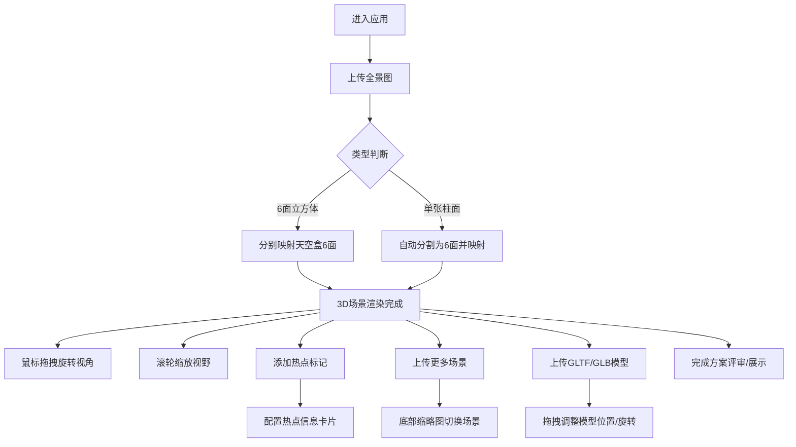

## 1. 产品概述
3D全景漫游Web应用，旨在帮助设计师快速将平面设计图转化为沉浸式3D空间体验，用于方案评审和客户展示。
- 解决问题：传统平面设计难以传达空间感，需要快速构建可交互的3D全景场景
- 目标用户：室内设计师、建筑设计师、房地产展示人员、方案评审团队
- 产品价值：降低3D场景制作门槛，数秒内将全景图转化为可漫游的交互场景

## 2. 核心功能

### 2.1 用户角色
| 角色 | 注册方式 | 核心权限 |
|------|---------|---------|
| 设计师用户 | 无需注册，直接使用 | 上传全景图、添加热点、切换场景、嵌入3D模型 |
| 评审用户 | 无需注册，通过链接访问 | 浏览场景、点击热点查看信息、切换场景 |

### 2.2 功能模块
1. **全景渲染模块**：立方体/柱面全景图加载、天空盒映射、360度视角控制、FOV缩放
2. **热点交互模块**：热点创建、广告牌效果、信息卡片弹出、悬停放大动画
3. **场景管理模块**：多场景上传、缩略图导航、渐隐渐现切换动画、场景独立配置
4. **模型嵌入模块**：GLTF/GLB模型加载、位置拖拽调整、旋转控制、环境光照阴影
5. **界面UI模块**：深色主题导航栏、帮助浮层、移动端适配、动画微交互

### 2.3 页面详情
| 页面名称 | 模块名称 | 功能描述 |
|---------|---------|----------|
| 主应用页 | 全景画布区 | Three.js渲染区域，360度拖拽旋转，滚轮缩放FOV(30-100度) |
| 主应用页 | 上传控制区 | 支持6面立方体贴图(每张≤2048px)或单张柱面全景图(宽≤4096px)，多场景上传(最多5个) |
| 主应用页 | 顶部导航栏 | 半透明毛玻璃效果，显示场景名称、热点数量、帮助按钮 |
| 主应用页 | 热点编辑区 | 点击场景添加热点(最多20个)，配置标题/描述/富文本/图片URL |
| 主应用页 | 底部缩略图栏 | 场景缩略图水平滚动，带渐变遮罩边缘，点击/箭头切换 |
| 主应用页 | 模型控制区 | 上传GLTF/GLB模型(≤5MB)，拖拽调整位置和旋转 |
| 主应用页 | 帮助浮层 | 点击?图标弹出，展示操作提示指南 |

## 3. 核心流程
用户进入应用 → 上传全景图(立方体/柱面) → 系统自动映射为3D天空盒 → 用户拖拽查看全景 → 点击场景位置添加热点 → 编辑热点内容 → 上传更多场景(最多5个) → 通过缩略图切换场景 → 可选上传3D模型嵌入场景 → 导出/分享全景漫游

## 4. 用户界面设计

### 4.1 设计风格
- **主色调**：深色背景#0A0A1A，文字#E0E0F0，强调色#00FF88(霓虹绿)
- **按钮风格**：圆角矩形(8px)，悬停放大1.1倍，点击涟漪波纹效果
- **字体**：展示字体使用Orbitron(科技感)，正文字体使用Noto Sans SC
- **布局**：全屏沉浸式布局，无白边，固定定位UI元素覆盖在画布上方
- **视觉效果**：毛玻璃半透明导航栏(backdrop-filter: blur)，渐变遮罩，发光效果

### 4.2 页面设计概述
| 页面名称 | 模块名称 | UI元素 |
|---------|---------|--------|
| 主应用页 | 全景画布 | 全屏覆盖，加载淡入动画，30fps+流畅渲染 |
| 主应用页 | 顶部导航栏 | 半透明黑(80%不透明度+模糊)，左侧场景名称，中间热点计数，右侧帮助按钮 |
| 主应用页 | 热点标记 | 圆形发光点(直径20px，#00FF88)，悬停放大1.5倍显示文字标签，广告牌始终面向相机 |
| 主应用页 | 信息卡片 | 深色卡片(圆角12px，阴影)，支持富文本和图片，出现时缩放+淡入动画 |
| 主应用页 | 底部缩略图栏 | 水平排列，左右箭头按钮，渐变遮罩边缘，当前场景高亮发光边框 |
| 主应用页 | 上传按钮 | 浮动按钮，强调色背景，悬停发光效果，拖拽上传区域 |
| 主应用页 | 帮助浮层 | 半透明遮罩，居中卡片，操作指南分步骤说明 |
| 主应用页 | 3D模型辅助线框 | 半透明白色线框包围盒，拖拽时光标变为move |

### 4.3 响应式设计
- **桌面端**：完整UI布局，鼠标拖拽旋转，滚轮缩放，点击热点
- **移动端**：导航栏折叠为汉堡菜单，缩略图横向滑动，双指触控旋转视角，单指点击热点
- **触控优化**：触控热点检测范围扩大(30px)，防止误触，滑动平滑惯性效果

### 4.4 3D场景指导
- **环境/HDRI**：用户上传全景图作为天空盒环境贴图，营造真实空间氛围
- **光照设置**：环境光(HemisphereLight 强度0.6) + 方向光模拟场景主光源，开启阴影投射
- **相机设置**：PerspectiveCamera，默认FOV 75度，范围30-100度，OrbitControls禁用平移
- **构图与焦点**：热点为视觉焦点，发光效果引导用户交互，初始视角朝向场景正前方
- **交互与动画**：场景切换0.8秒渐隐渐现，热点脉冲发光动画，卡片弹出弹性缓动
- **后处理效果**：轻微Bloom效果增强发光热点，色调映射ACES Filmic
- **资源与性能**：总帧率≥30fps，单模型≤5MB，单场景贴图≤2048px，WebGL2.0优先
