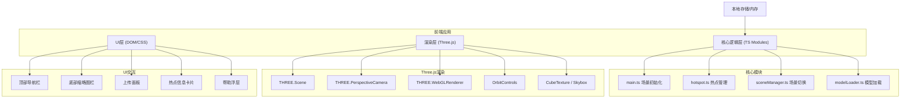

## 1. 架构设计



## 2. 技术说明

- **前端框架**：原生TypeScript + Three.js (无React/Vue，按用户要求直接组织TS模块)
- **构建工具**：Vite 5.x (极速冷启动，HMR热更新)
- **3D引擎**：Three.js 0.160.x + @types/three 类型定义
- **控制器**：OrbitControls (内置在Three.js examples中)
- **模型加载**：GLTFLoader (Three.js内置)
- **样式方案**：原生CSS3 + CSS变量，CSS动画与过渡
- **无后端**：纯前端应用，文件通过FileReader读取本地，无需服务器

**项目结构：**
```
auto50/
├── package.json
├── index.html
├── vite.config.js
├── tsconfig.json
└── src/
    ├── main.ts          # 入口，场景初始化，全景加载，交互控制
    ├── hotspot.ts       # 热点创建/管理，广告牌，信息卡片
    ├── sceneManager.ts  # 多场景切换，渐隐动画，缩略图生成
    └── modelLoader.ts   # GLTF加载，位置/旋转调整，阴影
```

## 3. 路由定义
纯单页应用(SPA)，无前端路由：
| 路径 | 用途 |
|-----|------|
| / | 全景漫游主应用(唯一入口) |

## 4. 数据结构定义

```typescript
// 场景配置
interface PanoramaScene {
  id: string;
  name: string;
  type: 'cube' | 'equirectangular';
  textures: {
    px?: HTMLImageElement;  // +X (右)
    nx?: HTMLImageElement;  // -X (左)
    py?: HTMLImageElement;  // +Y (上)
    ny?: HTMLImageElement;  // -Y (下)
    pz?: HTMLImageElement;  // +Z (前)
    nz?: HTMLImageElement;  // -Z (后)
    equirectangular?: HTMLImageElement;  // 单张柱面图
  };
  thumbnail: string;  // base64缩略图
  hotspots: Hotspot[];
  models: SceneModel[];
}

// 热点配置
interface Hotspot {
  id: string;
  sceneId: string;
  position: THREE.Vector3;  // 3D空间位置
  title: string;
  description: string;  // 支持富文本HTML
  imageUrl?: string;
  color: string;  // 默认#00FF88
}

// 嵌入模型
interface SceneModel {
  id: string;
  sceneId: string;
  url: string;  // Blob URL
  position: { x: number; y: number; z: number };
  rotation: { x: number; y: number; z: number };
  scale: number;
}
```

## 5. 核心模块职责

### 5.1 main.ts
- 初始化THREE.Scene, PerspectiveCamera, WebGLRenderer
- 配置OrbitControls (enableDamping=true, 禁用pan, min/maxFov)
- 实现全景加载：CubeTexture(6面) 或 EquirectangularToCubeGenerator
- 绑定事件：窗口resize, 鼠标点击添加热点, 触控双指手势
- 渲染循环：requestAnimationFrame, 保持30fps+
- DOM UI初始化：导航栏, 缩略图栏, 上传控件, 帮助按钮

### 5.2 hotspot.ts
- HotspotManager类：管理热点列表的CRUD
- 创建热点Mesh：CircleGeometry + MeshBasicMaterial + 发光效果
- 广告牌效果：每帧update使热点lookAt摄像机
- 射线检测(Raycaster)：鼠标/触控点击与悬停检测
- 信息卡片DOM：创建/销毁/动画，富文本渲染
- 悬停/点击动画：scale 1→1.5, 脉冲发光, CSS涟漪

### 5.3 sceneManager.ts
- SceneManager类：维护场景数组，当前场景索引
- 场景切换逻辑：0.8秒opacity渐隐 → 替换天空盒纹理 → 渐现
- 缩略图生成：canvas压缩为100x100 JPEG base64
- 缩略图UI：水平滚动条，左右箭头，激活态高亮
- 每个场景独立的热点和模型数据持久化

### 5.4 modelLoader.ts
- ModelLoader类：封装GLTFLoader，加载GLTF/GLB
- 大小校验：文件≤5MB，否则拒绝
- 放置逻辑：模型默认放置于摄像机前方2-5单位
- 拖拽调整：射线拾取模型，鼠标移动更新position
- 旋转调整：UI滑块控制yaw/pitch/roll
- 环境光照：HemisphereLight + DirectionalLight(开启shadowMap)
- 辅助线框：LineSegments + BoxGeometry包裹模型

## 6. 性能优化策略
1. **纹理优化**：上传时检测尺寸，超过2048px自动缩放到2048，生成Mipmap
2. **渲染优化**：renderer.setPixelRatio(Math.min(window.devicePixelRatio, 2))
3. **场景切换**：预加载下一个场景纹理到内存，避免IO等待(卡顿<0.2s)
4. **热点渲染**：使用Sprite替代Mesh面向相机，减少lookAt计算
5. **垃圾回收**：切换场景时 dispose 旧纹理、几何体、材质
6. **帧率监控**：FPS计数器，降级策略(移动端降pixelRatio到1)
7. **CSS动画**：优先transform/opacity属性，避免layout触发
