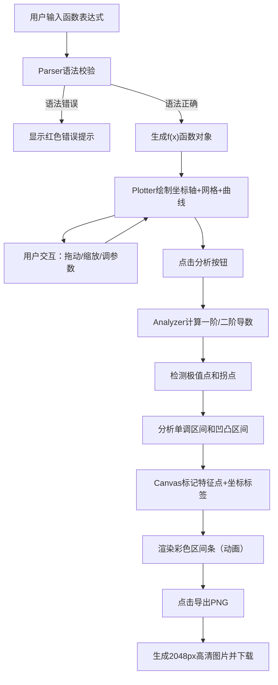

## 1. 产品概述

基于Canvas的可交互函数图像观察器，面向在线教育场景中的教师与学生。支持输入任意单变量数学函数，动态绘制曲线，自动分析并标注极值点、拐点等关键数学特征，使抽象的数学概念可视化、可交互。

- 核心价值：解决传统静态数学图片无法交互、难以突出数学概念的痛点，提供动态探索式学习体验
- 目标用户：数学教师、学生、数学爱好者

## 2. 核心特性

### 2.1 功能模块

1. **函数输入与解析模块**：支持表达式语法解析、实时校验、错误提示
2. **Canvas绘图引擎**：坐标轴、网格线、函数曲线、特征点标记
3. **数学分析引擎**：一阶/二阶导数计算、极值点/拐点检测、单调性/凹凸性分析
4. **交互控制模块**：拖动平移、滚轮缩放、参数面板、一键重置
5. **导出模块**：高清PNG图片导出

### 2.2 页面详情

| 模块名称 | 子模块 | 功能描述 |
|-----------|-------------|---------------------|
| 输入面板 | 函数输入框 | 支持+,-,*,/,^运算符，sin/cos/tan/exp/log/sqrt内置函数，回车或按钮触发绘制 |
| 输入面板 | 语法校验 | 实时校验表达式，错误时输入框下方显示红色提示 |
| Canvas绘图区 | 坐标轴绘制 | 黑色实线+箭头+刻度标签，可开关显示 |
| Canvas绘图区 | 网格背景 | 浅灰色虚线，密度可调，可开关显示 |
| Canvas绘图区 | 函数曲线 | 深蓝色#1a237e，线宽2px，步长0.1像素级精确 |
| Canvas绘图区 | 特征点标记 | 极值点(红色圆点，6px)、拐点(绿色菱形，8px)，带坐标标签 |
| Canvas绘图区 | 交互操作 | 鼠标拖动平移、滚轮缩放，实时重绘无闪烁 |
| 分析结果区 | 彩色区间条 | 单调性(绿/红)、凹凸性(蓝/橙)区间条，逐段动画出现 |
| 控制面板 | 坐标范围设置 | X/Y轴范围、刻度步长独立设置，一键重置默认[-10,10] |
| 控制面板 | 外观设置 | 网格/标签开关、曲线颜色选择(6种预设色+自定义) |
| 控制面板 | 毛玻璃浮层 | 固定左上角，齿轮图标展开/收起 |
| 导出功能 | PNG导出 | 2048px宽度、白色背景、下载到本地 |

## 3. 核心流程

用户输入函数表达式 → 解析器验证语法 → 合法则生成可执行函数对象 → Plotter根据参数绘制坐标系与曲线 → 点击"分析"按钮触发Analyzer计算导数与特征点 → 在Canvas上标记极值点和拐点并绘制彩色区间条 → 用户可拖动/缩放交互观察 → 调整参数实时重绘 → 导出高清图片

## 4. 用户界面设计

### 4.1 设计风格

- **主色调**：浅灰背景(#fafafa) + 深蓝色强调(#1a237e)
- **设计调性**：极简学术风，清晰、专业、无干扰
- **按钮风格**：圆角8px，悬停时阴影加深，点击时有scale 1.05→1.0弹性反馈
- **字体**：标题使用优雅衬线字体增强学术感，正文使用现代无衬线字体保证可读性
- **控制面板**：毛玻璃效果(rgba(255,255,255,0.85)背景 + 10px模糊 + 1px #ddd边框)
- **图标风格**：简约线性图标，与学术调性一致

### 4.2 页面设计概述

| 区域 | 模块 | UI元素 |
|-----------|-------------|-------------|
| 顶部区域 | 输入面板 | 大尺寸输入框+绘制按钮+分析按钮+导出按钮，统一圆角8px |
| 中央区域 | Canvas画布 | 居中显示，80%宽度，高度=宽度×0.6，最小600px最大1200px |
| 左上角 | 控制面板浮层 | 齿轮图标点击展开/收起，表单式布局各项参数设置 |
| 底部区域 | 分析结果 | 两个横向彩色区间条（单调性、凹凸性），标注区间范围 |

### 4.3 动画效果

- **特征点淡入**：极值点/拐点标记opacity 0→1，持续0.4s
- **区间条动画**：从左到右逐段出现，每段间隔0.1s
- **按钮反馈**：点击时scale 1.05→1.0，配合过渡曲线
- **面板展开**：高度+透明度过渡，0.25s缓动

### 4.4 响应式适配

- 桌面端优先设计
- Canvas宽度：页面80%，最小600px，最大1200px
- 高度=宽度×0.6
- 屏幕宽度<768px时：控制面板变为顶部导航栏样式（水平排列）
- 触控设备：优化拖动和缩放手势
