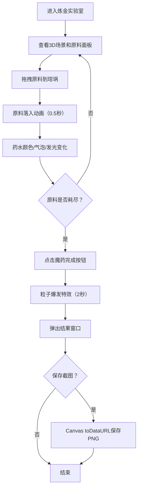

## 1. 产品概述

3D魔法药水调配模拟器——一个基于Web的沉浸式炼金实验室体验。玩家在神秘的3D炼金场景中，通过拖拽魔法原料到坩埚中调配独一无二的魔法药水，实时观察药水颜色、气泡和发光效果变化，最终生成并保存自己的作品。

- 目标用户：喜欢奇幻风格互动体验的休闲玩家和创意爱好者
- 核心价值：将魔法炼金的想象通过3D可视化和实时物理反馈具象化，提供实验般的沉浸感

## 2. 核心功能

### 2.1 功能模块

1. **炼金实验室场景**：Three.js构建的3D实验室，包含深石色工作台、半透明玻璃坩埚、暖黄点光源、深紫星空背景
2. **原料拖拽系统**：5种魔法原料（发光蘑菇、冰晶碎片、暗影草、火焰鳞片、月光露珠），可拖拽到坩埚中
3. **药水状态系统**：实时颜色混合、气泡粒子系统、发光强度控制
4. **状态显示面板**：左侧卷轴面板显示当前药水颜色、气泡密度、发光强度
5. **完成与截图**：原料消耗完后可完成药水，触发粒子爆发特效，生成药水名称，支持截图保存

### 2.2 页面详情

| 页面名称 | 模块名称 | 功能描述 |
|----------|----------|----------|
| 炼金实验室 | 3D场景渲染 | 深石色工作台、玻璃坩埚、暖黄灯光、星空背景，固定45度俯视角，可旋转缩放 |
| 炼金实验室 | 原料面板 | 右侧5种原料图标，显示剩余数量（10单位），支持拖拽到坩埚 |
| 炼金实验室 | 卷轴面板 | 左侧Canvas绘制卷轴，实时显示药水颜色色块、气泡密度数值、发光强度 |
| 炼金实验室 | 投入动画 | 原料缩小旋转落入坩埚（0.5秒），药水颜色按RGB加权平均变化 |
| 炼金实验室 | 气泡粒子 | 坩埚内半透明气泡上浮，数量=原料消耗量×5，最多500个 |
| 炼金实验室 | 完成特效 | 全屏200个彩色粒子爆发扩散（2秒），弹出结果窗口 |
| 炼金实验室 | 结果窗口 | 显示药水名称、颜色、气泡密度、发光强度，提供保存截图按钮 |

## 3. 核心流程

玩家进入炼金实验室 → 从右侧原料面板选择原料 → 拖拽到坩埚上方松开 → 原料动画落入 → 药水颜色/气泡/发光实时变化 → 左侧面板更新状态 → 重复调配直到原料耗尽 → 点击"魔药完成" → 粒子爆发特效 → 查看结果 → 可选保存截图

## 4. 用户界面设计

### 4.1 设计风格

- **主色调**：暗色系背景（#0a0a1a），半透明深色玻璃质感面板
- **强调色**：发光金色（#ffd700）用于文字和边框
- **按钮风格**：金色边框，悬停放大1.1倍，点击有按压动画和闪光效果
- **字体**：奇幻风格装饰字体用于标题，清晰易读字体用于数值
- **布局风格**：三栏布局（左卷轴面板 / 中3D场景 / 右原料面板），宽屏下间距均匀
- **图标风格**：魔法奇幻风，每种原料有独特颜色和形态

### 4.2 页面设计概览

| 页面名称 | 模块名称 | UI元素 |
|----------|----------|--------|
| 炼金实验室 | 3D场景区 | 深紫星空背景、深石色工作台、半透明玻璃坩埚、暖黄灯光 |
| 炼金实验室 | 左侧卷轴面板 | 半透明毛玻璃背景、金色文字、颜色色块64×64、气泡密度0-100、发光强度0.0-1.0 |
| 炼金实验室 | 右侧原料面板 | 半透明毛玻璃背景、5种原料图标、数量角标、拖拽交互 |
| 炼金实验室 | 完成按钮 | 金色边框、悬停放大、按压动画、闪光效果 |
| 炼金实验室 | 结果弹窗 | 毛玻璃背景、药水名称、属性数值、保存截图按钮 |
| 炼金实验室 | 加载页面 | #0a0a1a背景、"炼金术加载中..."发光文字动画 |

### 4.3 响应式适配

- 桌面优先设计，最小宽度1024px
- 宽屏（1600px+）：工作台居中，图标面板右侧固定，卷轴面板左侧固定，三者间距均匀
- 中等宽度（1024-1600px）：三栏布局自适应缩小

### 4.4 3D场景指导

- **环境**：深紫色夜空，星光粒子点缀，营造神秘炼金氛围
- **灯光**：点光源从左上角45度照射（暖黄色），环境光强度0.3
- **相机**：固定桌面左上方45度俯视，鼠标拖拽旋转坩埚（Y轴360度），滚轮缩放（0.5-2倍）
- **构图焦点**：坩埚居中，工作台为底座，原料面板和卷轴面板分列两侧
- **交互动画**：原料落入动画、气泡上浮、颜色渐变、发光脉动、完成时粒子爆发
- **性能预算**：30fps以上，气泡粒子最多500个同时存在
