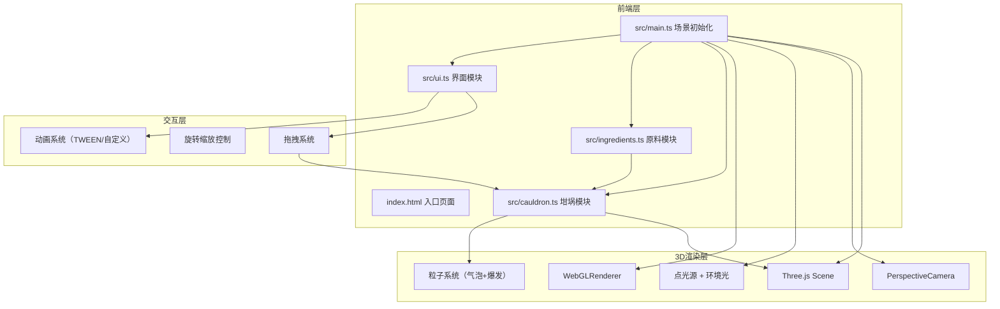

## 1. 架构设计



## 2. 技术说明

- **前端框架**：纯TypeScript + Three.js（不使用React，因为3D场景以Canvas为主）
- **构建工具**：Vite，端口3000，index.html作为入口
- **3D引擎**：Three.js + @types/three
- **语言**：TypeScript（严格模式，target ES2020，moduleResolution bundler）
- **后端**：无（纯前端项目）
- **数据库**：无

## 3. 路由定义

本项目为单页应用，无路由。仅一个页面：炼金实验室。

## 4. 文件结构

| 文件路径 | 职责 |
|----------|------|
| package.json | 项目依赖（three, typescript, vite, @types/three）和启动脚本 |
| index.html | 入口页面，全屏#0a0a1a背景，加载动画 |
| vite.config.js | Vite构建配置，入口index.html，端口3000 |
| tsconfig.json | TypeScript严格模式，ES2020，bundler模块解析 |
| src/main.ts | 创建场景、相机、光源，初始化UI和交互事件 |
| src/cauldron.ts | 坩埚几何体、材质、液体颜色混合、气泡粒子系统 |
| src/ingredients.ts | 5种原料数据类型、颜色效果参数、混合计算函数 |
| src/ui.ts | 卷轴面板、图标面板、完成按钮、结果弹窗交互 |

## 5. 核心数据结构

### 5.1 原料定义

```typescript
interface Ingredient {
  id: string;
  name: string;
  color: { r: number; g: number; b: number };
  bubbleEffect: number;      // 气泡贡献值（正数增加，负数减少）
  glowContribution: number;  // 发光强度贡献
  quantity: number;          // 剩余数量（初始10）
  particleEffect?: 'snow' | 'float' | 'none';  // 特殊粒子效果
}
```

### 5.2 药水状态

```typescript
interface PotionState {
  color: { r: number; g: number; b: number };
  bubbleDensity: number;     // 0-100
  glowIntensity: number;     // 0.0-1.0
  ingredients: Map<string, number>;  // 已添加的原料及数量
}
```

### 5.3 气泡粒子

```typescript
interface Bubble {
  position: { x: number; y: number; z: number };
  velocity: number;
  size: number;              // 0.01-0.03
  opacity: number;
}
```

## 6. 核心算法

### 6.1 颜色混合

采用RGB加权平均：新颜色 = Σ(原料颜色 × 原料数量) / Σ(原料数量)

### 6.2 气泡密度

每5秒采样一次：气泡密度 = min(100, 当前活跃气泡数 / 5)

### 6.3 发光强度

累加所有原料的glowContribution，clamp到[0.0, 1.0]范围

### 6.4 药水名称生成

根据添加的原料组合自动生成名称，例如"暗影火龙露"
