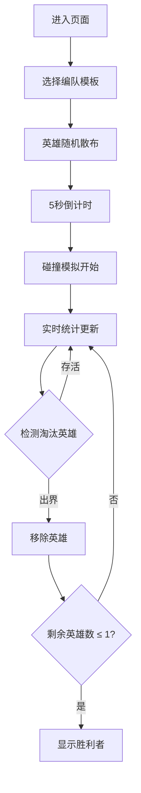

## 1. 产品概述

3D英雄编队碰撞模拟器是一款基于Web的奇幻策略游戏可视化工具，玩家可通过编队不同种族英雄，观察其在圆形竞技场中的碰撞物理模拟效果。

- 核心功能：英雄编队选择、羁绊效果系统、3D物理碰撞模拟、实时统计展示
- 目标用户：策略游戏爱好者、游戏机制研究者
- 产品价值：直观展示英雄阵容搭配对战斗结果的影响，提供沉浸式的3D碰撞视觉体验

## 2. 核心功能

### 2.1 Feature Module

1. **主场景页**：英雄编队面板、3D竞技场景、实时统计面板、倒计时与胜负判定

### 2.2 Page Details

| 页面名称 | 模块名称 | 功能描述 |
|-----------|-------------|---------------------|
| 主场景页 | 英雄编队面板 | 4种预配置编队模板（全人类、全精灵、混合混搭、随机乱斗），点击加载编队 |
| 主场景页 | 3D竞技场景 | Three.js渲染的圆形竞技场，英雄球体碰撞动画，碰撞光晕特效，粒子星空背景 |
| 主场景页 | 实时统计面板 | FPS帧率、碰撞次数、存活英雄数、胜负判定显示 |
| 主场景页 | 羁绊效果系统 | 同种族3人以上增益、4种不同种族敏捷加成的自动计算与视觉反馈 |

## 3. 核心流程

用户进入页面 → 选择编队模板 → 英雄随机散布于竞技场 → 5秒倒计时 → 英雄向中心移动并碰撞 → 实时统计更新 → 淘汰出界英雄 → 剩余1人时显示胜利者

## 4. User Interface Design

### 4.1 Design Style

- 主色调：深紫色（#1a0a2e）背景 + 金色（#ffd700）强调色
- 辅色：人类金（#ffd700）、精灵绿（#4ade80）、兽人红（#ef4444）、亡灵紫（#a855f7）
- 按钮风格：圆角半透明玻璃态（backdrop-filter: blur(6px)），悬停上浮+阴影加深
- 字体：Cinzel（装饰性标题） + Rajdhani（功能性正文）
- 布局风格：左侧编队面板 + 中央3D场景 + 右下角统计面板
- 图标风格：Emoji种族图标（👤🧝👹💀）

### 4.2 Page Design Overview

| 页面名称 | 模块名称 | UI Elements |
|-----------|-------------|-------------|
| 主场景页 | 英雄编队面板 | 玻璃态侧边栏，4个编队卡片，种族图标，点击反馈动画 |
| 主场景页 | 3D竞技场景 | 六边形网格地面，发光圆环边界，呼吸脉动效果，粒子星空 |
| 主场景页 | 实时统计面板 | 毛玻璃卡片，数据数值+标签，胜利者闪光特效 |
| 主场景页 | 碰撞特效 | 半透明膨胀光环（白→淡蓝渐变），辉光后处理 |

### 4.3 Responsiveness

- 桌面优先设计，1366x768以上分辨率布局合理
- 侧边栏固定宽度280px，3D场景自适应剩余空间
- 统计面板固定定位右下角，不随滚动移动
- 小屏设备自动堆叠布局

### 4.4 3D Scene Guidance

- 环境：深紫色星空背景，PointLight多光源照明
- 光照：AmbientLight(0x404040) + 2个PointLight(0xffffff, 1.5) + DirectionalLight
- 相机：PerspectiveCamera(60, aspect, 0.1, 1000)，初始位置(0, 12, 16)
- 视角控制：OrbitControls，距离限制5-20单位，启用阻尼
- 后处理：UnrealBloomPass辉光效果，强度0.8，阈值0.2
- 性能：20个英雄同时碰撞维持≥45FPS，碰撞检测每帧更新
