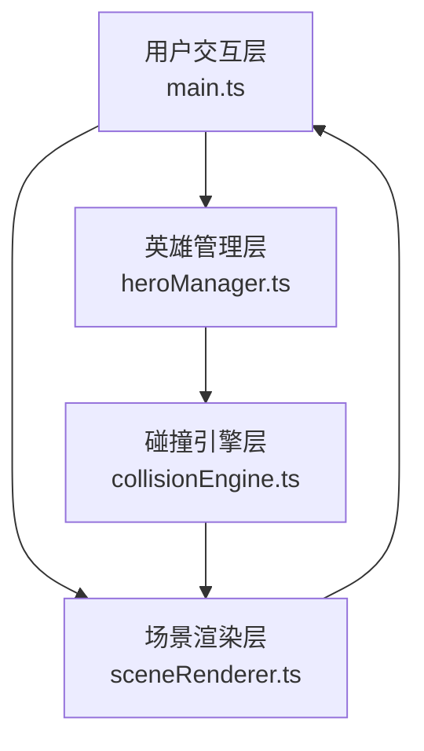

## 1. Architecture Design



**数据流向：**
1. `main.ts` 接收用户输入 → 调用 `heroManager.ts` 获取编队配置
2. `heroManager.ts` 返回英雄数据 → 传递给 `collisionEngine.ts` 初始化物理状态
3. 每帧 `main.ts` 驱动 `collisionEngine.ts` 更新碰撞计算
4. `collisionEngine.ts` 输出最新位置/速度 → `sceneRenderer.ts` 更新3D对象
5. `sceneRenderer.ts` 渲染后由 `main.ts` 呈现到Canvas

## 2. Technology Description

- 前端框架：原生 TypeScript（无框架），模块化组织
- 构建工具：Vite 5.x，入口 index.html，端口 3000
- 3D渲染：Three.js 0.160.x + @types/three
- 后处理：Three.js Examples（UnrealBloomPass, EffectComposer）
- 样式：原生CSS + CSS变量（玻璃态毛玻璃效果）
- 字体：Google Fonts（Cinzel, Rajdhani）

## 3. Route Definitions

此项目为单页面应用，无路由。

| Route | Purpose |
|-------|---------|
| / | 主场景页面（3D竞技场 + 编队面板 + 统计面板） |

## 4. 模块职责与接口定义

### 4.1 heroManager.ts - 英雄管理层

```typescript
// 种族枚举
enum Race { HUMAN = 'human', ELF = 'elf', ORC = 'orc', UNDEAD = 'undead' }

// 英雄数据结构
interface Hero {
  id: string;
  name: string;
  race: Race;
  radius: number;       // 0.4-0.8 随机
  baseRadius: number;
  position: { x: number; z: number };
  velocity: { x: number; z: number };
  baseSpeed: number;    // 0.5 单位/秒
  isBuffed: boolean;    // 羁绊增益状态
  isAlive: boolean;
}

// 编队模板
interface FormationTemplate {
  id: string;
  name: string;
  description: string;
  heroRaces: Race[];    // 5个种族配置
  icon: string;
}

// 导出接口
- getFormationTemplates(): FormationTemplate[]
- createFormation(templateId: string): Hero[]
- calculateBonds(heroes: Hero[]): { buffedHeroId?: string; allAgile: boolean }
- applyBondEffects(heroes: Hero[]): void
```

### 4.2 collisionEngine.ts - 碰撞引擎层

```typescript
interface CollisionEvent {
  position: { x: number; z: number };
  timestamp: number;
}

// 导出接口
- init(heroes: Hero[], arenaRadius: number): void
- update(deltaTime: number): CollisionEvent[]
- getAliveHeroes(): Hero[]
- getCollisionCount(): number
- setCountdownActive(active: boolean): void
- setSimulationActive(active: boolean): void
```

**物理规则：**
- 圆形碰撞检测：两球距离 < 半径之和
- 弹性碰撞：动量守恒 + 能量守恒
- 边界反弹：竞技场半径8，出界>9淘汰
- 速度方向：倒计时后朝向竞技场中心

### 4.3 sceneRenderer.ts - 场景渲染层

```typescript
interface RendererConfig {
  container: HTMLElement;
  arenaRadius: number;
}

// 导出接口
- init(config: RendererConfig): void
- setHeroes(heroes: Hero[]): void
- updateHeroes(heroes: Hero[]): void
- addCollisionEffect(x: number, z: number): void
- updateBoundaryPulse(time: number): void
- showWinner(race: Race): void
- hideWinner(): void
- render(): void
- dispose(): void
```

## 5. 文件结构

```
auto54/
├── .trae/documents/
│   ├── PRD.md
│   └── technical-architecture.md
├── index.html
├── package.json
├── tsconfig.json
├── vite.config.js
└── src/
    ├── main.ts
    ├── heroManager.ts
    ├── collisionEngine.ts
    └── sceneRenderer.ts
```
