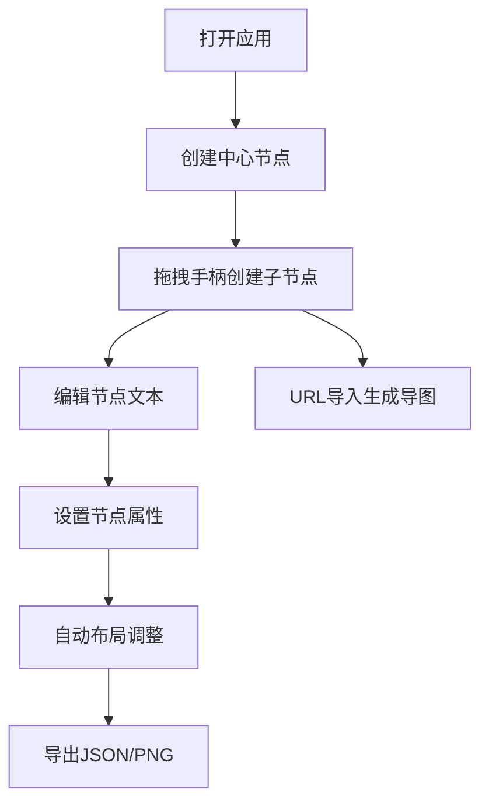

## 1. 产品概述

交互式思维导图Web应用，解决学习或头脑风暴时手动整理结构耗时且难以动态调整的问题。用户可通过文本或URL自动生成互动式思维导图，支持节点编辑、富媒体交互、导入导出、撤销重做等功能。

- 主要用途：学习笔记整理、头脑风暴、知识图谱构建
- 目标用户：学生、研究人员、产品经理、创意工作者
- 产品价值：将繁琐的手动整理自动化，提供动态调整能力，提升思维可视化

## 2. 核心功能

### 2.1 功能模块

1. **核心编辑模块**：画布渲染、节点管理、连接线管理、自动布局
2. **富媒体交互模块**：节点样式、图片嵌入、备注管理
3. **导入导出模块**：URL内容抓取、JSON导出、PNG导出
4. **历史记录模块**：撤销重做、状态快照、动画过渡
5. **用户界面模块**：工具栏、属性面板、响应式布局

### 2.2 页面详情

| 页面名称 | 模块名称 | 功能描述 |
|-----------|-------------|---------------------|
| 主画布页 | 画布渲染 | Canvas自适应窗口，最小800x600，网格线辅助对齐 |
| 主画布页 | 节点编辑 | 点击添加中心节点，双击修改文本，拖拽手柄创建子节点 |
| 主画布页 | 自动布局 | 放射状/树状布局，避免节点重叠，支持Ctrl拖拽自由移动 |
| 主画布页 | 连接线 | 贝塞尔曲线，悬停高亮动画 |
| 主画布页 | 浮动操作栏 | 悬停显示展开/折叠、删除、备注按钮 |
| 工具栏 | 操作按钮 | 添加中心节点、加载URL、导出JSON、导出PNG、撤销、重做 |
| 属性面板 | 节点属性 | 颜色选择器、图片URL、备注编辑 |
| 导入弹窗 | URL加载 | 输入URL，自动抓取页面标题和h1-h3生成思维导图 |

## 3. 核心流程

### 3.1 用户操作流程

用户打开应用 → 点击画布创建中心节点 → 拖拽手柄创建子节点 → 编辑节点内容 → 设置节点属性（颜色、图片、备注）→ 自动布局调整 → 导出JSON/PNG

### 3.2 操作流程图

## 4. 用户界面设计

### 4.1 设计风格

- 主背景色：#F9FAFB（浅色主题）
- 节点默认：#FFFFFF白色背景，圆角12px，阴影0 2px 8px rgba(0,0,0,0.1)
- 选中状态：#3B82F6蓝色发光边框
- 网格线：#E5E7EB，间距40px，线宽0.5px
- 工具栏：半透明磨砂玻璃，backdrop-filter: blur(12px)
- 属性面板：#FFFFFF白色，左侧阴影
- 连接线：默认灰色，悬停蓝色加粗
- 字体：系统默认无衬线字体，支持中文和表情符号
- 动画：CSS transition 0.2s ease，过渡动画300ms ease-out

### 4.2 页面设计概述

| 页面名称 | 模块名称 | UI元素 |
|-----------|-------------|-------------|
| 主画布页 | 工具栏 | 固定顶部，磨砂玻璃背景，6个操作按钮，SVG内联图标 |
| 主画布页 | 画布区域 | Canvas画布，网格背景，节点和连接线渲染 |
| 主画布页 | 属性面板 | 右侧固定，选中显示属性，未选中折叠为"属性"文字 |
| 主画布页 | 浮动操作栏 | 节点悬停显示，三个操作图标 |
| 主画布页 | 备注弹窗 | 300x200px浮动文本框，带滚动条 |

### 4.3 响应式设计

- 桌面端（≥768px）：右侧属性面板固定显示
- 移动端（<768px）：属性面板隐藏，抽屉式按钮代替
- 画布最小尺寸800x600，自适应窗口大小

### 4.4 交互细节

- 按钮悬停：背景色变深#E5E7EB
- 按钮按下：缩放0.95
- 节点选中：蓝色发光边框
- 连接线悬停：蓝色加粗
- 撤销重做：300ms ease-out动画过渡
- 加载动画：旋转浅蓝色圆圈

## 5. 非功能性需求

### 5.1 性能要求

- 100个节点内帧率保持30fps以上
- 节点拖拽无明显卡顿
- 脏区域标记优化渲染性能

### 5.2 技术约束

- 使用TypeScript和原生Canvas API
- 无第三方图表库或jQuery
- 仅依赖typescript和vite
