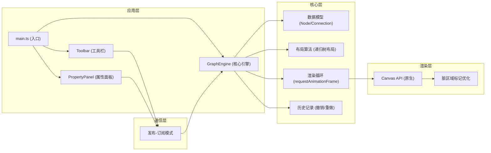

## 1. 架构设计



## 2. 技术描述

- 前端技术栈：TypeScript 5.x + Vite 5.x + 原生Canvas API
- 构建工具：Vite
- 无第三方图表库、无jQuery、无前端框架（React/Vue等）
- 仅依赖：typescript、vite
- 编程语言：TypeScript (严格模式，ES2020)

## 3. 文件结构

| 文件路径 | 职责描述 |
|---------|---------|
| `package.json` | 项目依赖配置，启动脚本 `npm run dev` |
| `index.html` | 入口页面，全屏布局，加载动画 |
| `vite.config.js` | Vite构建配置，端口3000，入口index.html |
| `tsconfig.json` | TypeScript配置，严格模式，target ES2020 |
| `src/main.ts` | 应用入口，初始化画布、事件绑定、加载配置 |
| `src/GraphEngine.ts` | 核心引擎：数据模型、布局算法、渲染循环、性能优化、历史记录 |
| `src/Toolbar.ts` | 工具栏创建与事件注册，发布-订阅通信 |
| `src/PropertyPanel.ts` | 属性面板创建与更新，监听节点选择事件 |

## 4. 核心数据模型

### 4.1 节点数据结构

```typescript
interface Node {
  id: string;
  text: string;
  x: number;
  y: number;
  width: number;
  height: number;
  color: string;
  imageUrl?: string;
  note?: string;
  parentId?: string;
  children: string[];
  collapsed: boolean;
  hasNote: boolean;
  isDragging: boolean;
  isEditing: boolean;
  level: number;
  subtreeSize: number;
}
```

### 4.2 连接线数据结构

```typescript
interface Connection {
  id: string;
  fromNodeId: string;
  toNodeId: string;
  isHovered: boolean;
}
```

### 4.3 历史记录数据结构

```typescript
interface HistoryState {
  nodes: Node[];
  connections: Connection[];
  selectedNodeId?: string;
}

interface HistoryManager {
  undoStack: HistoryState[];
  redoStack: HistoryState[];
  maxHistory: number; // 20
}
```

### 4.4 事件系统（发布-订阅）

```typescript
type EventType = 
  | 'node:select'
  | 'node:add'
  | 'node:delete'
  | 'node:update'
  | 'node:move'
  | 'layout:update'
  | 'url:load'
  | 'export:json'
  | 'export:png'
  | 'history:undo'
  | 'history:redo';

interface EventBus {
  on(event: EventType, callback: (data: any) => void): void;
  emit(event: EventType, data: any): void;
  off(event: EventType, callback: (data: any) => void): void;
}
```

## 5. 核心算法

### 5.1 递归树布局算法

```
函数: layoutSubtree(node, startX, startY, direction)
  1. 如果节点已折叠，返回节点尺寸
  2. 递归计算所有子节点的子树尺寸
  3. 计算当前节点的总高度（所有子树高度之和 + 间距）
  4. 定位当前节点
  5. 按顺序定位每个子节点，垂直方向平均分配空间
  6. 返回当前子树的总尺寸
```

### 5.2 脏区域渲染优化

```
1. 维护dirtyRects数组，标记需要重绘的区域
2. 每次状态变更时，将相关节点和连接线的包围盒加入dirtyRects
3. 渲染循环中，仅重绘dirtyRects覆盖的区域
4. 合并重叠的脏区域以减少重绘次数
```

### 5.3 贝塞尔曲线绘制

```
控制点计算:
- 起点: 父节点右侧边缘中点
- 终点: 子节点左侧边缘中点
- 控制点1: 起点向右偏移 (水平距离 * 0.5)
- 控制点2: 终点向左偏移 (水平距离 * 0.5)
```

## 6. 性能优化策略

1. **脏区域标记**：仅重绘变更区域，而非全屏重绘
2. **离屏Canvas**：静态元素预渲染到离屏Canvas
3. **requestAnimationFrame**：使用浏览器原生渲染循环
4. **对象池**：复用节点和连接线对象，减少GC压力
5. **布局防抖**：频繁操作后延迟布局计算
6. **Canvas分层**：网格背景、连接线、节点分层渲染

## 7. 导入导出协议

### 7.1 JSON导出格式

```json
{
  "version": "1.0",
  "exportTime": "2026-06-11T00:00:00.000Z",
  "nodes": [
    {
      "id": "node-1",
      "text": "中心主题",
      "x": 500,
      "y": 400,
      "width": 120,
      "height": 60,
      "color": "#FFFFFF",
      "imageUrl": null,
      "note": "备注内容",
      "parentId": null,
      "children": ["node-2", "node-3"],
      "collapsed": false
    }
  ],
  "connections": [
    {
      "id": "conn-1",
      "fromNodeId": "node-1",
      "toNodeId": "node-2"
    }
  ]
}
```

### 7.2 URL导入协议

```
输入: URL字符串
处理:
  1. 使用fetch获取页面HTML
  2. 使用DOMParser解析HTML
  3. 提取<title>作为中心节点
  4. 遍历<h1>, <h2>, <h3>标签，按层级构建节点树
  5. 限制最大深度5层
  6. 每个标题截取前20字符
  7. 触发布局算法重新排列
输出: 节点树结构
```

## 8. 事件绑定

### 8.1 画布事件

| 事件 | 处理逻辑 |
|-----|---------|
| `click` | 空白处创建中心节点 |
| `mousedown` | 检测节点/手柄点击，开始拖拽 |
| `mousemove` | 更新拖拽位置，检测悬停 |
| `mouseup` | 结束拖拽，触发布局 |
| `dblclick` | 节点双击进入编辑模式 |
| `keydown` | Ctrl键检测，快捷键处理 |
| `wheel` | 画布缩放/平移 |

### 8.2 键盘快捷键

| 快捷键 | 功能 |
|-------|------|
| `Ctrl+Z` | 撤销 |
| `Ctrl+Shift+Z` | 重做 |
| `Ctrl` + 拖拽 | 自由移动节点 |
| `Delete` | 删除选中节点 |
| `Enter` | 确认编辑 |
| `Esc` | 取消编辑 |

## 9. 浏览器兼容性

- 支持浏览器：Chrome 90+, Firefox 88+, Safari 14+, Edge 90+
- 依赖API：Canvas 2D, requestAnimationFrame, fetch, DOMParser
- CSS特性：backdrop-filter, CSS变量, CSS transition
