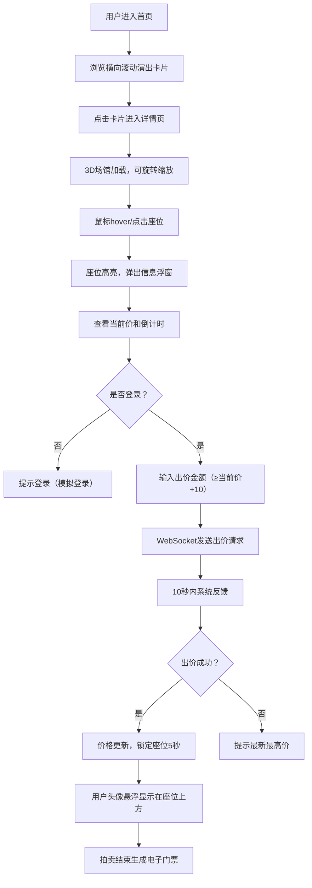

## 1. 产品概述

线上虚拟音乐会门票拍卖与座位选择平台，让用户在线浏览虚拟演唱会、通过3D场馆模型实时竞价心仪座位、最终生成电子门票。

- **核心价值**：模拟真实场馆选座体验，结合拍卖机制打造稀缺感和互动性，全程在线完成
- **目标用户**：音乐爱好者、演唱会观众、收藏爱好者

## 2. 核心功能

### 2.1 用户角色

| 角色 | 注册方式 | 核心权限 |
|------|----------|----------|
| 普通用户 | 模拟登录（演示用） | 浏览演出、查看3D场馆、对座位出价、查看电子门票 |

### 2.2 功能模块

1. **首页**：横向滚动演出卡片列表、导航栏、搜索筛选
2. **演出详情页**：3D场馆模型渲染、座位交互、拍卖出价面板、实时倒计时
3. **门票页面**：电子门票展示、座位信息、二维码

### 2.3 页面详情

| 页面名称 | 模块名称 | 功能描述 |
|----------|----------|----------|
| 首页 | 演出卡片列表 | 横向滚动，每张卡片含海报、艺人、时间、起拍价、剩余座位 |
| 首页 | 顶部导航 | 半透明毛玻璃效果，品牌logo、搜索、用户头像 |
| 演出详情页 | 3D场馆 | Three.js渲染，圆形舞台、阶梯座位、分区着色 |
| 演出详情页 | 座位交互 | 点击高亮、信息浮窗、出价按钮 |
| 演出详情页 | 拍卖面板 | 倒计时、出价输入、历史出价列表 |
| 演出详情页 | 实时通讯 | WebSocket接收出价广播、锁定座位 |

## 3. 核心流程

## 4. 用户界面设计

### 4.1 设计风格

- **主背景色**：#1a1a2e（深空蓝紫）
- **卡片/面板色**：#16213e、#0f3460（渐变深蓝）
- **强调色**：#e94560（霓虹红）、#ffd700（霓虹金）
- **VIP区**：#ffd700（金色）
- **普通区**：#0066cc（蓝色）
- **按钮样式**：霓虹边框发光，hover时缩放1.05，点击回弹
- **字体**：Orbitron（标题，科技感）、Noto Sans SC（正文）
- **整体风格**：霓虹科技感、赛博朋克、深色主题
- **特殊效果**：毛玻璃导航、倒计时闪烁、座位淡入上移动画、霓虹辉光

### 4.2 页面设计概览

| 页面名称 | 模块名称 | UI元素 |
|----------|----------|--------|
| 首页 | 演出卡片 | 圆角16px、渐变边框、hover上浮10px、glow效果、0.3s过渡 |
| 首页 | 横向滚动 | 隐藏滚动条、惯性滚动、左右渐变遮罩 |
| 详情页 | 3D场馆 | 占页面左侧70%、黑色背景、舞台中心发光 |
| 详情页 | 座位浮窗 | 圆角12px、半透明背景、霓虹边框、向下箭头指向座位 |
| 详情页 | 出价面板 | 右侧30%、毛玻璃效果、渐变边框、倒计时闪烁 |
| 全局 | 导航栏 | backdrop-filter: blur(20px)、半透明、固定顶部 |

### 4.3 响应式设计

- **桌面（≥1200px）**：详情页左右分栏（70%/30%），首页卡片横向滚动
- **平板（768-1199px）**：详情页上下布局，首页每行2张卡片
- **手机（<768px）**：单列布局，详情页上下堆叠，首页单列滚动
- **触摸优化**：座位点击区域扩大、双击缩放、禁止页面滚动时3D场景不响应

### 4.4 3D场景设计

- **环境**：深色星空背景，添加雾化效果营造深度
- **灯光**：舞台中心聚光灯（暖黄色），环境光（深蓝色），座位区域补光
- **相机**：初始视角俯视45度，距离场馆边缘20单位，fov 60
- **座位交互**：hover时放大10%+红色边框，点击时同样效果+弹出浮窗
- **性能**：InstancedMesh渲染座位，限制帧率30+，移动端降级渲染
- **后处理**：轻微Bloom效果增强霓虹感，FXAA抗锯齿
