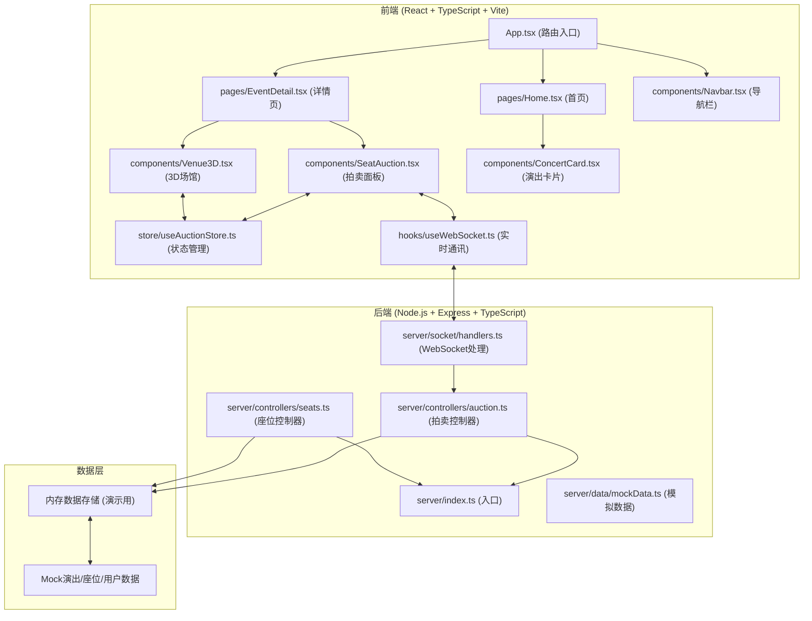
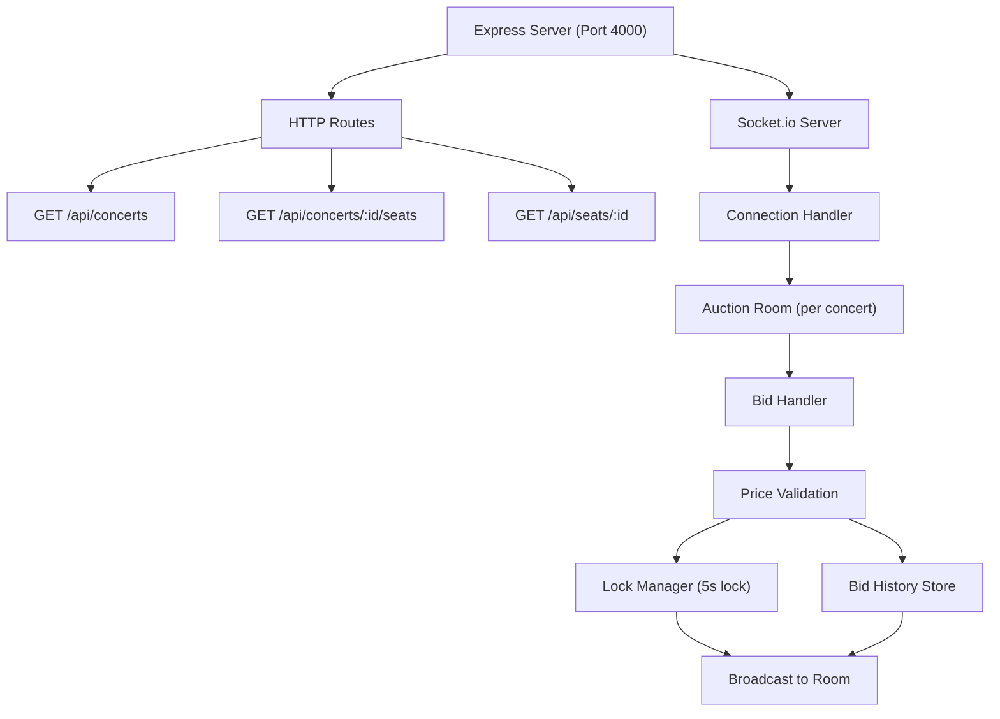
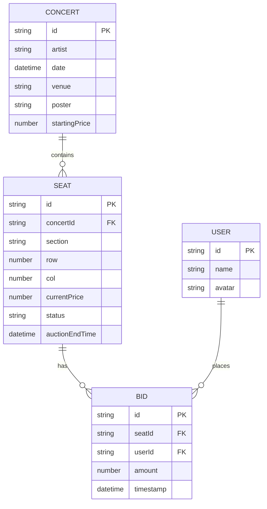

## 1. 架构设计



## 2. 技术描述

- **前端**：React@18 + TypeScript + Vite@5 + Three.js@0.160 + Zustand@4 + Socket.io-client@4
- **后端**：Express@4 + TypeScript + Socket.io@4 + CORS@2 + UUID@9
- **样式**：TailwindCSS@3 + CSS变量（霓虹主题）
- **初始化工具**：vite-init react-express-ts模板
- **构建配置**：Vite端口3000，Proxy /api到4000端口
- **数据库**：内存存储（演示用），Mock数据初始化

## 3. 路由定义

| 路由 | 用途 |
|------|------|
| / | 首页 - 演出列表 |
| /event/:id | 演出详情页 - 3D场馆+拍卖 |
| /ticket/:id | 电子门票页 |

## 4. API 定义

```typescript
// 类型定义
interface Concert {
  id: string;
  artist: string;
  date: string;
  startTime: string;
  poster: string;
  startingPrice: number;
  totalSeats: number;
  availableSeats: number;
  venue: string;
}

interface Seat {
  id: string;
  concertId: string;
  row: number;
  col: number;
  section: 'vip' | 'regular';
  status: 'available' | 'bidding' | 'locked' | 'sold';
  currentPrice: number;
  currentBidder?: {
    id: string;
    name: string;
    avatar: string;
  };
  auctionEndTime: string;
  bidHistory: Bid[];
}

interface Bid {
  id: string;
  seatId: string;
  userId: string;
  userName: string;
  userAvatar: string;
  amount: number;
  timestamp: string;
}

// HTTP API
GET /api/concerts          # 获取演出列表
GET /api/concerts/:id      # 获取演出详情
GET /api/concerts/:id/seats # 获取所有座位
GET /api/seats/:id         # 获取单个座位详情

// WebSocket Events
Client -> Server:
  - 'seat:bid' { seatId, userId, amount }
  
Server -> Client:
  - 'seat:update' { seatId, seatData }
  - 'seat:locked' { seatId, duration }
  - 'bid:success' { seatId, newPrice }
  - 'bid:failed' { seatId, reason, currentPrice }
```

## 5. 服务器架构



## 6. 数据模型

### 6.1 ER图



### 6.2 初始化数据

```typescript
// Mock演出数据
const concerts = [
  {
    id: 'concert-001',
    artist: 'Neon Dreams',
    date: '2026-07-15T20:00:00',
    venue: '虚拟体育馆',
    startingPrice: 100,
    totalSeats: 200,
    poster: '/images/neon-dreams.jpg'
  },
  {
    id: 'concert-002', 
    artist: 'Cyber Symphony',
    date: '2026-07-20T19:30:00',
    venue: '赛博音乐厅',
    startingPrice: 150,
    totalSeats: 150,
    poster: '/images/cyber-symphony.jpg'
  }
];

// 生成座位数据（圆形场馆，3层，每层20-40个座位）
// VIP: 第一层（金色）, Regular: 第二三层（蓝色）
```
