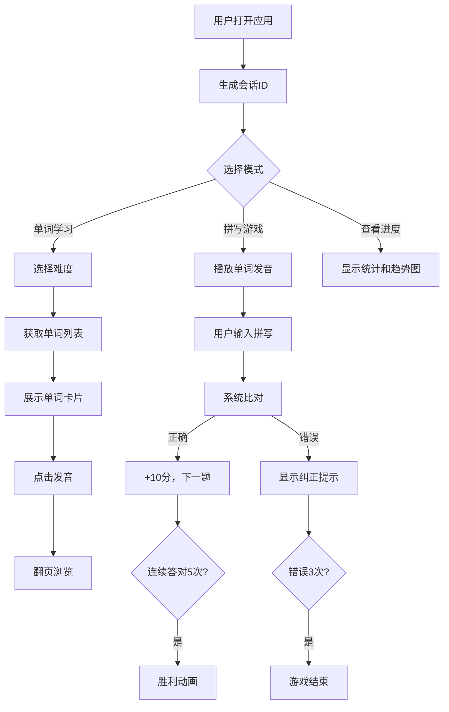

## 1. 产品概述
本产品是一个基于Web的语音交互式英文单词与自然拼读训练应用，旨在帮助学生通过互动方式提升英语单词学习效果。解决传统静态卡片学习缺乏发音与拼写即时反馈的痛点。
- 主要面向需要学习英文单词的学生群体，提供单词学习、拼写游戏、进度追踪等功能
- 核心价值在于通过语音交互、即时反馈和游戏化设计提升学习效率和趣味性

## 2. 核心功能

### 2.1 用户角色
| 角色 | 注册方式 | 核心权限 |
|------|----------|----------|
| 普通用户 | 自动生成会话ID | 单词学习、拼写游戏、查看个人进度 |
| 管理员 | 手动访问/admin路由 | 添加新单词、管理单词库 |

### 2.2 功能模块
1. **主页**: 难度选择导航、功能入口、进度概览
2. **单词学习模式**: 分级单词卡片展示、发音播放、翻页浏览
3. **拼写游戏模式**: 听力拼写、语音识别输入、即时纠错、得分系统
4. **用户进度追踪**: 成绩统计、练习历史、趋势折线图
5. **管理员面板**: 单词添加表单、数据管理

### 2.3 页面详情
| 页面名称 | 模块名称 | 功能描述 |
|----------|----------|----------|
| 主页 | 难度选择区 | 初级/中级/高级三个难度按钮，点击进入对应单词列表 |
| 主页 | 功能导航区 | 单词学习、拼写游戏、进度查看的入口卡片 |
| 单词学习页 | 单词卡片网格 | 每页10个随机单词卡片，含发音、音标、图片、例句 |
| 单词学习页 | 翻页控制 | 上一页/下一页按钮，页码显示 |
| 拼写游戏页 | 发音播放区 | 大尺寸喇叭按钮，点击播放单词发音 |
| 拼写游戏页 | 输入区 | 文本输入框、语音识别按钮、提交按钮 |
| 拼写游戏页 | 结果反馈区 | 拼写纠正显示、得分显示、胜利/失败动画 |
| 进度页 | 成绩统计区 | 累计得分、正确率、练习次数 |
| 进度页 | 趋势图区 | 最近10次练习得分折线图 |
| 管理员页 | 单词添加表单 | 单词、音标、释义、图片URL、难度、音频文件上传 |

## 3. 核心流程
用户打开应用 → 自动生成会话ID并存储 → 选择学习模式（单词学习/拼写游戏）
- 单词学习：选择难度 → 获取单词列表 → 浏览卡片 → 点击发音 → 翻页
- 拼写游戏：开始游戏 → 播放发音 → 输入拼写（手动/语音）→ 提交比对 → 反馈结果 → 累计得分 → 胜利/结束
- 进度查看：从侧边栏进入 → 查看统计数据和趋势图

## 4. 用户界面设计

### 4.1 设计风格
- 主色调：柔和糖果色系，淡紫 #D4A5E8、淡绿 #A8E6CF、淡粉 #FFD6E0
- 卡片样式：圆角12px，阴影 0 4px 12px rgba(0,0,0,0.1)，悬停上移4px并加深阴影
- 字体：白色无衬线字体，清晰易读
- 按钮：圆角设计，悬停有过渡动画，点击有反馈
- 动画：加载旋转动画、拼写输入框微光闪烁、胜利五彩纸屑粒子效果

### 4.2 页面设计概述
| 页面名称 | 模块名称 | UI元素 |
|----------|----------|--------|
| 主页 | 难度选择区 | 三个彩色卡片按钮，分别对应初级(淡绿)、中级(淡紫)、高级(淡粉) |
| 单词学习页 | 卡片网格 | 响应式网格布局，卡片含图片、单词、音标、发音按钮、例句 |
| 拼写游戏页 | 中央交互区 | 大号发音按钮居中，下方输入框带聚焦动画，结果反馈彩色标记 |
| 进度页 | 统计区 | 数据卡片展示，Canvas折线图平滑动画 |
| 管理员页 | 表单区 | 清晰的表单布局，标签与输入框对齐，提交成功通知 |

### 4.3 响应式设计
- 桌面端：多列网格布局，侧边栏常驻
- 移动端(<768px)：单列布局，顶部导航栏变为汉堡菜单，卡片宽度自适应屏幕
- 触摸优化：按钮最小尺寸44x44px，手势滑动翻页支持

### 4.4 动效设计
- 加载动画：浅蓝渐变背景，中心旋转加载图标
- 卡片悬停：translateY(-4px)，阴影加深，transition 0.3s ease
- 输入框聚焦：蓝色边框动画，微光闪烁效果
- 胜利动画：五彩纸屑粒子效果，持续2秒后自动消散
- 页面切换：淡入淡出过渡效果
