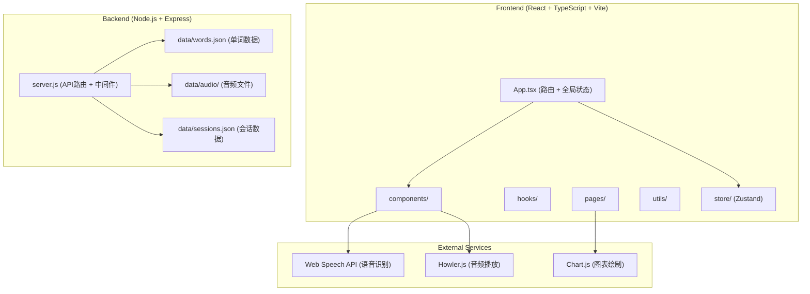
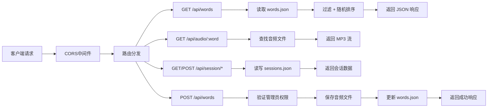
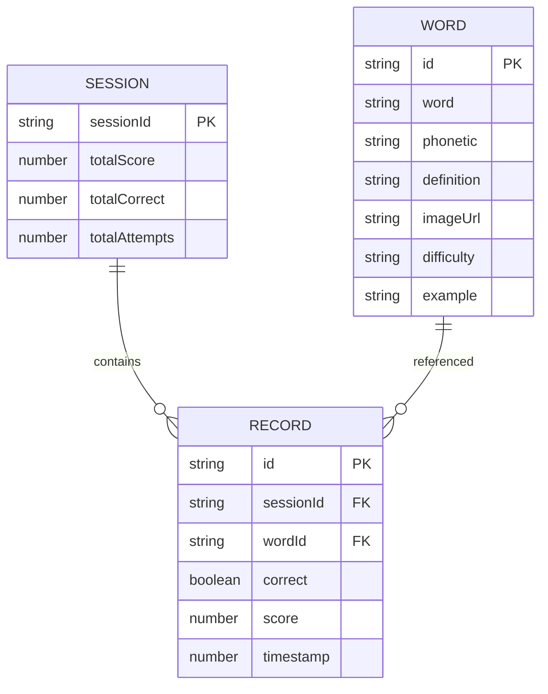

## 1. 架构设计



## 2. 技术描述

- **前端框架**: React 18 + TypeScript 5
- **构建工具**: Vite 5 (端口5173，代理/api到后端3001端口)
- **状态管理**: Zustand 4
- **路由**: React Router DOM 6
- **音频播放**: Howler 2.2
- **图表**: Chart.js 4
- **图标**: Lucide React
- **样式**: Tailwind CSS 3 + CSS变量
- **后端**: Express 4 (端口3001)
- **CORS**: cors 中间件
- **ID生成**: uuid 9
- **数据存储**: 本地JSON文件

## 3. 路由定义

| 路由 | 页面 | 功能 |
|------|------|------|
| / | HomePage | 主页，难度选择和功能入口 |
| /learn/:difficulty | LearnPage | 单词学习模式 |
| /spelling | SpellingPage | 拼写游戏模式 |
| /progress | ProgressPage | 用户进度追踪 |
| /admin | AdminPage | 管理员数据管理 |

## 4. API 定义

```typescript
// 单词对象类型
interface Word {
  id: string;
  word: string;
  phonetic: string;
  definition: string;
  imageUrl: string;
  difficulty: 'beginner' | 'intermediate' | 'advanced';
  example?: string;
}

// 会话记录类型
interface SessionRecord {
  wordId: string;
  correct: boolean;
  timestamp: number;
  score: number;
}

// 会话数据类型
interface SessionData {
  sessionId: string;
  records: SessionRecord[];
  totalScore: number;
  totalCorrect: number;
  totalAttempts: number;
}

// GET /api/words?difficulty=beginner
// 响应: Word[] (100个单词，按难度过滤并随机打乱)

// GET /api/words/:id
// 响应: Word

// GET /api/audio/:word
// 响应: MP3音频文件流

// GET /api/session/:sessionId
// 响应: SessionData

// POST /api/session/:sessionId/record
// 请求体: { wordId: string, correct: boolean, score: number }
// 响应: { success: boolean, updatedData: SessionData }

// POST /api/words
// 请求体: Omit<Word, 'id'> & { audioFile?: File }
// 响应: { success: boolean, word: Word }
```

## 5. 服务器架构图



## 6. 数据模型

### 6.1 数据模型定义



### 6.2 数据文件结构

```
server/
├── data/
│   ├── words.json          # 100个基础单词数据
│   ├── sessions.json       # 用户会话记录
│   └── audio/              # MP3音频文件目录
│       ├── apple.mp3
│       ├── banana.mp3
│       └── ...
└── server.js               # Express服务端
```

### 6.3 目录结构说明

**文件调用关系与数据流向：**

1. **[index.html](file:///c:/Users/Administrator/Desktop/VersionFast/VersionFast/tasks/auto57/index.html)** 
   - 入口页面，加载 React 应用
   - 浅蓝渐变背景 + 加载动画

2. **[src/App.tsx](file:///c:/Users/Administrator/Desktop/VersionFast/VersionFast/tasks/auto57/src/App.tsx)**
   - 主组件，路由配置和全局状态管理
   - 调用 `/api/words` 获取单词数据
   - 向下传递数据给子组件

3. **[src/pages/HomePage.tsx](file:///c:/Users/Administrator/Desktop/VersionFast/VersionFast/tasks/auto57/src/pages/HomePage.tsx)**
   - 接收 App 传递的单词数据
   - 展示难度选择卡片
   - 导航到其他页面

4. **[src/pages/LearnPage.tsx](file:///c:/Users/Administrator/Desktop/VersionFast/VersionFast/tasks/auto57/src/pages/LearnPage.tsx)**
   - 从路由参数获取难度级别
   - 调用 `/api/words?difficulty=xxx` 获取对应难度单词
   - 使用 [WordCard](file:///c:/Users/Administrator/Desktop/VersionFast/VersionFast/tasks/auto57/src/components/WordCard.tsx) 组件展示
   - 管理分页状态

5. **[src/components/WordCard.tsx](file:///c:/Users/Administrator/Desktop/VersionFast/VersionFast/tasks/auto57/src/components/WordCard.tsx)**
   - 接收单词对象作为 props
   - 展示拼写、音标、配图
   - 喇叭图标点击 → Howler 播放 `/api/audio/:word`
   - 播放完成后通知父组件

6. **[src/pages/SpellingPage.tsx](file:///c:/Users/Administrator/Desktop/VersionFast/VersionFast/tasks/auto57/src/pages/SpellingPage.tsx)**
   - 管理游戏状态（得分、连续正确数、错误次数）
   - 使用 [SpellingGame](file:///c:/Users/Administrator/Desktop/VersionFast/VersionFast/tasks/auto57/src/components/SpellingGame.tsx) 组件

7. **[src/components/SpellingGame.tsx](file:///c:/Users/Administrator/Desktop/VersionFast/VersionFast/tasks/auto57/src/components/SpellingGame.tsx)**
   - 接收当前单词和用户输入
   - 与正确拼写比对（忽略大小写）
   - 返回比对结果（红绿标记）和得分
   - 支持 Web Speech API 语音输入

8. **[src/pages/ProgressPage.tsx](file:///c:/Users/Administrator/Desktop/VersionFast/VersionFast/tasks/auto57/src/pages/ProgressPage.tsx)**
   - 从 localStorage 获取 sessionId
   - 调用 `/api/session/:sessionId` 获取历史记录
   - 使用 Chart.js 绘制趋势折线图

9. **[src/pages/AdminPage.tsx](file:///c:/Users/Administrator/Desktop/VersionFast/VersionFast/tasks/auto57/src/pages/AdminPage.tsx)**
   - 表单提交新单词数据
   - 调用 `POST /api/words` 添加单词

10. **[server/server.js](file:///c:/Users/Administrator/Desktop/VersionFast/VersionFast/tasks/auto57/server/server.js)**
    - Express 后端服务
    - 提供所有 API 接口
    - 读写 JSON 数据文件
    - 提供音频文件流

**数据流向总结：**
```
用户交互 → React 组件状态更新 → API 调用 → Express 处理 → 
JSON 文件读写 → API 响应 → React 状态更新 → UI 重新渲染
```
