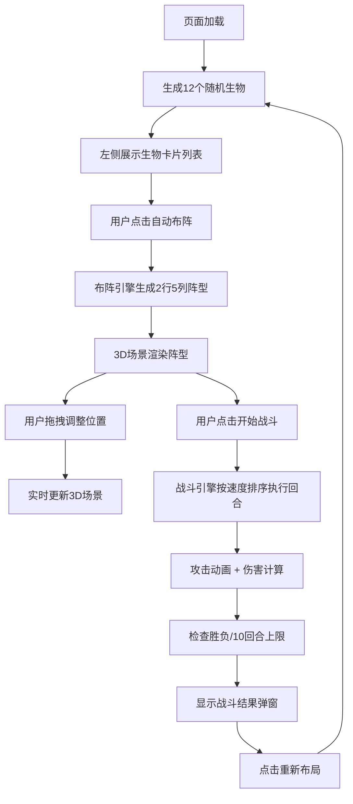

## 1. 产品概述

本产品是一个基于Web的3D魔法生物战队自动布阵与战斗模拟器，帮助玩家在奇幻策略游戏中快速编排生物阵型并预演战斗结果。通过3D可视化和自动布阵算法，解决手动编排繁琐、战斗结果难以预估的问题。

- 主要用途：为魔法生物战队提供自动布阵优化和战斗结果模拟
- 目标用户：奇幻策略游戏玩家、战棋游戏爱好者
- 产品价值：通过智能布阵算法和可视化战斗模拟，提升玩家游戏体验和战术决策效率

## 2. 核心功能

### 2.1 功能模块

1. **主界面**：3D战场场景、左侧生物卡片列表、底部控制工具栏
2. **布阵系统**：自动布阵算法、手动拖拽调整阵型
3. **战斗系统**：回合制战斗模拟、元素克制计算、伤害统计
4. **渲染系统**：3D生物模型渲染、战斗动画效果、UI信息展示

### 2.2 页面详情

| 页面名称 | 模块名称 | 功能描述 |
|-----------|-------------|---------------------|
| 主界面 | 生物卡片列表 | 展示12个随机生物（4火4水4草），按元素分组，显示攻击力、生命值、速度 |
| 主界面 | 3D战场场景 | 渲染2行5列网格阵型，生物模型带元素光环，支持拖拽调整位置 |
| 主界面 | 控制工具栏 | 自动布阵按钮、开始战斗按钮、重新布局按钮 |
| 主界面 | 战斗信息面板 | 右上角显示回合数、双方存活数 |
| 主界面 | 战斗结果弹窗 | 显示胜负、存活数量、伤害对比柱状图 |

## 3. 核心流程

## 4. 用户界面设计

### 4.1 设计风格

- **主色调**：深紫至黑色径向渐变背景，营造魔法星空氛围
- **元素色彩**：火元素（红色）、水元素（蓝色）、草元素（绿色）
- **按钮风格**：紫到蓝渐变背景，圆角矩形，悬浮时发光效果（box-shadow阴影扩散）
- **字体**：使用Cinzel装饰性字体搭配Inter正文，营造奇幻魔法风格
- **布局风格**：左侧卡片列表（300px宽）+ 中央3D场景 + 底部工具栏（60px高）
- **卡片风格**：半透明毛玻璃材质（backdrop-filter: blur(10px)），圆角12px

### 4.2 页面设计概述

| 页面名称 | 模块名称 | UI元素 |
|-----------|-------------|-------------|
| 主界面 | 背景 | 深紫径向渐变 + CSS闪烁星星动画 |
| 主界面 | 生物卡片 | 元素颜色圆点（12px）、攻击力数字、生命值进度条 |
| 主界面 | 3D生物模型 | 火（红色圆锥）、水（蓝色立方体）、草（绿色球体），尺寸0.5单位 |
| 主界面 | 元素光环 | 半透明彩色圆环，半径0.3单位，漂浮在生物上方 |
| 主界面 | 攻击光线 | 从攻击者射向目标的彩色光线，存续0.3秒 |
| 主界面 | 战斗效果 | 受击闪烁（0.2秒间隔，持续1秒），死亡缩小消失（0.5秒动画） |
| 主界面 | 结果弹窗 | 伤害对比柱状图（红vs蓝），胜方信息，重新布局按钮 |

### 4.3 响应性

- 桌面端优先设计，3D场景自适应窗口大小
- 左侧卡片列表固定300px宽度，支持垂直滚动
- 底部工具栏固定高度60px，按钮居中排列
- 拖拽操作支持鼠标，涟漪动画反馈位置变化

### 4.4 3D场景指导

- **环境**：深紫色星空背景，营造魔法氛围
- **光照**：两盏方向光（主光+补光）+ 环境光，确保3D模型清晰可见
- **相机设置**：初始位置在阵型正前方5单位、高度3单位，略微俯视角度
- **地面**：浅灰色10x10单位网格平面，显示阵型网格线
- **动画**：所有动画使用requestAnimationFrame驱动，确保30fps以上帧率
- **性能优化**：几何体复用、材质共享、减少draw call

## 5. 性能约束

- 3D场景渲染帧率：普通笔记本（i5+集成显卡）保持30fps以上
- 生物列表滚动响应时间：≤50ms
- 每回合战斗计算时长：≤100ms
- 单次战斗最多10回合，防止无限循环
