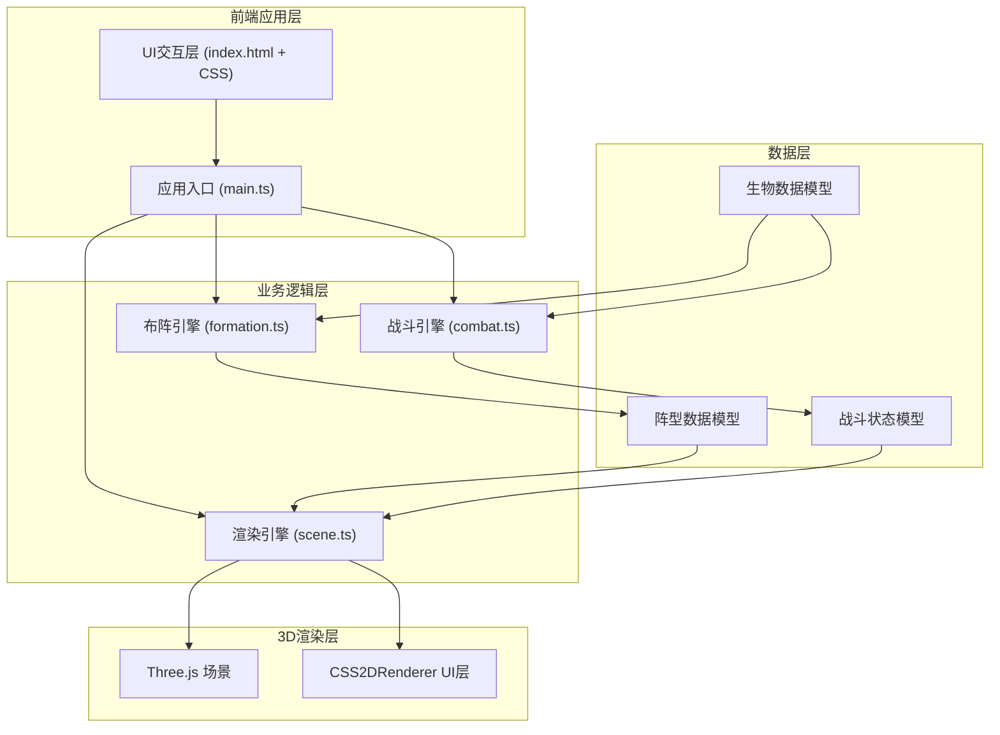
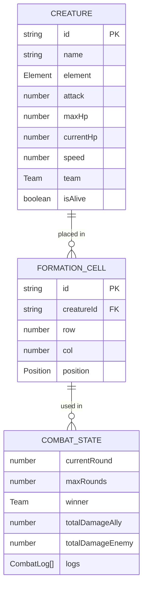

## 1. 架构设计



**数据流方向**：
- `main.ts` 接收UI事件 → 调用 `formation.ts` 生成阵型数组 → 调用 `scene.ts` 绘制战场
- `main.ts` 调用 `combat.ts` 结算战斗 → 将结果传递给 `scene.ts` 更新显示
- 拖拽事件 → `main.ts` 更新阵型数据 → `scene.ts` 重绘3D场景

## 2. 技术描述

- **前端核心**：TypeScript + Three.js + Vite
- **3D渲染**：Three.js r160+，CSS2DRenderer
- **构建工具**：Vite 5.x
- **类型系统**：TypeScript 5.x，严格模式
- **样式方案**：原生CSS + CSS变量，无CSS框架

**依赖版本规范**：
```json
{
  "three": "^0.160.0",
  "@types/three": "^0.160.0",
  "typescript": "^5.3.0",
  "vite": "^5.0.0"
}
```

## 3. 文件结构与调用关系

```
auto60/
├── package.json              # 项目配置与依赖
├── vite.config.js            # Vite构建配置（端口3000）
├── tsconfig.json             # TypeScript配置（严格模式，ES2020）
├── index.html                # 入口页面（全屏星空背景）
└── src/
    ├── main.ts               # 应用入口，协调各模块
    │   ├── 调用: formation.generateFormation()
    │   ├── 调用: combat.simulateCombat()
    │   ├── 调用: scene.init() / renderFormation() / updateCombat()
    │   └── 监听: 拖拽事件、按钮点击事件
    ├── types/
    │   └── index.ts          # 类型定义（生物、阵型、战斗状态）
    ├── engine/
    │   ├── formation.ts      # 布阵引擎
    │   │   ├── generateFormation() → 阵型数组
    │   │   └── sortBySpeedAndElement() → 排序逻辑
    │   └── combat.ts         # 战斗引擎
    │       ├── simulateCombat() → 战斗结果
    │       ├── calculateDamage() → 伤害计算
    │       └── getElementMultiplier() → 克制系数
    ├── render/
    │   └── scene.ts          # 渲染引擎
    │       ├── init() → 初始化Three.js场景
    │       ├── renderFormation() → 绘制阵型
    │       ├── updateCombat() → 更新战斗动画
    │       ├── showAttackRay() → 攻击光线
    │       ├── showDamageFlash() → 受击闪烁
    │       └── showDeathAnimation() → 死亡动画
    └── utils/
        └── creatureFactory.ts # 生物工厂，生成随机生物
```

## 4. 数据模型

### 4.1 数据模型定义



### 4.2 TypeScript类型定义

```typescript
// 元素类型
type Element = 'fire' | 'water' | 'grass';

// 阵营
type Team = 'ally' | 'enemy';

// 生物接口
interface Creature {
  id: string;
  name: string;
  element: Element;
  attack: number;      // 5-15
  maxHp: number;       // 20-50
  currentHp: number;
  speed: number;       // 1-5
  team: Team;
  isAlive: boolean;
}

// 阵型格子
interface FormationCell {
  id: string;
  creatureId: string | null;
  row: 0 | 1;          // 0=前排, 1=后排
  col: 0 | 1 | 2 | 3 | 4;
  position: { x: number; z: number };
}

// 阵型数组
type Formation = FormationCell[];

// 战斗日志
interface CombatLog {
  round: number;
  attackerId: string;
  targetId: string;
  damage: number;
  elementMultiplier: number;
  isKill: boolean;
}

// 战斗结果
interface CombatResult {
  winner: Team | 'draw';
  allySurvivors: number;
  enemySurvivors: number;
  totalDamageAlly: number;
  totalDamageEnemy: number;
  logs: CombatLog[];
  creatures: Map<string, Creature>;
}

// 元素克制系数
const ELEMENT_MULTIPLIERS: Record<Element, Record<Element, number>> = {
  fire: { fire: 0.5, water: 0.5, grass: 1.5 },
  water: { fire: 1.5, water: 0.5, grass: 0.5 },
  grass: { fire: 0.5, water: 1.5, grass: 0.5 }
};
```

## 5. 核心算法说明

### 5.1 自动布阵算法

```
输入: 生物列表（含速度、元素属性）
输出: 2行5列阵型数组

算法步骤:
1. 按速度降序排序生物（速度快放前排）
2. 前5个生物放入前排（row=0），z坐标前移0.5单位
3. 后5个生物放入后排（row=1），z坐标后移0.5单位
4. 每行内部按元素克制关系排列：
   - 统计敌方主力元素
   - 将克制敌方的生物放在对应列位置
5. 每行前后间距2单位，列间距1单位
6. 剩余2个生物作为替补，不放入阵型
```

### 5.2 战斗模拟算法

```
输入: 阵型数组、生物数据
输出: 战斗结果

算法步骤:
1. 收集双方存活生物，按速度降序确定攻击顺序
2. 最多执行10回合:
   a. 遍历攻击队列:
      i. 跳过已死亡生物
      ii. 从敌方行选择目标（优先同列，否则随机）
      iii. 计算伤害 = 攻击力 × 元素克制系数
      iv. 扣除目标生命值
      v. 记录战斗日志
      vi. 若目标死亡，标记为已死亡
   b. 回合结束，检查胜负条件
3. 统计总伤害、存活数量
4. 返回战斗结果
```

## 6. 性能优化策略

1. **3D渲染优化**：
   - 复用几何体（BoxGeometry, ConeGeometry, SphereGeometry各一个实例）
   - 共享材质，减少内存占用
   - 网格平面使用SingleSide渲染
   - 限制最大生物数量为10个（2×5阵型）

2. **动画优化**：
   - 使用requestAnimationFrame统一动画循环
   - 动画对象池管理，避免频繁GC
   - 死亡动画完成后立即从场景移除对象

3. **计算优化**：
   - 战斗计算与渲染分离，使用微任务队列批量处理
   - 元素克制表预计算，直接查表获取系数
   - 攻击队列预排序，每回合只排序一次

## 7. 启动脚本

- `npm run dev`：启动Vite开发服务器（端口3000）
- `npm run build`：生产构建
- `npm run check`：TypeScript类型检查
