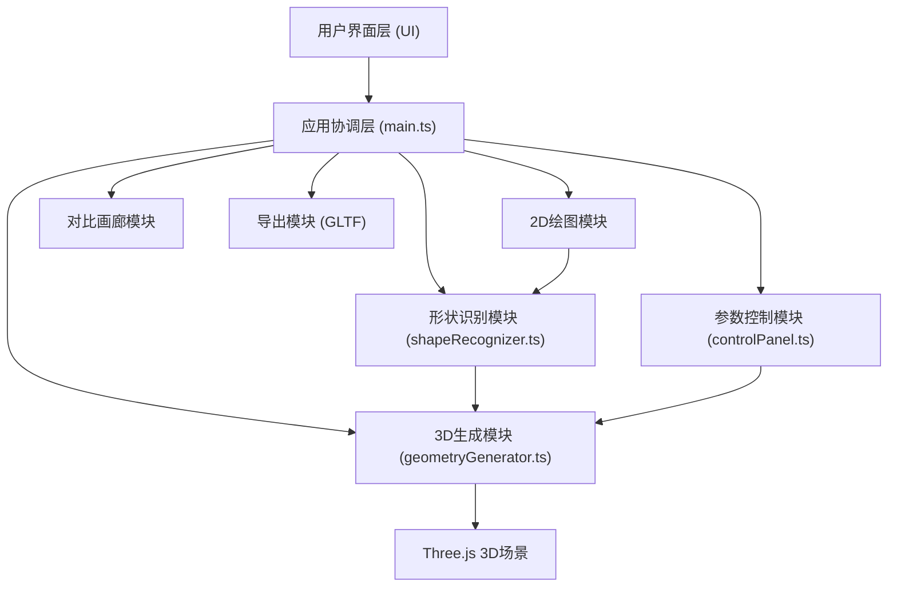

## 1. 架构设计



## 2. 技术描述

- **前端框架**: 原生 TypeScript (无UI框架，直接操作DOM)
- **构建工具**: Vite 5.x
- **3D渲染引擎**: Three.js 0.160.x + @types/three
- **语言**: TypeScript 5.x (严格模式, target ES2020, module ESNext)
- **样式**: 原生CSS (CSS变量，深色主题，响应式布局)
- **初始化方式**: Vite vanilla-ts 模板

## 3. 项目文件结构

| 文件路径 | 目的 |
|----------|------|
| `/package.json` | 项目依赖：three, typescript, vite, @types/three；脚本：npm run dev |
| `/index.html` | 入口页面，深色背景，各容器div布局，加载动画 |
| `/vite.config.js` | Vite配置：端口3000，自动打开浏览器 |
| `/tsconfig.json` | TypeScript配置：严格模式，ES2020，ESNext模块 |
| `/src/main.ts` | 应用入口：协调2D画布与3D场景，事件监听，数据流 |
| `/src/shapeRecognizer.ts` | 形状识别：RDP降采样，圆形/矩形/三角形/多边形识别算法 |
| `/src/geometryGenerator.ts` | 几何体生成：Sphere/Box/Cylinder/Extrude，材质，clone/exportGLTF |
| `/src/controlPanel.ts` | 参数面板DOM：滑块、颜色选择器、按钮，CustomEvent事件派发 |

## 4. 核心数据结构与接口

### 4.1 类型定义

```typescript
// 2D点
interface Point {
  x: number;
  y: number;
}

// 形状识别结果
interface RecognitionResult {
  type: 'circle' | 'rect' | 'triangle' | 'polygon';
  confidence: number;
  fittedPoints: Point[];
}

// 几何体参数
interface GeometryParams {
  size: number;        // 0.5 - 3.0
  rotationX: number;   // 0 - 360
  rotationY: number;   // 0 - 360
  rotationZ: number;   // 0 - 360
  color: string;       // 6种预设颜色之一
}

// 画廊克隆项
interface GalleryItem {
  id: string;
  mesh: THREE.Mesh;
  params: GeometryParams;
  shapeType: string;
  thumbnail: string;   // data URL
}
```

### 4.2 事件定义

```typescript
// 参数变更事件
interface ParamsChangeEvent extends CustomEvent {
  detail: GeometryParams;
}

// 形状识别完成事件
interface ShapeRecognizedEvent extends CustomEvent {
  detail: RecognitionResult;
}
```

## 5. 核心算法说明

### 5.1 Ramer-Douglas-Peucker 降采样算法
- 输入：原始点序列，epsilon=5像素
- 输出：简化后的点序列，保留形状特征
- 用途：减少轨迹点数量，提高识别效率

### 5.2 形状识别逻辑
1. **封闭度检测**：计算起点与终点距离 / 轨迹总长度，阈值0.95
2. **圆形检测**：计算所有点到质心的距离方差，方差小则为圆形
3. **矩形检测**：最小外接矩形，检查4个角点与原始点拟合度
4. **三角形检测**：最小外接三角形，检查3个角点拟合度
5. **不规则多边形**：以上都不满足时，使用降采样后的点

### 5.3 几何体生成映射
- circle + 封闭度>0.95 + 高宽比≈1 → SphereGeometry
- circle + 其他 → CylinderGeometry
- rect → BoxGeometry
- triangle → CylinderGeometry (radialSegments=3)
- polygon → ExtrudeGeometry (Shape + ExtrudeSettings)

## 6. 性能优化策略

1. **轨迹采样**：requestAnimationFrame驱动，每帧至少60点采样
2. **3D渲染**：启用FrustumCulling，几何体共享材质实例
3. **参数更新**：直接修改mesh.scale/rotation，避免重建几何体
4. **缩略图生成**：使用离屏Canvas渲染，WebGLRenderer.readRenderTargetPixels
5. **动画**：使用requestAnimationFrame + 时间插值，避免setTimeout
