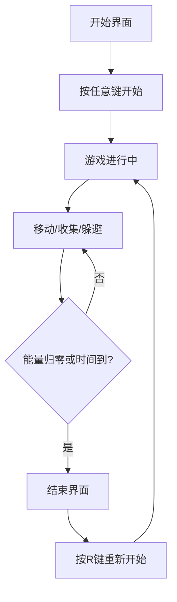

## 1. 产品概述

《星际逃逸》是一款基于Canvas的2D俯视角动作生存游戏。玩家控制坠毁在陌生星球的飞船，收集能源核心碎片修复飞船，同时躲避外星生物追击，最终在3分钟内尽可能获得高分。

- 主要目的：提供紧张刺激的生存游戏体验，考验玩家的反应能力和策略规划
- 目标用户：休闲游戏玩家，喜欢快节奏动作游戏的用户
- 产品价值：轻量化、无需安装的网页游戏，提供沉浸式太空探险体验

## 2. 核心功能

### 2.1 用户角色
| 角色 | 注册方式 | 核心权限 |
|------|----------|----------|
| 玩家 | 无需注册 | 完整游戏体验 |

### 2.2 功能模块
1. **游戏主循环**：场景初始化、帧循环、游戏状态管理
2. **玩家控制系统**：WASD移动、能量管理、碎片收集
3. **外星生物AI**：巡逻/追击双状态、碰撞反弹、随机生成
4. **碎片收集系统**：随机生成、呼吸动画、拾取粒子效果
5. **碰撞检测系统**：玩家-敌人碰撞、玩家-碎片碰撞、敌人-敌人碰撞
6. **UI界面系统**：开始界面、游戏界面、结束界面

### 2.3 页面详情
| 页面名称 | 模块名称 | 功能描述 |
|----------|----------|----------|
| 开始界面 | 标题展示 | 显示"星际逃逸"标题，带呼吸动画效果 |
| 开始界面 | 提示文本 | "按任意键开始"黄色闪烁文本 |
| 游戏界面 | 分数显示 | 左上角实时显示当前分数 |
| 游戏界面 | 能量条 | 左上角显示绿色渐变能量条，低于30%变红 |
| 游戏界面 | 倒计时 | 右上角3分钟倒计时 |
| 游戏界面 | 游戏画面 | Canvas绘制的游戏场景 |
| 结束界面 | 最终分数 | 显示游戏结束时的最终得分 |
| 结束界面 | 重新开始 | "按R键重新开始"提示 |

## 3. 核心流程

玩家进入游戏看到开始界面 → 按任意键开始游戏 → 控制飞船移动收集碎片 → 躲避外星生物追击 → 3分钟倒计时结束或能量归零 → 显示结束界面 → 按R键重新开始

## 4. 用户界面设计

### 4.1 设计风格
- 主色调：深紫色(#0B0A2E)到黑色渐变的太空背景
- 辅助色：蓝色(玩家飞船)、红色(敌人)、金色(碎片)、绿色(能量条)、黄色(提示文本)
- 字体：等宽字体，分数24px，标题48px
- 发光效果：所有UI元素边缘带1px发光效果
- 动画：标题呼吸动画(透明度0.7-1.0循环)、碎片呼吸动画(缩放周期2秒)

### 4.2 页面设计概述
| 页面名称 | 模块名称 | UI元素 |
|----------|----------|----------|
| 开始界面 | 标题区 | 48px"星际逃逸"标题，柔和呼吸动画，居中显示 |
| 开始界面 | 提示区 | 黄色"按任意键开始"闪烁文本，居中显示在标题下方 |
| 游戏界面 | 左上角UI | 分数(白色24px等宽字体)、能量条(200x20px绿色渐变) |
| 游戏界面 | 右上角UI | 3分钟倒计时(白色24px等宽字体) |
| 游戏界面 | 游戏区 | Canvas画布，深紫色星空背景 |
| 结束界面 | 分数展示 | 最终得分，居中显示 |
| 结束界面 | 提示区 | "按R键重新开始"文本 |

### 4.3 响应性
- 桌面端优先，Canvas固定尺寸居中显示
- 键盘操作优化，WASD控制飞船移动

### 4.4 游戏元素设计
- **玩家飞船**：蓝色三角形，边长20px，白色发光描边
- **外星生物**：红色八边形，半径15px，绿色眼球状中心点
- **能源碎片**：金色圆形，半径10px，渐变金色，缓慢缩放呼吸动画
- **粒子效果**：碎片收集时产生5个飘散粒子，0.5秒后消失
- **碰撞效果**：玩家被击中时红色闪烁0.3秒

## 5. 性能要求
- 游戏帧率：稳定60fps
- AI更新频率：不低于30fps
- 内存占用：不超过100MB
- 加载体验：入口页面带加载进度条
