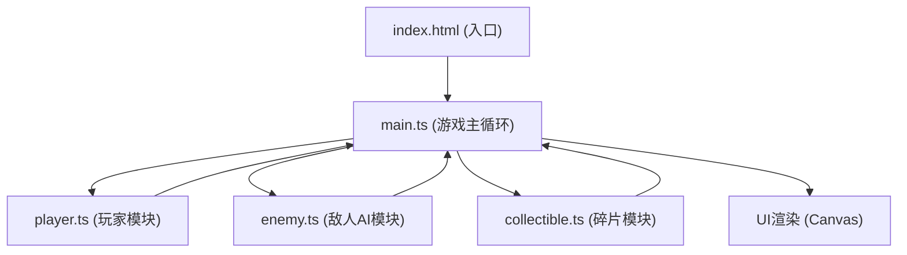

## 1. 架构设计



**数据流向说明：**
1. 键盘输入 → main.ts → player.ts (更新玩家位置/能量)
2. 玩家位置 → main.ts → enemy.ts (计算敌人移动)
3. 碰撞检测 → main.ts → collectible.ts (更新碎片状态)
4. 所有模块状态 → main.ts → Canvas渲染/UI更新

## 2. 技术描述

- **前端技术栈**：TypeScript + Vite + 原生Canvas API
- **初始化工具**：Vite vanilla-ts 模板
- **构建工具**：Vite 4.x
- **语言版本**：TypeScript 5.x，target ES2020
- **后端**：无（纯前端游戏）
- **数据库**：无

## 3. 文件结构

```
/
├── package.json              # 项目依赖和脚本
├── vite.config.js            # Vite构建配置
├── tsconfig.json             # TypeScript配置
├── index.html                # 入口HTML
└── src/
    ├── main.ts               # 游戏主循环、状态管理、碰撞检测
    ├── player.ts             # 玩家控制、移动、能量管理
    ├── enemy.ts              # 外星生物AI、巡逻/追击逻辑
    └── collectible.ts        # 碎片生成、收集、粒子效果
```

**文件调用关系：**
- [main.ts](file:///c:/Users/Administrator/Desktop/VersionFast/VersionFast/tasks/auto63/src/main.ts) 依赖 [player.ts](file:///c:/Users/Administrator/Desktop/VersionFast/VersionFast/tasks/auto63/src/player.ts)、[enemy.ts](file:///c:/Users/Administrator/Desktop/VersionFast/VersionFast/tasks/auto63/src/enemy.ts)、[collectible.ts](file:///c:/Users/Administrator/Desktop/VersionFast/VersionFast/tasks/auto63/src/collectible.ts)
- [player.ts](file:///c:/Users/Administrator/Desktop/VersionFast/VersionFast/tasks/auto63/src/player.ts)：独立模块，导出Player类
- [enemy.ts](file:///c:/Users/Administrator/Desktop/VersionFast/VersionFast/tasks/auto63/src/enemy.ts)：独立模块，导出Enemy类和EnemyManager
- [collectible.ts](file:///c:/Users/Administrator/Desktop/VersionFast/VersionFast/tasks/auto63/src/collectible.ts)：独立模块，导出Collectible类和CollectibleManager

## 4. 模块接口定义

### 4.1 Player 接口
```typescript
interface Player {
    x: number;
    y: number;
    energy: number;
    velocityX: number;
    velocityY: number;
    isHit: boolean;
    hitTimer: number;
    
    update(keys: Set<string>, dt: number, canvasWidth: number, canvasHeight: number): void;
    draw(ctx: CanvasRenderingContext2D): void;
    collectEnergy(amount: number): void;
    takeDamage(amount: number): void;
}
```

### 4.2 Enemy 接口
```typescript
interface Enemy {
    x: number;
    y: number;
    state: 'patrol' | 'chase';
    velocityX: number;
    velocityY: number;
    isKnockback: boolean;
    knockbackTimer: number;
    
    update(playerX: number, playerY: number, dt: number, canvasWidth: number, canvasHeight: number): void;
    draw(ctx: CanvasRenderingContext2D): void;
    bounceFrom(otherX: number, otherY: number): void;
}
```

### 4.3 Collectible 接口
```typescript
interface Collectible {
    x: number;
    y: number;
    radius: number;
    scale: number;
    collected: boolean;
    
    update(dt: number): void;
    draw(ctx: CanvasRenderingContext2D): void;
}
```

## 5. 游戏常量定义

```typescript
// 游戏配置
const GAME_CONFIG = {
    CANVAS_WIDTH: 800,
    CANVAS_HEIGHT: 600,
    PLAYER_SPEED: 150,           // px/s
    PLAYER_SIZE: 20,             // 三角形边长
    ENEMY_PATROL_SPEED: 60,      // px/s
    ENEMY_CHASE_SPEED: 120,      // px/s
    ENEMY_DETECTION_RANGE: 150,  // px
    ENEMY_COUNT_MIN: 3,
    ENEMY_COUNT_MAX: 5,
    COLLECTIBLE_RADIUS: 10,
    COLLECTIBLE_SPAWN_MIN: 2000, // ms
    COLLECTIBLE_SPAWN_MAX: 3000, // ms
    ENERGY_MAX: 100,
    ENERGY_DRAIN_RATE: 2,        // % per second
    ENERGY_RESTORE: 10,          // % per collectible
    ENERGY_DAMAGE: 20,           // % per enemy hit
    GAME_DURATION: 180,          // seconds (3 minutes)
    PARTICLE_COUNT: 5,
    PARTICLE_DURATION: 500,      // ms
    HIT_FLASH_DURATION: 300,     // ms
    KNOCKBACK_DURATION: 500,     // ms
}
```

## 6. 性能优化策略

1. **帧率控制**：使用 `requestAnimationFrame` 配合 `deltaTime` 计算，确保移动速度与帧率无关
2. **AI更新优化**：敌人AI逻辑每16ms更新一次（~60fps），满足不低于30fps要求
3. **对象池**：粒子效果使用对象池复用，避免频繁创建销毁
4. **Canvas渲染优化**：
   - 离屏Canvas预渲染静态背景
   - 减少状态切换（save/restore）
   - 批量绘制同类元素
5. **内存管理**：及时清理已收集的碎片和过期粒子，避免内存泄漏

## 7. 构建配置

### vite.config.js
- 入口：index.html
- 端口：3000
- 构建目标：ES2020

### tsconfig.json
- 严格模式：true
- target: ES2020
- module: ESNext
- 模块解析：Bundler
