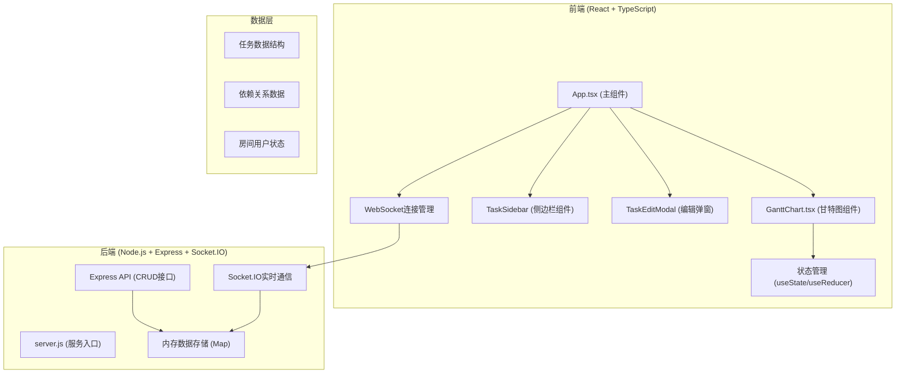

## 1. 架构设计



## 2. 技术描述

- **前端**：React@18 + TypeScript + Vite
- **构建工具**：Vite@5
- **后端**：Express@4 + Socket.IO@4
- **通信协议**：WebSocket (Socket.IO) + HTTP API
- **数据存储**：内存Map（开发环境）
- **样式**：原生CSS + CSS变量
- **图标**：lucide-react

## 3. 依赖包

| 包名 | 版本 | 用途 |
|------|------|------|
| react | ^18.2.0 | 前端框架 |
| react-dom | ^18.2.0 | React DOM渲染 |
| typescript | ^5.0.0 | 类型安全 |
| vite | ^5.0.0 | 构建工具 |
| express | ^4.18.0 | 后端服务 |
| cors | ^2.8.5 | 跨域支持 |
| socket.io | ^4.7.0 | 实时通信服务端 |
| socket.io-client | ^4.7.0 | 实时通信客户端 |
| uuid | ^9.0.0 | 唯一ID生成 |
| lucide-react | ^0.294.0 | 图标库 |

## 4. 项目结构

```
auto65/
├── package.json
├── index.html
├── vite.config.js
├── tsconfig.json
├── server/
│   └── server.js
└── src/
    ├── App.tsx
    ├── GanttChart.tsx
    ├── types.ts
    ├── utils.ts
    └── main.tsx
```

## 5. 数据模型

### 5.1 任务数据模型

```typescript
interface Task {
  id: string;
  name: string;
  assignee: string;
  startDate: string;
  endDate: string;
  progress: number;
  status: 'pending' | 'in-progress' | 'completed' | 'warning';
  parentId?: string;
  dependencies: string[];
  color: string;
}
```

### 5.2 依赖关系模型

```typescript
interface Dependency {
  id: string;
  fromTaskId: string;
  toTaskId: string;
}
```

## 6. API 定义

### 6.1 HTTP 接口

| 方法 | 路径 | 描述 |
|------|------|------|
| GET | /api/tasks | 获取所有任务 |
| POST | /api/tasks | 创建新任务 |
| PUT | /api/tasks/:id | 更新任务 |
| DELETE | /api/tasks/:id | 删除任务 |

### 6.2 Socket.IO 事件

| 事件名 | 方向 | 数据 | 描述 |
|--------|------|------|------|
| join-room | 客户端→服务端 | { roomId: string } | 加入协作房间 |
| task-created | 客户端→服务端 | Task | 任务创建 |
| task-updated | 客户端→服务端 | Task | 任务更新 |
| task-deleted | 客户端→服务端 | { id: string } | 任务删除 |
| dependency-created | 客户端→服务端 | Dependency | 依赖创建 |
| dependency-deleted | 客户端→服务端 | { id: string } | 依赖删除 |
| sync-tasks | 服务端→客户端 | Task[] | 同步任务列表 |
| broadcast-task-created | 服务端→客户端 | Task | 广播任务创建 |
| broadcast-task-updated | 服务端→客户端 | Task | 广播任务更新 |
| broadcast-task-deleted | 服务端→客户端 | { id: string } | 广播任务删除 |
| broadcast-dependency-created | 服务端→客户端 | Dependency | 广播依赖创建 |
| broadcast-dependency-deleted | 服务端→客户端 | { id: string } | 广播依赖删除 |

## 7. 核心算法

### 7.1 日期到像素转换

```typescript
function dateToPixel(date: Date, startDate: Date, dayWidth: number): number {
  const diffDays = (date.getTime() - startDate.getTime()) / (1000 * 60 * 60 * 24);
  return diffDays * dayWidth;
}
```

### 7.2 像素到日期转换

```typescript
function pixelToDate(pixel: number, startDate: Date, dayWidth: number): Date {
  const days = pixel / dayWidth;
  return new Date(startDate.getTime() + days * 24 * 60 * 60 * 1000);
}
```

### 7.3 贝塞尔曲线路径计算

```typescript
function calculateBezierPath(x1: number, y1: number, x2: number, y2: number): string {
  const midX = (x1 + x2) / 2;
  const controlOffset = Math.abs(x2 - x1) * 0.4;
  return `M ${x1} ${y1} C ${x1 + controlOffset} ${y1}, ${x2 - controlOffset} ${y2}, ${x2} ${y2}`;
}
```

### 7.4 进度步进计算

```typescript
function snapProgress(progress: number): number {
  return Math.round(progress / 5) * 5;
}
```

### 7.5 日期吸附到网格

```typescript
function snapToGrid(date: Date, snapToHalfDay: boolean = false): Date {
  const d = new Date(date);
  d.setHours(0, 0, 0, 0);
  if (snapToHalfDay && date.getHours() >= 12) {
    d.setHours(12, 0, 0, 0);
  }
  return d;
}
```

## 8. 性能优化策略

1. **虚拟滚动**：仅渲染视口内的任务条
2. **requestAnimationFrame**：拖拽动画使用RAF确保60fps
3. **防抖处理**：频繁操作防抖，减少Socket.IO消息
4. **增量更新**：仅更新变化的任务DOM，不重绘整个甘特图
5. **CSS transform**：拖拽使用transform而非top/left，提升性能
6. **缓存计算结果**：日期-像素转换结果缓存，避免重复计算
