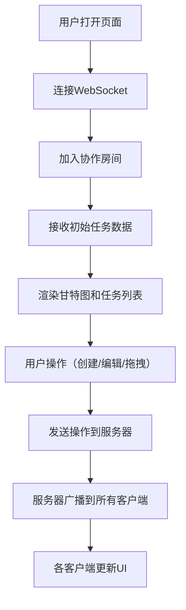

## 1. 产品概述

团队目标管理与进度追踪甘特图协作应用，支持多人实时协作创建项目任务、设置依赖关系、分配负责人和截止日期，通过拖拽甘特条实时更新进度。

- 主要用途：团队项目管理、任务进度追踪、跨成员协作
- 目标用户：项目经理、开发团队、产品团队
- 产品价值：提升团队协作效率，实时同步项目进度，可视化任务依赖关系

## 2. 核心功能

### 2.1 用户角色

| 角色 | 注册方式 | 核心权限 |
|------|----------|----------|
| 团队成员 | 无需注册，自动加入协作房间 | 创建/编辑/删除任务、拖拽调整进度、创建依赖关系 |

### 2.2 功能模块

1. **任务管理模块**：任务创建、编辑、删除、树形列表展示、筛选功能
2. **甘特图渲染模块**：时间轴绘制、任务条渲染、依赖连线可视化、拖拽交互
3. **实时同步模块**：Socket.IO实时广播、多人协作数据同步
4. **进度追踪模块**：进度百分比显示、拖拽调整进度、状态颜色标识
5. **视图控制模块**：水平滚动、缩放控制（天/周/月视图）、日期刻度显示

### 2.3 页面详情

| 页面名称 | 模块名称 | 功能描述 |
|---------|---------|----------|
| 主应用页面 | 左侧边栏 | 任务树形列表展示、按负责人/状态筛选、任务选中高亮 |
| 主应用页面 | 甘特图主区域 | 时间轴头部、任务条渲染、依赖连线、拖拽交互、进度调整 |
| 主应用页面 | 底部控制栏 | 视图缩放滑块、当前视图模式显示 |
| 主应用页面 | 编辑弹窗 | 任务名称、负责人、起止日期编辑 |
| 主应用页面 | 右键菜单 | 任务删除操作 |

## 3. 核心流程

用户进入应用后自动连接WebSocket，加入协作房间，可查看所有任务。通过侧边栏或甘特图创建新任务，拖拽任务条调整时间范围，拖拽进度手柄调整完成度。从任务连接点拖拽到另一任务创建依赖关系。所有操作实时同步到所有在线用户。

## 4. 用户界面设计

### 4.1 设计风格

- 主色调：深灰#2d2d2d（侧边栏）、蓝紫渐变色#6366f1到#8b5cf6（选中高亮）
- 任务条配色：蓝#3b82f6、绿#10b981、紫#8b5cf6、橙#f59e0b、粉#ec4899、青#14b8a6
- 按钮风格：圆角4px，点击0.2s按压缩放动画
- 字体：现代无衬线字体，清晰层级
- 布局：左侧边栏（20%）+ 右侧甘特图（80%）
- 图标：使用lucide-react图标库

### 4.2 页面设计概述

| 页面名称 | 模块名称 | UI元素 |
|---------|---------|--------|
| 主应用 | 侧边栏 | 深色背景、树形任务列表、筛选下拉框、新建任务按钮 |
| 主应用 | 甘特图区域 | 白色背景、浅灰时间轴头部、任务条圆角4px高32px、红色虚线标记今日、贝塞尔曲线依赖连线 |
| 主应用 | 交互反馈 | 拖拽时grab/grabbing光标、任务条投影动画、进度数字实时显示 |

### 4.3 响应式

- Desktop-first设计
- 窗口宽度<768px时侧边栏折叠为顶部导航条
- 触摸设备优化拖拽交互

### 4.4 视觉细节

- 背景：入口页面浅灰渐变背景，淡入加载动画
- 任务条：圆角4px，高度32px，按负责人分配颜色
- 依赖连线：深灰#6b7280，线宽2px，箭头三角形
- 拖拽效果：box-shadow 0 4px 12px rgba(0,0,0,0.15)
- 网格线：水平网格每行40px，垂直网格按视图天数划分

## 5. 性能指标

- 支持200个任务条同时显示
- 拖拽和滚动帧率≥30fps
- 依赖连线计算和重绘≤50ms
- Socket.IO广播到10客户端响应≤300ms
- 实时同步延迟<200ms
