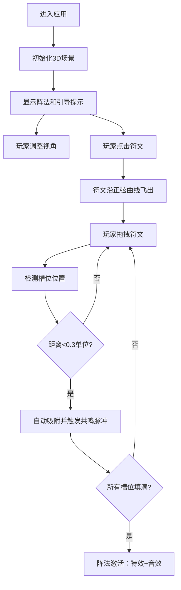

## 1. 产品概述

3D符文阵法交互应用是一款基于Web的奇物收集类游戏辅助工具，玩家可以将收集到的魔法符文和上古器物放置在特定的阵法图案中激活共鸣效果，体验丰富的视觉特效和属性加成。

- 主要目的：提供沉浸式的3D符文阵法交互体验，让玩家感受魔法符文与阵法的神秘力量
- 目标用户：奇物收集类游戏玩家、魔法奇幻爱好者
- 产品价值：通过精美的3D视觉效果和流畅的交互体验，增强玩家对符文收集和阵法系统的兴趣

## 2. 核心功能

### 2.1 功能模块

1. **阵法系统**：提供3种独特阵法（六芒星魔法阵、螺旋元素阵、符文圆环阵），每种阵法具有独特的几何线条和粒子特效
2. **符文系统**：管理6种不同元素符文（火、水、风、土、光、暗），支持拖拽、放置、动画和交互反馈
3. **交互系统**：支持自由视角控制（平移、缩放、旋转）、符文拖拽放置、自动吸附、共鸣脉冲效果
4. **激活系统**：当所有槽位填入正确符文后触发阵法激活，展示华丽的视觉特效和音频提示

### 2.2 页面详情

| 页面名称 | 模块名称 | 功能描述 |
|-----------|-------------|---------------------|
| 主页面 | 3D渲染容器 | 全屏Three.js渲染场景，展示阵法和符文 |
| 主页面 | UI信息面板 | 左上角显示当前阵法名称和符文放置进度 |
| 主页面 | 引导提示 | 底部显示操作引导文字，带淡入动画 |
| 主页面 | 符文选择区 | 提供6种符文供玩家选择和拖拽 |

## 3. 核心流程

玩家进入应用后，首先看到精美的3D阵法场景，底部有操作引导。玩家可以：
1. 使用鼠标中键平移、滚轮缩放、右键旋转来调整视角
2. 点击符文使其飞出到场景中
3. 拖拽符文到阵法对应槽位
4. 位置正确时符文自动吸附并触发共鸣脉冲
5. 所有符文正确放置后，阵法整体激活，展示特效和音效

## 4. 用户界面设计

### 4.1 设计风格

- **主色调**：深紫色渐变背景（#1a0a2e到#0d1b2a）
- **元素色**：
  - 火符文：红色 #ff4444
  - 水符文：蓝色 #4488ff
  - 风符文：青色 #44ffff
  - 土符文：棕色 #aa7744
  - 光符文：金色 #ffdd44
  - 暗符文：紫色 #aa44ff
- **视觉风格**：神秘魔法风格，半透明玻璃效果光晕，发光边缘
- **字体**：使用Cinzel Decorative（标题）+ Noto Sans SC（正文）组合，营造奇幻氛围
- **动效**：所有交互带平滑过渡动画，屏幕震动效果增强反馈

### 4.2 页面设计概述

| 页面名称 | 模块名称 | UI元素 |
|-----------|-------------|-------------|
| 主页面 | 3D渲染容器 | 居中Three.js画布，响应式缩放，最小800x600 |
| 主页面 | UI信息面板 | 左上角半透明玻璃面板，显示阵法名称和进度条 |
| 主页面 | 引导提示 | 底部白色文字，淡入动画，10秒后自动淡出 |
| 主页面 | 符文选择区 | 底部横向排列6个符文图标，悬停放大效果 |

### 4.3 响应式设计

- 桌面端优先设计，画布随窗口自动缩放
- 最小宽度800px，最小高度600px
- 触摸设备支持双指缩放和拖拽操作
- UI元素在小屏幕上自动调整布局

### 4.4 3D场景指导

- **环境**：深色渐变背景，添加微妙的星空粒子效果
- **光照**：环境光+方向光+点光源组合，突出符文和阵法的发光效果
- **相机**：PerspectiveCamera，初始位置(0, 5, 8)，看向原点
- **交互**：自定义相机控制（中键平移、滚轮缩放、右键旋转），带阻尼效果
- **特效**：发光边缘、粒子系统、拖尾效果、光波扩散、屏幕震动
- **性能**：最多30个粒子系统（每个≤500粒子），6个符文模型，保持30fps以上

## 5. 性能约束

- 首次加载时间≤3秒（含纹理和模型加载）
- 运行帧率≥30fps
- 内存占用≤500MB
- 粒子系统数量≤30个，单系统粒子数≤500
