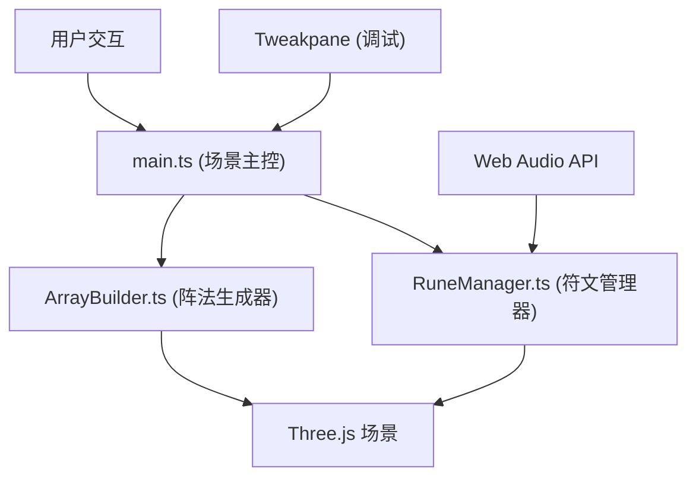

## 1. 架构设计



## 2. 技术描述

- **前端核心**：TypeScript + Three.js + Vite
- **UI调试**：Tweakpane
- **音频**：Web Audio API（合成音效，无需外部文件）
- **构建工具**：Vite 5.x
- **类型安全**：严格TypeScript模式，@types/three类型定义

### 文件结构与调用关系

```
auto66/
├── package.json              # 项目配置与依赖
├── vite.config.js            # Vite构建配置
├── tsconfig.json             # TypeScript配置
├── index.html                # 入口HTML
└── src/
    ├── main.ts               # 场景初始化与主控
    │   ├── 创建Scene/Camera/Renderer
    │   ├── 加载纹理资源
    │   ├── 实例化ArrayBuilder
    │   ├── 实例化RuneManager
    │   ├── 注册鼠标事件
    │   └── 驱动渲染循环
    ├── ArrayBuilder.ts       # 阵法生成器
    │   ├── 接收阵法配置参数
    │   ├── 生成几何线条(Line2)
    │   ├── 创建粒子系统(Points)
    │   ├── 生成能量光环(Mesh)
    │   └── 输出3D对象到场景
    └── RuneManager.ts        # 符文管理器
        ├── 创建6种符文模型
        ├── 处理鼠标拖拽逻辑
        ├── 检测槽位吸附
        ├── 触发共鸣脉冲特效
        ├── 验证阵法完整性
        └── 播放激活音效
```

### 数据流向

1. **main.ts → ArrayBuilder.ts**：传入阵法类型配置 → 生成3D模型和粒子系统 → 添加到场景
2. **main.ts → RuneManager.ts**：传入鼠标事件和场景引用 → 更新符文状态 → 触发视觉反馈
3. **RuneManager.ts → main.ts**：阵法激活事件 → 通知UI更新 → 触发全局特效

## 3. 核心类型定义

```typescript
// 阵法类型
type ArrayType = 'hexagram' | 'spiral' | 'ring';

// 符文元素类型
type ElementType = 'fire' | 'water' | 'wind' | 'earth' | 'light' | 'dark';

// 符文状态
type RuneState = 'idle' | 'flying' | 'dragging' | 'placed';

// 阵法槽位
interface ArraySlot {
  position: THREE.Vector3;
  requiredElement: ElementType;
  occupied: boolean;
  runeId: string | null;
}

// 符文数据
interface RuneData {
  id: string;
  element: ElementType;
  state: RuneState;
  position: THREE.Vector3;
  targetPosition: THREE.Vector3 | null;
  mesh: THREE.Group;
}

// 阵法配置
interface ArrayConfig {
  type: ArrayType;
  name: string;
  slots: ArraySlot[];
  lineColor: number;
  particleColor: number;
  particleCount: number;
}
```

## 4. 性能优化策略

1. **对象池**：粒子系统复用Geometry和Material
2. **LOD**：符文模型根据距离自动切换细节等级
3. **视锥剔除**：Three.js内置视锥剔除，优化渲染
4. **动画节流**：使用requestAnimationFrame统一驱动，避免重复计算
5. **内存管理**：及时dispose不再使用的Geometry和Material
6. **纹理压缩**：使用KTX2压缩纹理，减少加载时间

## 5. 关键实现要点

### 阵法几何生成
- 使用CatmullRomCurve3生成平滑曲线
- Line2实现2px线宽和发光效果
- BufferGeometry构建高性能粒子系统

### 符文交互
- Raycaster进行3D拾取检测
- 正弦曲线运动：y = A * sin(ωt + φ)
- 拖尾效果：自定义ShaderMaterial + 顶点动画

### 相机控制
- 阻尼效果：velocity *= 0.95
- 旋转速度：0.5度/像素
- 缩放范围：2-15单位

### 音效合成
- Web Audio API生成C大调和弦(C-E-G)
- 攻击0.01s，衰减0.3s，延音0.5，释放1s
- 激活时播放上升琶音效果
