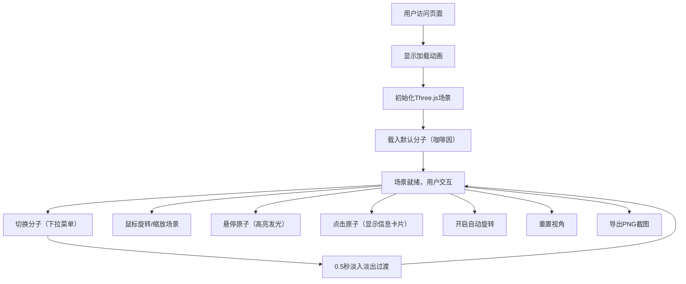

## 1. 产品概述

基于Web的3D分子结构查看与交互编辑器，让化学爱好者和研究人员在浏览器中直观地探索和操作分子模型。

- **核心目标**：提供沉浸式的分子可视化体验，支持交互式操作（旋转、缩放、选中、拖拽），帮助用户理解分子三维结构
- **目标用户**：化学学生、教师、研究人员、科普爱好者
- **市场价值**：降低分子模型学习门槛，无需昂贵设备即可在浏览器中体验虚拟化学实验室

## 2. 核心功能

### 2.1 用户角色
本产品为单角色系统，无需登录注册。

| 角色 | 注册方式 | 核心权限 |
|------|----------|----------|
| 访客用户 | 无需注册 | 查看、切换分子、旋转缩放、选中查看信息、导出截图 |

### 2.2 功能模块
1. **3D分子场景**：Three.js渲染的3D空间，显示原子球体和化学键
2. **分子切换面板**：左侧下拉菜单，预设咖啡因、阿司匹林、葡萄糖三种分子
3. **操作工具栏**：右侧工具栏，含旋转锁定、重置视角、导出截图
4. **信息卡片**：点击原子时弹出元素信息和坐标
5. **加载动画**：页面加载时的旋转分子图标动画

### 2.3 页面详情
| 页面名称 | 模块名称 | 功能描述 |
|----------|----------|----------|
| 主页面 | 3D渲染场景 | 原子球体（不同颜色/半径）+ 半透明圆柱键，支持鼠标拖拽旋转缩放 |
| 主页面 | 分子切换面板 | 下拉选择三种预设分子，切换时0.5秒淡入淡出过渡 |
| 主页面 | 操作工具栏 | 旋转开关（每秒5度自动旋转）、重置视角、1920x1080 PNG截图导出 |
| 主页面 | 信息卡片 | 点击原子显示元素名称和三维坐标 |
| 主页面 | 加载动画 | 全屏加载时显示旋转分子图标 |

## 3. 核心流程

用户访问页面 → 显示加载动画 → 初始化3D场景并载入默认分子 → 用户通过鼠标与场景交互 → 可切换分子/开启自动旋转/查看原子信息/导出截图

## 4. 用户界面设计

### 4.1 设计风格
- **主色调**：星空渐变背景（深灰#1a1a2e → 深紫#16213e）
- **强调色**：按钮渐变蓝紫（#667eea → #764ba2），暖黄色点光源
- **原子配色**：碳灰(#555555)、氢白(#ffffff)、氧红(#ff3333)、氮蓝(#3366ff)
- **按钮样式**：圆角8px，渐变背景，悬停缩放1.05并加深颜色
- **字体**：现代无衬线字体，清晰易读
- **布局风格**：全屏沉浸式3D场景 + 透明浮层UI控件（左上面板、右上工具栏）
- **图标风格**：简约线性图标，与浮层风格统一

### 4.2 页面设计概述
| 页面名称 | 模块名称 | UI元素 |
|----------|----------|--------|
| 主页面 | 3D场景 | 全屏Canvas、星空渐变背景、暖黄色点光源、原子球体（金属光泽材质）、半透明圆柱键 |
| 主页面 | 分子切换面板 | 左上透明浮层、下拉选择框、圆角8px、渐变蓝紫按钮 |
| 主页面 | 工具栏 | 右上透明浮层、三个控件（开关+两个按钮）、悬停动效 |
| 主页面 | 信息卡片 | 跟随原子位置弹出、半透明背景、元素名+坐标显示、优雅出现动画 |
| 主页面 | 加载动画 | 全屏遮罩、中心旋转分子图标、淡入淡出过渡 |

### 4.3 响应式
- 桌面端优先设计，适配1920x1080及以上分辨率
- 画布自适应窗口大小，监听resize事件
- 浮层UI采用固定定位，小屏设备自动调整间距
- 支持触摸设备的手势缩放和旋转

### 4.4 3D场景指导
- **环境氛围**：深空星空渐变背景，营造虚拟实验室沉浸感
- **光照设置**：左上角45度暖黄色点光源（主光）+ 低强度环境光（补光）
- **相机设置**：PerspectiveCamera，初始位置自动计算使分子居中且完整显示
- **交互方式**：鼠标左键拖拽旋转、滚轮缩放、悬停高亮、点击选中
- **动画效果**：原子高亮发光（强度0.5，持续0.3秒）、分子切换淡入淡出（0.5秒）、自动匀速旋转（每秒5度）
- **材质属性**：MeshStandardMaterial，粗糙度0.3，金属度0.1，呈现微弱金属光泽
- **性能要求**：60fps稳定运行，单个分子≤100原子，几何资源复用
