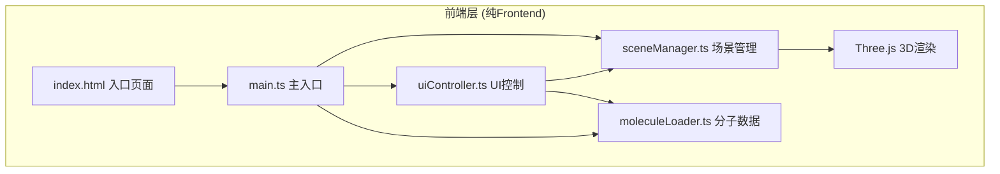

## 1. 架构设计



## 2. 技术描述
- **前端框架**：原生 TypeScript（无UI框架）+ Three.js
- **构建工具**：Vite 5.x（端口5173，index.html为入口）
- **类型系统**：TypeScript 5.x 严格模式，target ES2020，moduleResolution bundler
- **渲染引擎**：Three.js 0.160+
- **后端**：无（纯前端应用，分子数据硬编码）
- **数据库**：无

## 3. 项目文件结构

```
auto67/
├── index.html              # 入口HTML，全屏背景+加载动画
├── package.json            # 依赖：three, typescript, vite, @types/three
├── vite.config.js          # Vite构建配置
├── tsconfig.json           # TypeScript配置（严格模式）
└── src/
    ├── main.ts             # 程序入口，初始化所有模块
    ├── moleculeLoader.ts   # 预设分子数据（3种分子硬编码）
    ├── sceneManager.ts     # Three.js场景管理（灯光/相机/原子/键）
    └── uiController.ts     # UI事件绑定与交互控制
```

## 4. 模块职责与接口定义

### 4.1 moleculeLoader.ts
维护预设分子列表，返回原子和键的结构化数据。

```typescript
export interface AtomData {
  element: 'C' | 'H' | 'O' | 'N';
  x: number;
  y: number;
  z: number;
}

export interface BondData {
  atomIndex1: number;
  atomIndex2: number;
}

export interface MoleculeData {
  name: string;
  formula: string;
  atoms: AtomData[];
  bonds: BondData[];
}

export class MoleculeLoader {
  getMoleculeList(): { name: string; formula: string }[];
  getMoleculeData(name: string): MoleculeData | null;
}
```

**预设分子**：
- 咖啡因 C8H10N4O2
- 阿司匹林 C9H8O4  
- 葡萄糖 C6H12O6

### 4.2 sceneManager.ts
封装所有Three.js操作，提供原子/键的增删改查、视角控制、交互检测。

```typescript
export interface AtomInfo {
  element: string;
  x: number;
  y: number;
  z: number;
}

export type HighlightCallback = (info: AtomInfo | null) => void;
export type ClickCallback = (info: AtomInfo | null) => void;

export class SceneManager {
  constructor(container: HTMLElement);
  createLights(): void;
  createBackground(): void;
  setMolecule(data: MoleculeData, onProgress?: (alpha: number) => void): Promise<void>;
  clearMolecule(): void;
  startAutoRotation(degreesPerSecond: number): void;
  stopAutoRotation(): void;
  resetView(): void;
  setOnAtomHover(callback: HighlightCallback): void;
  setOnAtomClick(callback: ClickCallback): void;
  exportScreenshot(width: number, height: number): string; // dataURL
  dispose(): void;
}
```

**原子配置**：
| 元素 | 颜色 | 半径 |
|------|------|------|
| C | #555555 | 0.3 |
| H | #ffffff | 0.2 |
| O | #ff3333 | 0.25 |
| N | #3366ff | 0.28 |

### 4.3 uiController.ts
负责DOM UI的创建、事件监听、与sceneManager和moleculeLoader的协调。

```typescript
export class UIController {
  constructor(
    container: HTMLElement,
    sceneManager: SceneManager,
    moleculeLoader: MoleculeLoader
  );
  createMoleculeSelector(): void;       // 左上面板
  createToolbar(): void;                // 右上工具栏
  createInfoCard(): void;               // 原子信息卡片
  showInfoCard(info: AtomInfo, screenX: number, screenY: number): void;
  hideInfoCard(): void;
  showLoading(): void;
  hideLoading(): void;
}
```

### 4.4 main.ts
入口文件，串联所有模块。

```typescript
async function main() {
  const container = document.getElementById('app')!;
  const sceneManager = new SceneManager(container);
  const moleculeLoader = new MoleculeLoader();
  const uiController = new UIController(container, sceneManager, moleculeLoader);
  
  const defaultMol = moleculeLoader.getMoleculeData('咖啡因')!;
  await sceneManager.setMolecule(defaultMol);
}
```

## 5. 核心实现要点

### 5.1 几何复用
- 为每种元素创建共享的 SphereGeometry（按半径分）
- 圆柱键使用共享的 CylinderGeometry，通过 scale/rotate 适配不同长度和方向

### 5.2 材质配置
- 原子：MeshStandardMaterial({ roughness: 0.3, metalness: 0.1 })
- 键：MeshStandardMaterial({ color: 0x888888, transparent: true, opacity: 0.6 })
- 高亮：临时增加 emissive 颜色，强度0.5，通过setTimeout在0.3秒后恢复

### 5.3 射线拾取
- 使用 THREE.Raycaster 进行鼠标拾取
- 只对原子和键的Mesh进行检测
- 区分悬停（pointermove）和点击（click）事件

### 5.4 分子居中与自动缩放
- 计算所有原子的bounding box得到中心点
- 根据包围盒对角线长度计算相机距离，确保完整显示
- 相机 lookAt 中心，分子组 position 设为负中心（即居中到原点）

### 5.5 淡入淡出过渡
- 通过 Group 的 children 遍历修改 material.opacity
- 0.5秒内从0→1或1→0，使用 requestAnimationFrame + easing 函数

### 5.6 截图导出
- 渲染器设置 preserveDrawingBuffer: true
- 在指定分辨率下（临时调整渲染尺寸）渲染一帧
- canvas.toDataURL('image/png') 并触发下载

## 6. 性能保障

1. **几何复用**：同半径球体共享Geometry实例
2. **材质复用**：同元素共享Material实例（高亮时临时克隆或修改emissive）
3. **渲染优化**：禁用阴影计算（单点光源，分子较小无需阴影）
4. **事件节流**：mousemove使用requestAnimationFrame节流
5. **资源清理**：切换分子时 dispose 旧的Geometry/Material
6. **FPS监控**：保证原子数≤100时稳定60fps
