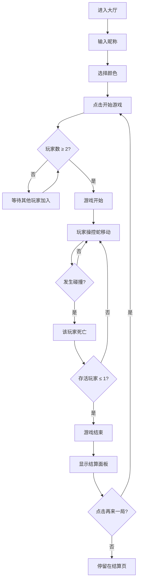

## 1. 产品概述

实时多人在线贪吃蛇对战游戏，支持 2-4 名玩家在同一竞技场内操控不同颜色的蛇进行对战，通过吃食物增长身体、避免碰撞，最终根据蛇的长度和存活时间进行排名。

- 主要目的：提供一个轻量级、实时的多人对战休闲游戏
- 目标用户：休闲游戏玩家、朋友间娱乐对战
- 核心价值：低门槛、高趣味性的实时多人竞技体验

## 2. 核心功能

### 2.1 用户角色

| 角色 | 注册方式 | 核心权限 |
|------|----------|----------|
| 玩家 | 输入昵称即加入 | 进入大厅、选择颜色、参与游戏、查看排名 |

### 2.2 功能模块

1. **大厅界面**：玩家昵称输入、颜色选择、开始游戏按钮、玩家列表
2. **游戏主界面**：Canvas 竞技场、实时计分板、游戏状态显示
3. **结算界面**：最终排名、玩家统计数据、再来一局按钮

### 2.3 页面详情

| 页面名称 | 模块名称 | 功能描述 |
|----------|----------|----------|
| 大厅页面 | 昵称输入 | 玩家输入昵称，校验非空 |
| 大厅页面 | 颜色选择 | 8 种预设颜色供选择，实时预览 |
| 大厅页面 | 玩家列表 | 显示已加入玩家及其颜色 |
| 大厅页面 | 开始按钮 | 点击后等待其他玩家，满 2 人自动开始 |
| 游戏页面 | Canvas 竞技场 | 渲染蛇、食物、网格背景 |
| 游戏页面 | 计分板 | 显示玩家名、长度、击杀数，按长度降序 |
| 游戏页面 | 游戏状态 | 显示安全模式提示等状态 |
| 结算页面 | 排名列表 | 显示最终排名、最大长度、存活时间、击杀数 |
| 结算页面 | 再来一局 | 点击返回大厅重新开始 |

## 3. 核心流程

### 3.1 主流程描述

玩家进入大厅 → 输入昵称并选择颜色 → 点击开始游戏 → 等待至少 2 名玩家 → 游戏自动开始 → 玩家操控蛇吃食物、躲避碰撞 → 只剩 1 人或全部死亡 → 游戏结束 → 显示结算面板 → 可选择再来一局

### 3.2 流程图

## 4. 用户界面设计

### 4.1 设计风格

- **主色调**：#e94560（珊瑚红/玫红色）
- **背景色**：#1a1a2e（深蓝紫色）
- **辅助色**：#0f3460（深蓝色）
- **网格线**：#3a3a5a（半透明细线）
- **设计风格**：深色科技感、霓虹发光效果、毛玻璃质感
- **字体**：现代无衬线字体，数字使用等宽字体
- **按钮**：圆角矩形，hover 时放大 1.1 倍 + 阴影加深
- **动画**：页面切换 fade-in 0.3s，食物呼吸动画 1s 周期

### 4.2 页面设计概览

| 页面名称 | 模块名称 | UI 元素 |
|----------|----------|---------|
| 大厅页面 | 标题区 | 游戏 Logo、副标题、霓虹发光效果 |
| 大厅页面 | 表单区 | 昵称输入框、颜色选择器（8 色圆形按钮） |
| 大厅页面 | 玩家列表 | 横向排列的玩家卡片，显示颜色和昵称 |
| 大厅页面 | 操作区 | 开始游戏按钮、等待提示 |
| 游戏页面 | Canvas | 居中显示，深色背景 + 网格 |
| 游戏页面 | 计分板 | 左上角，毛玻璃背景，金色高亮第一名 |
| 游戏页面 | 状态提示 | 安全模式等文字提示 |
| 结算页面 | 遮罩层 | 半透明黑色背景 |
| 结算页面 | 结果面板 | 居中卡片，毛玻璃效果 |
| 结算页面 | 排名列表 | 前三名特殊高亮 |
| 结算页面 | 操作按钮 | 再来一局按钮 |

### 4.3 响应式设计

- 桌面端（≥768px）：横向布局，Canvas 居中，计分板左上角
- 移动端（<768px）：纵向布局，缩小蛇和食物尺寸，计分板适配小屏
- 触控优化：移动端支持虚拟方向键或滑动控制

### 4.4 游戏元素视觉规范

- **蛇**：圆角矩形身体，渐变填充（头部到尾部渐变为半透明），头部带两个圆形眼睛
- **普通食物**：白色圆形，呼吸动画
- **加速食物**：红色圆形，呼吸动画，每 10 秒刷新
- **炸弹食物**：黑色圆形带警示标记，每 15 秒刷新
- **食物数量**：动态保持 10-15 个
