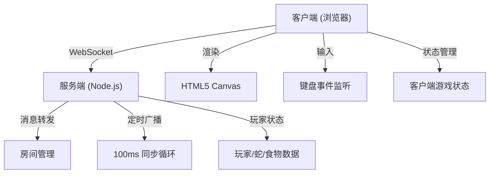
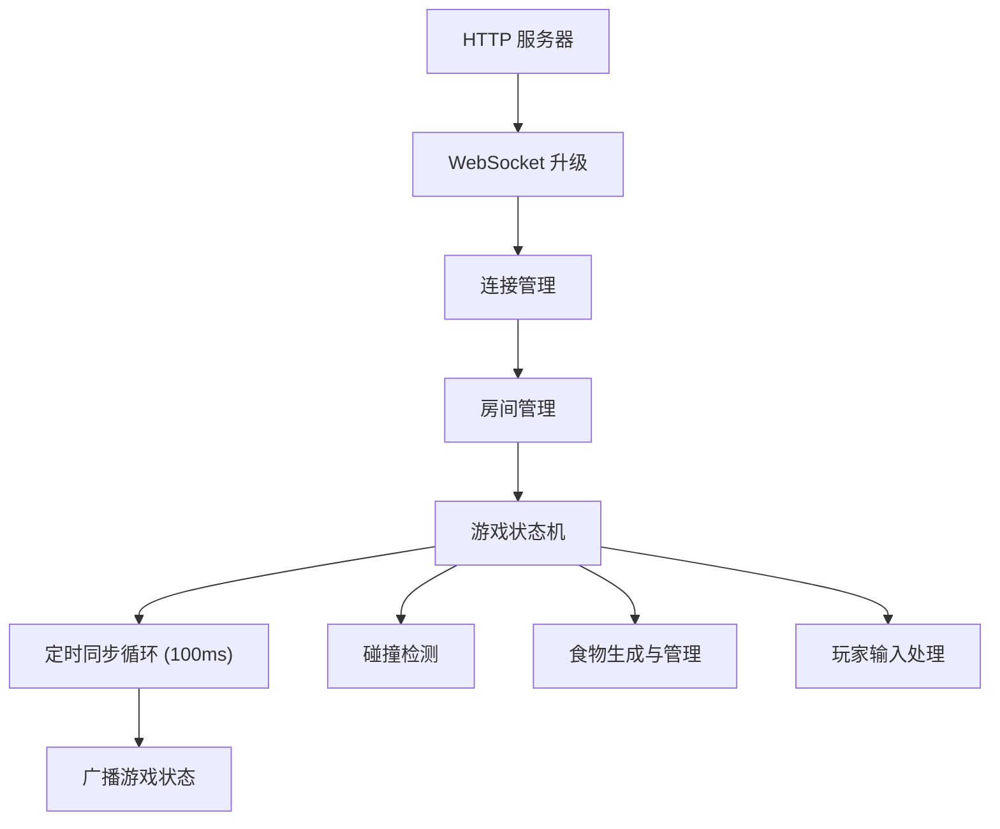

## 1. 架构设计



## 2. 技术说明

- **前端构建工具**: Vite 5.x
- **前端语言**: TypeScript 5.x (严格模式)
- **前端渲染**: HTML5 Canvas 2D API
- **实时通信**: 原生 WebSocket API（浏览器端 + Node.js 原生实现）
- **后端**: Node.js 原生 http 模块 + 自定义 WebSocket 服务器
- **目标帧率**: 60 FPS（客户端渲染）
- **同步频率**: 每 100ms 广播一次游戏状态

## 3. 文件结构

| 文件路径 | 作用 |
|----------|------|
| `package.json` | 项目依赖和脚本配置 |
| `index.html` | 入口 HTML 页面，包含 div#app 挂载点 |
| `tsconfig.json` | TypeScript 配置（严格模式，target ES2020） |
| `vite.config.js` | Vite 构建配置 + 代理配置 |
| `src/types.ts` | 共享类型定义（蛇、食物、玩家、游戏状态等） |
| `src/client/main.ts` | 客户端主入口，Canvas 渲染、键盘输入、WebSocket 连接 |
| `src/server/server.ts` | 服务端，WebSocket 服务器、房间管理、状态同步 |

## 4. 核心类型定义

### 4.1 方向枚举

```typescript
type Direction = 'up' | 'down' | 'left' | 'right';
```

### 4.2 食物类型枚举

```typescript
type FoodType = 'normal' | 'speed' | 'bomb';
```

### 4.3 位置接口

```typescript
interface Position {
  x: number;
  y: number;
}
```

### 4.4 蛇接口

```typescript
interface Snake {
  id: string;
  body: Position[];
  direction: Direction;
  color: string;
  speed: number;
  speedBoostEndTime: number;
  isAlive: boolean;
  length: number;
  kills: number;
  spawnTime: number;
  deathTime: number | null;
}
```

### 4.5 食物接口

```typescript
interface Food {
  id: string;
  type: FoodType;
  position: Position;
  spawnTime: number;
  duration: number;
}
```

### 4.6 玩家接口

```typescript
interface Player {
  id: string;
  name: string;
  color: string;
  snakeId: string;
  isReady: boolean;
}
```

### 4.7 游戏状态接口

```typescript
interface GameState {
  status: 'waiting' | 'playing' | 'ended';
  players: Player[];
  snakes: Snake[];
  foods: Food[];
  gridWidth: number;
  gridHeight: number;
  safeMode: boolean;
  startTime: number;
  endTime: number | null;
}
```

### 4.8 WebSocket 消息类型

```typescript
type WSMessageType = 
  | 'join' 
  | 'leave' 
  | 'ready' 
  | 'start' 
  | 'direction' 
  | 'state' 
  | 'gameOver'
  | 'error';

interface WSMessage<T = any> {
  type: WSMessageType;
  data: T;
  timestamp: number;
}
```

## 5. 服务器架构



### 5.1 服务器核心模块

| 模块 | 职责 |
|------|------|
| WebSocket 服务器 | 处理连接、消息收发、连接断开 |
| 房间管理器 | 管理房间列表、玩家加入/离开 |
| 游戏引擎 | 游戏状态更新、碰撞检测、食物管理 |
| 同步器 | 每 100ms 广播游戏状态到所有客户端 |

## 6. 客户端架构

### 6.1 核心模块

| 模块 | 职责 |
|------|------|
| 渲染器 | Canvas 绘制蛇、食物、网格、背景 |
| 输入管理器 | 键盘事件监听、方向输入处理 |
| 网络管理器 | WebSocket 连接、消息收发 |
| 游戏状态 | 本地状态管理、插值计算 |
| UI 层 | 大厅界面、计分板、结算面板 |

### 6.2 游戏循环

```
requestAnimationFrame (60 FPS)
  ├─ 输入处理 (键盘状态更新)
  ├─ 状态插值 (基于服务器状态 + 时间差)
  ├─ 碰撞预测 (客户端预测)
  └─ 渲染 (Canvas 绘制)
```

## 7. 同步机制

### 7.1 服务器权威模型

- 所有游戏逻辑判定（碰撞、吃食物、死亡）在服务端完成
- 客户端仅做预测渲染和输入发送
- 服务器每 100ms 广播完整游戏状态

### 7.2 客户端插值

- 客户端维护两个状态快照：上一帧和当前帧
- 在 100ms 间隔内进行线性插值，实现 60 FPS 平滑渲染
- 延迟控制在 200ms 以内

### 7.3 输入处理

- 客户端即时响应方向键输入（预测）
- 同时将方向变更发送到服务器
- 服务器验证并应用到游戏状态
- 客户端收到服务器状态后校正本地预测

## 8. 性能指标

| 指标 | 目标 |
|------|------|
| 渲染帧率 | 60 FPS |
| 网络同步频率 | ≤ 100ms 一次 |
| 端到端延迟 | ≤ 200ms |
| 最大同时在线 | 4 人/房间 |
| 消息大小 | 尽量精简，JSON 格式 |
