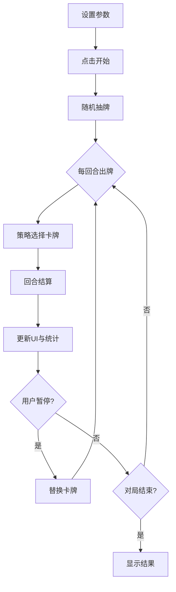

## 1. 产品概述

回合制卡牌对战演练场是一个面向卡牌游戏设计者的测试工具，用于快速验证不同卡牌组合、技能连锁效果和战斗数值平衡。两个虚拟玩家自动对战，用户可随时干预替换卡牌，观察对战斗走势的影响。

- 目标用户：卡牌游戏设计师、数值策划人员
- 核心价值：快速迭代测试卡牌平衡性，无需编写代码即可观察不同参数下的战斗模拟结果

## 2. 核心功能

### 2.1 功能模块

1. **对战主区域**：双玩家头像与生命条、卡牌出牌动画区、战斗日志滚动区
2. **控制面板**：对战参数调整（最大回合数、卡牌比例、出牌策略）
3. **统计面板**：实时战斗图表（生命值柱状图、卡牌使用频率环形图、伤害折线图）
4. **手动干预**：暂停对战、替换手牌、恢复对战

### 2.2 页面详情

| 页面名称 | 模块名称 | 功能描述 |
|----------|----------|----------|
| 对战演练场 | 对战主区域 | 展示双玩家头像、生命条、出牌动画、战斗日志 |
| 对战演练场 | 控制面板（左侧） | 调整最大回合数（10-50）、卡牌比例（5种各0%-40%总和100%）、出牌策略选择 |
| 对战演练场 | 统计面板（右侧） | 生命值柱状图、卡牌使用频率环形图、每回合伤害折线图 |

## 3. 核心流程

1. 用户在左侧控制面板设置参数（回合数、卡牌比例、策略）
2. 点击开始，系统从卡池随机抽取各5张手牌
3. 每回合双方按策略出牌，引擎结算伤害/治疗/中毒等效果
4. 战报数据同步更新：生命条动画、日志逐条淡入、统计图表刷新
5. 用户可随时暂停，为任一玩家替换手中卡牌
6. 替换后恢复自动对战，观察变化
7. 一方生命归零或达到最大回合数，对局结束

## 4. 用户界面设计

### 4.1 设计风格

- 主题：深色科技风（背景 #1A1A2E）
- 主色调：青色 #00CED1（玩家1）、粉色 #FF69B4（玩家2）
- 强调色：金黄 #FFD700（暴击）、绿色 #00FF7F（治疗）、紫色 #9370DB（中毒）
- 卡牌风格：磨砂玻璃卡片，圆角12px，带微光边框
- 字体：系统无衬线字体，标题16px加粗，正文13px，数值18px
- 布局：三列布局（控制280px + 主区域自适应 + 统计320px）

### 4.2 页面设计概览

| 页面名称 | 模块名称 | UI元素 |
|----------|----------|--------|
| 对战演练场 | 控制面板 | 磨砂玻璃背景，滑块控件，下拉选择，开始/暂停按钮 |
| 对战演练场 | 对战主区域 | 上下玩家区域，中心出牌区，底部日志列表 |
| 对战演练场 | 统计面板 | 深灰背景图表区，圆角内阴影，三图纵向排列 |

### 4.3 响应式

- 桌面优先，宽度 < 768px 时统计面板折叠到底部
- 控制面板在小屏幕下变为顶部折叠面板

### 4.4 动画规范

- 卡牌出牌：从中心向两侧飞出，0.5秒 ease-out
- 生命值变化：数字闪烁+抖动，0.3秒
- 日志条目：逐条淡入，间隔0.2秒
- 暴击效果：额外闪光+放大动画
