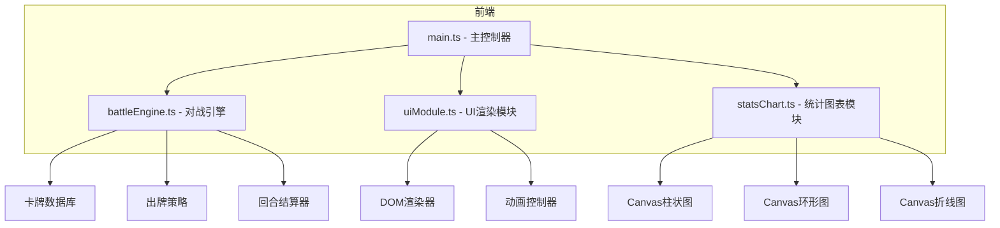

## 1. 架构设计



## 2. 技术说明

- 前端框架：原生 TypeScript + JavaScript（无第三方UI/图表库）
- 构建工具：Vite
- 语言：TypeScript（严格模式，target ES2020）
- 图表：基于 Canvas 2D 手绘实现
- 动画：CSS Animation + requestAnimationFrame
- 样式：纯CSS（无Tailwind，深色主题）
- 初始化工具：手动创建项目结构

## 3. 文件结构

| 文件路径 | 用途 |
|----------|------|
| package.json | 依赖：typescript, vite；脚本：npm run dev |
| index.html | 入口页面，全屏，CSS独立文件 |
| vite.config.js | 构建配置，入口index.html，端口3000 |
| tsconfig.json | 严格模式，target ES2020 |
| src/main.ts | 主文件：初始化应用状态、创建DOM、启动对战循环 |
| src/battleEngine.ts | 对战引擎：卡牌数据库、抽牌、策略、结算 |
| src/uiModule.ts | UI模块：头像、生命条、卡牌动画、日志 |
| src/statsChart.ts | 统计图表：Canvas柱状图、环形图、折线图 |
| src/style.css | 全局样式：深色主题、布局、动画 |

## 4. 数据模型

### 4.1 卡牌类型

```typescript
type CardType = 'attack' | 'defense' | 'heal' | 'poison' | 'crit';

interface Card {
  id: string;
  type: CardType;
  name: string;
  value: number;
}

interface Player {
  id: 1 | 2;
  hp: number;
  maxHp: number;
  hand: Card[];
  poisonTurns: number;
  poisonDmg: number;
}

interface BattleReport {
  round: number;
  player1Card: Card;
  player2Card: Card;
  player1Action: ActionDetail;
  player2Action: ActionDetail;
  player1HpAfter: number;
  player2HpAfter: number;
}

interface ActionDetail {
  type: string;
  damage?: number;
  heal?: number;
  poisonApplied?: boolean;
  blocked?: number;
}

interface BattleState {
  player1: Player;
  player2: Player;
  round: number;
  maxRounds: number;
  isPaused: boolean;
  isOver: boolean;
  logs: string[];
  damageHistory: { p1: number; p2: number }[];
  cardUsage: Record<CardType, number>;
  hpHistory: { p1: number; p2: number }[];
}
```

### 4.2 卡牌数据库

| 卡牌类型 | 名称前缀 | 数值范围 | 效果说明 |
|----------|----------|----------|----------|
| attack | 斩击 | 8-15 | 造成等值伤害 |
| defense | 护盾 | 5-10 | 减少等值受到的伤害 |
| heal | 治疗 | 6-12 | 恢复等值生命 |
| poison | 剧毒 | 3-5 | 施加中毒，每回合扣毒值，持续2回合 |
| crit | 暴击 | 10-18 | 造成双倍伤害 |

## 5. 对战引擎逻辑

### 5.1 回合结算流程

1. 双方各出一张牌（按策略选择）
2. 结算中毒效果（每回合先扣毒伤）
3. 结算双方卡牌效果：
   - 攻击牌 → 对对方造成伤害
   - 防御牌 → 减少本回合受到的伤害
   - 治疗牌 → 恢复自身生命（不超过上限）
   - 中毒牌 → 对对方施加中毒状态
   - 暴击牌 → 对对方造成双倍伤害
4. 防御减伤在受到伤害时计算
5. 生命值最低为0
6. 生成战报数据

### 5.2 出牌策略

- 随机出牌：从手牌中随机选择
- 攻击优先：优先选择攻击/暴击牌，其次随机
- 治疗优先：生命低于50%时优先治疗，否则随机

## 6. 性能指标

- 每回合结算 < 20ms
- 动画帧率 60fps 稳定
- 页面加载 < 2秒
- Canvas 图表用 requestAnimationFrame 刷新
